[TOC]

# 前言

> 多学一分钟，女友都不同，把障碍变成机会，把问题变成可能。

学习新知识的核心就在于 **重复 + 重复 + 重复**

本人也是从一无所知开始尝试刷算法，中间断断续续痛苦/纠结/无能狂怒。第1次的时候，整人是蒙圈的，看着别人的标准答案慢慢的摸索算法的含义，那真是一支笔一杯茶，一道力扣刷一天。当重复到第5次的时候，开始有些感觉了，看到题目的标题，就可以立刻回想到题目的大概的解题方向，但是很多细节还是脑袋一团浆糊，那就继续重复，当到了第8次的时候，突然就觉得就是这样的，很容易记住呀，不过如此呀。

刷题（本质就是背诵）我们的目的就是要去面试，所以题目尽可能的要选择命中率高的题库去刷，而不是力扣的题目从第一题开始，意义不大。当背诵了300道题目以后，去面试的时候，只要考算法题目，我其实很兴奋的（因为背的很熟悉），刷过的题目的命中率还挺高的。

大家不要把算法题想象的过于高大上，既然是题目，那就是有答案和解题套路的。背诵答案 + 总结解题套路，同类型的题目即使你题目都看的懵懵懂懂，都有可能蒙出来。

本文章题目都是来源于 https://codetop.cc/home  里面考察频度高的题目，都是面试后人工标记出来的（面试命中率高）。我写这个文章的目的，就是提供一份参考答案，包括代码每行的含义，以及通用的套路。因为一旦理解了，按照自己的方式去记忆会容易很多。
只需要用这个网站作为题目**是否做过**的标记即可（因为笔记功能要收费），自己的答案直接保存在力扣官方刷题网站上

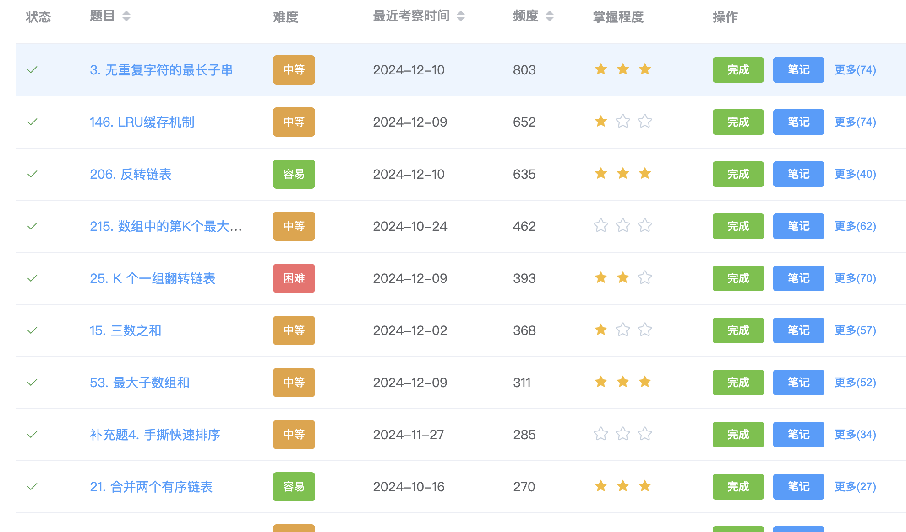


# 解题套路

解题套路可以先简单看下，当遇到相关的题目，可以回来再细细品味。建议还是先直接刷题。

## 二分搜索算法

在有序数组`nuns`中搜索 `target` 并返回索引，如果没有搜索到返回`-1`。

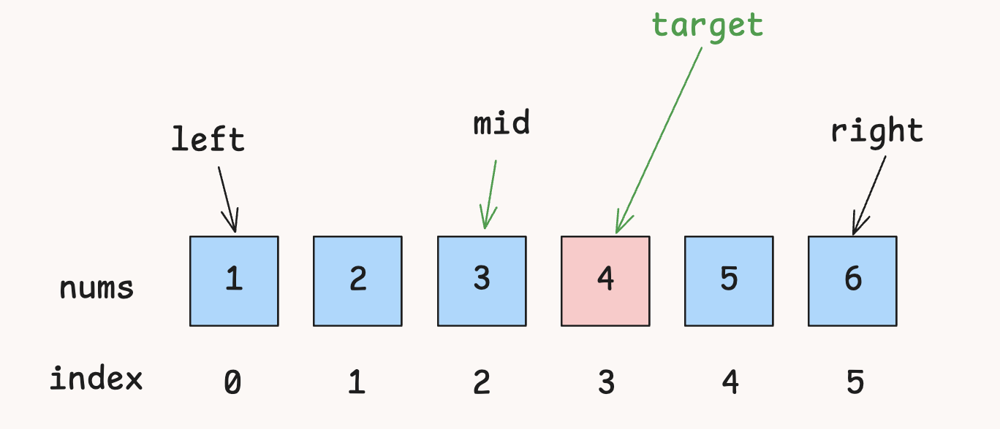

比如我们要搜索 `target = 4`此时`left = 0 right = 5` 计算得到的`mid = 2`

由图可知，`target > nums[2]`位于索引`mid=2`的右侧位置，说明`[1,2,3]`数据没有再搜索的必要（相当于切掉了一半的搜索数据量），只需要继续搜索 `[mid+1:right]`范围内的数据即可。也就是让 `left = mid+1`即 `left= 3 right = 5`，继续进行搜索的过程，直到找到数据或越界。

二分搜索算法的好处，在于每一次`for`循环搜索，可以剔除一半的数据量，让算法更快的趋近于目标值。

一般题目要求算法的时间复杂度`O(log2)`就要想到[二分搜索算法](https://leetcode.cn/problems/binary-search/)

```java
public int search(int[] nums, int target) {
    // 初始化左右指针，分别指向数组的首尾
    int left = 0, right = nums.length - 1;

    // 当左指针小于等于右指针时，继续查找
    while(left <= right) {
        // 计算中间索引，使用left + (right - left) / 2而不是(left + right) / 2
        // 是为了防止整数溢出
        int mid = left + (right - left) / 2;

        // 如果中间元素大于目标值，说明目标值在左半部分
        if(nums[mid] > target) {
            right = mid - 1; // 缩小右边界
        } 
        // 如果中间元素小于目标值，说明目标值在右半部分
        else if (nums[mid] < target) {
            left = mid + 1; // 扩大左边界
        } 
        // 如果中间元素等于目标值，直接返回索引
        else {
            return mid;
        }
    }

    // 如果循环结束还没有找到目标值，返回-1
    return -1;
}
```


## 二叉树遍历套路

```java
// 前序遍历 (Pre-order traversal)
func preOrder(root *TreeNode) {
    if root == nil {
        return
    }
    
    fmt.Println(root.Val)
    
    preOrder(root.Left)
    preOrder(root.Right)
}

// 中序遍历 (In-order traversal)
func inOrder(root *TreeNode) {
    if root == nil {
        return
    }
    
    inOrder(root.Left)
    fmt.Println(root.Val)
    inOrder(root.Right)
}

// 后序遍历 (Post-order traversal)
func postOrder(root *TreeNode) {
    if root == nil {
        return
    }
    
    postOrder(root.Left)
    postOrder(root.Right)
    fmt.Println(root.Val)
}
```


## 滑动窗口解题套路

- 定义 `left right := 0,0` 指向起始位置 `0`
- 让 `right`不断的右移，当遇到不符合题意的条件`condition`，停止移动 `right`
- 然后开始让`left`不断右移，直到条件`condition`得到满足，继续重复👆的步骤，右移`right`
- 当 `right`越界，全部结束

动态规划套路伪代码

```java
public class Main {
    public static void main(String[] args) {
        int[] nums = {1, 2, 3, 4, 5, 6};
        
        //1. 定义 `left right := 0,0` 指向起始位置 `0`
        int left = 0, right = 0;
        
        // right 越界结束
        while (right < nums.length) {
            
            // 2.不断移动 right
            int val = nums[right];
            right++; 
            
            // do something.....
            
            // 3.当 condition 不符合题意的时候，移动 left，直到满足题意，跳出 condition
            while (condition) {
                int val = nums[left];
                left++;
            }
            
            //.......
        }
    }
}
```

滑动窗口解题套路主要流程是包括

- `left right`的定义 
-  `condition`条件的选取（这个要结合题意）
- 以及两个`for`循环


## 动态规划解题套路

动态规划难点就是在于递推关系的发现，这个只能从具体的题目中来感受。如果说理解+ 背诵题目的话，其实动态规划的题目又是最容易记忆和理解的

- 明确`dp`数组的定义
- 明确 `dp[i]`和 `dp[i-1]`之间递推关系的定义(这个是动态规划的难点，其实说白了，就是要根据题意，找`dp[i]`和 `dp[i-1]`的关系 )，形式上看起来和高中学过的函数推到关系是一摸一样的，比如 `f(x) = f(x-1) + f(x-2)`

在实现代码的时候包括三个方面：

- 创建`dp`数组
- 初始化`dp`数组（需要特殊处理的值）
- 遍历 `nums`数组，实现一般性的递推关系

伪代码

```java
public class Main {
    public static void main(String[] args) {
        int[] nums = {1, 2, 3, 4};
        
        //1.定义 dp 数组
        int[] dp = new int[nums.length];
        
        //2. 初始化 dp 数组（根据题目要求也可能不需要这一步骤）
        for (int k = 0; k < dp.length; k++) {
            dp[k] = 1;
        }
        
        //3. 遍历 `nums`数组，实现一般性的递推关系
        for (int i = 1; i < nums.length; i++) {  // 从 i=1 开始，避免访问 dp[-1]
            dp[i] = dp[i - 1] + 1; // 比如：这里的递推关系为：前一个的 dp[i-1]的基础上，加1
        }
        
        //......
    }
}
```

有一道动态规划最简单的入门题目[509. 斐波那契数](https://leetcode.cn/problems/fibonacci-number)可以来体会下上面说的套路

**斐波那契数** （通常用 `F(n)` 表示）形成的序列称为 **斐波那契数列** 。该数列由 **0** 和 **1** 开始，后面的每一项数字都是前面两项数字的和。也就是：

> F(0) = 0
>
> F(1) = 1
>
> F(n) = F(n - 1) + F(n - 2)，其中 n > 1

给定 `n` ，请计算 `F(n)` 。答案需要取模 1e9+7(1000000007) ，如计算初始结果为：1000000008，请返回 1。

思路：

- `dp`定义： 在 `i`位置的数字和 `dp[i]`
- `dp`递推关系：每一项数字都是前面两项数字的和，所以有 `dp[i] = dp[i-1] + dp[i-2]`

其实，题目已经直接给出了 递推关系 `F(n) = F(n-1)+F(n-2)`，但是大部分的题目是不会给出，需要我们结合题目自己是思考这个递推关系。

```java
class Solution {
    public int fib(int n) {
        if(n <= 1) return n;
        int[] dp = new int[n+1];
        dp[0] = 0;
        dp[1] = 1;
        for(int index = 2; index <= n; index++) {
            dp[index] = dp[index - 1] + dp[index - 2];
        }
        return dp[n];
    }
}
```


## 回溯算法代码套路

回溯算法：每一层选择一个元素，剩下的元素留给下一层选择，一层一层的进行选择，直到将所有的情况遍历完成


打个比方：

有 A B C 三个苹果，有小明和小王 2个同学，各选择一个苹果。

- 如果小明先选择 A 苹果，那么小王只能选择B 或者 C 苹果；
- 如果小明选择 B 苹果，那么小王只能选择 A 或者 C 苹果；
- 如果小明选择 C 苹果，那么小王只能选择 A 或者 B 苹果。

可以看到，小明在选中一个苹果后，小王只能在剩下的苹果中选择一个留给自己（因为另一个已经被小明占用了）


回溯算法，就是在穷尽所有的情况，在 `backtrack`的 `for`循环中选中一个元素，剩下的的元素（通过 `start`来圈定）就留给 下一个 `backtrack`函数进行选择。

`start`不是必须的，有些题目可能需要在全部里面选择（比如，小明先选择 A 苹果，那么小王可以 选择A 或者 B 或者 C 苹果），有些需要在 `start`圈定的范围内选择（小明先选择 A 苹果，那么小王只能选择B 或者 C 苹果）

通用代码格式如下：

```java
/**
 * 回溯函数
 * @param nums 数组
 * @param start 遍历数组的起始位置（这个要根据题意，有时不需要）
 * @param trace 记录回溯的结果
 */
public static void backtrack(int[] nums, int start, List<Integer> trace) {
    // 结束条件
    if (condition) { // 这里的 condition 需要根据具体问题定义
        return;
    }

    for (int i = start; i < nums.length; i++) {
        // 当前选择
        trace.add(nums[i]);

        // 继续下一轮的回溯
        backtrack(nums, i + 1, trace);

        // 撤销当前选择
        trace.remove(trace.size() - 1);
    }
}
```

`start`用来限定每次 `backtrace`函数，能选择的元素范围

`trace = append(trace,nums[i])`在当前层选中元素`nums[i]`，剩下的元素留给下层的回溯`backtrack`选择

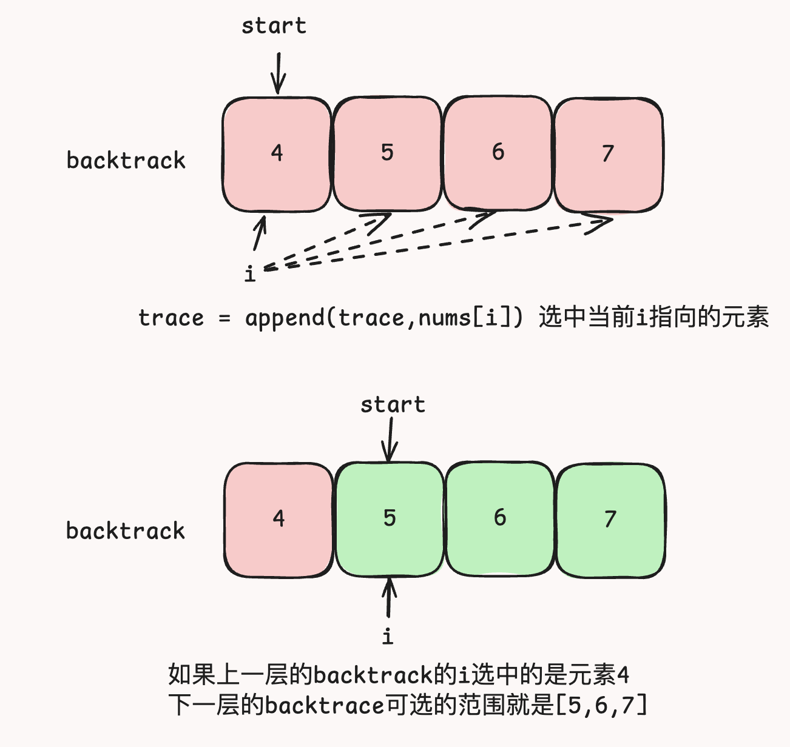


# CodeTop参考答案


## [3.无重复字符的最长字串 （滑动窗口）](https://leetcode.cn/problems/longest-substring-without-repeating-characters/description/)

给定一个字符串 `s` ，请你找出其中不含有重复字符的 **最长 子串** 的长度

```
示例1
输入: s = "abcabcbb"
输出: 3 
解释: 因为无重复字符的最长子串是 "abc"，所以其长度为 3。
```

思路：

- **滑动窗口核心思想**：维护一个`[left, right]`的窗口，保证窗口内字符不重复。当遇到重复字符时，移动`left`缩小窗口，直到窗口内无重复。
- **高效去重判断**：使用`boolean[128]`数组记录字符是否在当前窗口中出现过（ASCII字符全覆盖），时间复杂度O(1)。
- **动态更新结果**：每次右移`right`后，计算当前窗口长度`right - left + 1`，并更新最大值`ans`。

```java
class Solution {
    public int lengthOfLongestSubstring(String S) {
        boolean[] has = new boolean[128];
        int left = 0;
        int ans = 0;
        char[] s = S.toCharArray();
        for(int right = 0; right < s.length; right++) {
            while(has[s[right]]) {
                has[s[left]] = false;
                left++;
            }
            has[s[right]] = true;
            ans = Math.max(ans, right - left + 1);
        }
        return ans;
    }
}
```


## [146. LRU缓存](https://leetcode.cn/problems/lru-cache/)

请你设计并实现一个满足 [LRU (最近最少使用) 缓存](https://baike.baidu.com/item/LRU) 约束的数据结构。

实现 `LRUCache` 类：

- `LRUCache(int capacity)` 以 **正整数** 作为容量 `capacity` 初始化 LRU 缓存
- `int get(int key)` 如果关键字 `key` 存在于缓存中，则返回关键字的值，否则返回 `-1` 。
- `void put(int key, int value)` 如果关键字 `key` 已经存在，则变更其数据值 `value` ；如果不存在，则向缓存中插入该组 `key-value` 。如果插入操作导致关键字数量超过 `capacity` ，则应该 **逐出** 最久未使用的关键字。

函数 `get` 和 `put` 必须以 `O(1)` 的平均时间复杂度运行。

思路：

- **LRU核心机制**：通过双向链表维护访问顺序（最近访问的节点在头部，最久未访问的在尾部），结合`HashMap`实现O(1)时间复杂度的`get`和`put`操作。
- **缓存淘汰策略**：当容量满时，直接删除链表尾部的节点（最久未使用），并同步更新`HashMap`。
- **访问更新逻辑**：每次`get`或`put`时
  - 若节点存在则将其移动到链表头部（标记为最近使用）
  - 否则创建新节点并插入头部，超容量时再淘汰尾部节点。


```java
class LRUCache {
    private static class Node {
        int key, value;
        Node prev, next;

        Node(int k, int v) {
            key = k;
            value = v;
        }
    } 

    private final int capacity;
    private final Node dummy = new Node(0, 0);
    private final Map<Integer, Node> keyToNode = new HashMap<>();

    public LRUCache(int capacity) {
        this.capacity = capacity;
        dummy.prev = dummy;
        dummy.next = dummy;
    }

    private void remove(Node node) {
        node.next.prev = node.prev;
        node.prev.next = node.next;
    }

    private void pushFront(Node node) {
        node.prev = dummy;
        node.next = dummy.next;
        node.prev.next = node;
        node.next.prev = node;
    }

    private Node getNode(int key) {
        if(!keyToNode.containsKey(key)) {
            return null;
        }
        Node node = keyToNode.get(key);
        remove(node);
        pushFront(node);
        return node;
    }
    
    public int get(int key) {
        Node node = getNode(key);
        return node != null ? node.value : -1;
    }
    
    public void put(int key, int value) {
        Node node = getNode(key);
        if(node != null) {
            node.value = value;
            return;
        }

        node = new Node(key, value);
        keyToNode.put(key, node);
        pushFront(node);
        if(keyToNode.size() > capacity) {
            Node backNode = dummy.prev;
            keyToNode.remove(backNode.key);
            remove(backNode);
        }
    }
}
```


## [206. 反转链表](https://leetcode.cn/problems/reverse-linked-list/)

给你单链表的头节点 `head` ，请你反转链表，并返回反转后的链表。

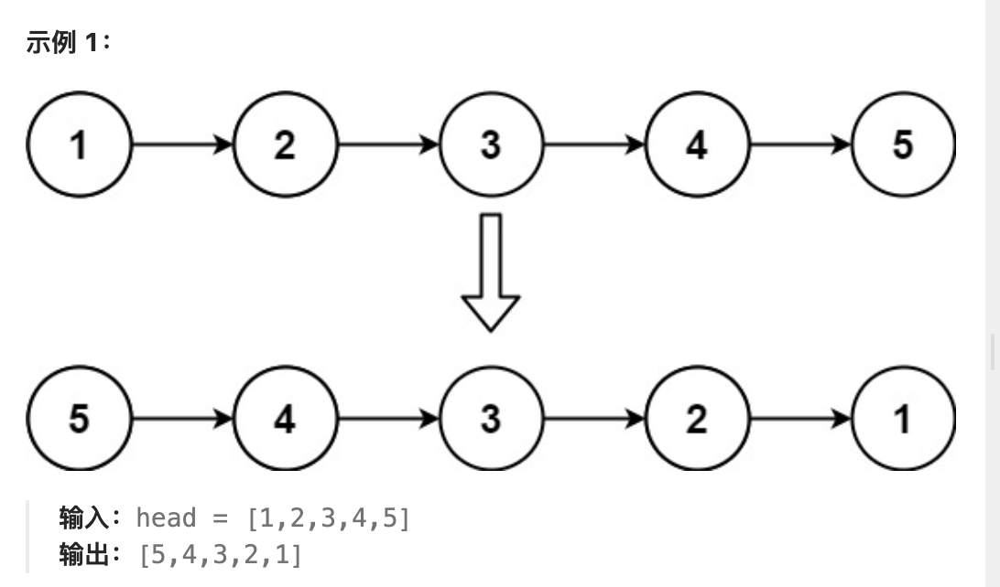

思路：

- **迭代反转链表**：使用双指针`cur`和`pre`，逐个反转节点的`next`指针方向，直到遍历完整个链表。
- **关键步骤**：每次迭代中，先用`temp`保存`cur.next`，再反转`cur.next`指向`pre`，最后移动`pre`和`cur`指针。
- **终止条件**：当`cur`为`null`时，`pre`即为反转后的新头节点。

```java
class Solution {
    public ListNode reverseList(ListNode head) {
        ListNode cur = head, pre = null;
        while(cur != null) {
            ListNode temp = cur.next;
            cur.next = pre;
            pre = cur;
            cur =temp;
        }
        return pre;
    }
}
```

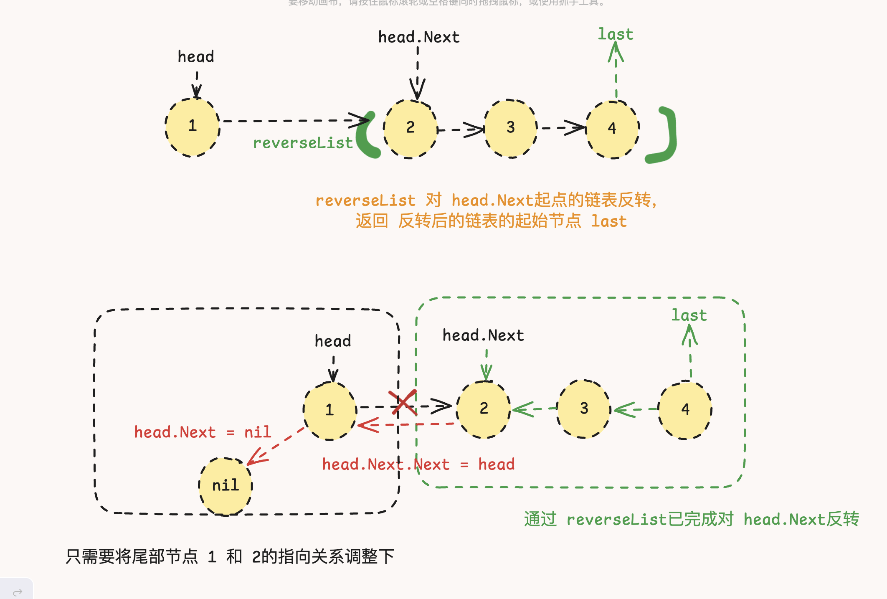


## [215. 数组中的第K个最大元素](https://leetcode.cn/problems/kth-largest-element-in-an-array/)

给定整数数组 `nums` 和整数 `k`，请返回数组中第  `k` 个最大的元素。请注意，你需要找的是数组排序后的第 `k` 个最大的元素，而不是第 `k` 个不同的元素。你必须设计并实现时间复杂度为 `O(n)` 的算法解决此问题。

```
示例 1:

输入: [3,2,1,5,6,4], k = 2
输出: 5

```

思路：

- **堆排序思想**：利用最大堆（大顶堆）的性质，每次取出堆顶元素（当前最大值），逐步缩小堆的范围，最终得到第k大的元素。
- **构建最大堆**：从最后一个非叶子节点开始，自底向上调整堆结构，确保每个父节点都大于其子节点。
- **逐步提取元素**：依次将堆顶元素与末尾元素交换，缩小堆的范围后重新调整堆，重复k次后堆顶即为第k大的元素。

```java
class Solution {
    public int findKthLargest(int[] nums, int k) {
        int heapSize = nums.length;
        build(nums, heapSize);
        for(int i = nums.length - 1; i >= nums.length - k + 1; i--) {
            swap(nums, 0, i );
            heapSize--;
            maxHeap(nums, 0, heapSize);
        }
        return nums[0];
    }

    private void build(int[] nums, int heapSize) {
        for(int i = heapSize / 2 - 1; i >= 0; i--) {
            maxHeap(nums, i, heapSize);
        }
    }

    private void maxHeap(int[] nums, int i, int heapSize) {
        int left = i * 2 + 1, right = i * 2 + 2, largest = i;
        if(left < heapSize && nums[left] > nums[largest]) {
            largest = left;
        }
        if(right < heapSize && nums[right] > nums[largest]) {
            largest = right;
        }
        if(i != largest) {
            swap(nums, largest, i);
            maxHeap(nums, largest, heapSize);
        }
    }

    private void swap(int[] nums, int i, int j) {
        int temp = nums[i];
        nums[i] = nums[j];
        nums[j] = temp;
    }
}
```

下图表示演示了， 数组 `2 1 3` 求第 1 大元素的过程

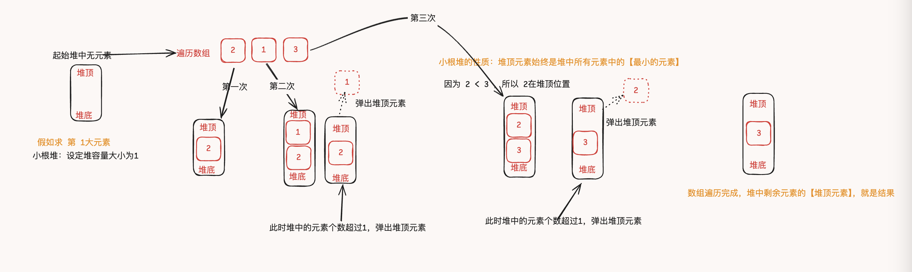


## [25. K个一组翻转链表](https://leetcode.cn/problems/reverse-nodes-in-k-group)

给你链表的头节点 `head` ，每 `k` 个节点一组进行翻转，请你返回修改后的链表。`k` 是一个正整数，它的值小于或等于链表的长度。如果节点总数不是 `k` 的整数倍，那么请将最后剩余的节点保持原有顺序。你不能只是单纯的改变节点内部的值，而是需要实际进行节点交换。

思路：

- 按照 长度k截取一段链表，然后将这段链表进行反转。【反转前的链表的头节点，变成了反转后的链表的尾部节点】
- **分组反转链表**：先统计链表长度，然后按每k个节点为一组进行反转，不足k个的组保持原序。
- **迭代反转过程**：对每组节点使用头插法反转，通过临时变量保存后续节点，确保分组间正确连接。
- **虚拟头节点辅助**：使用dummy节点简化边界条件处理，p0指针跟踪已处理部分的末尾，便于连接下一组反转后的头节点。

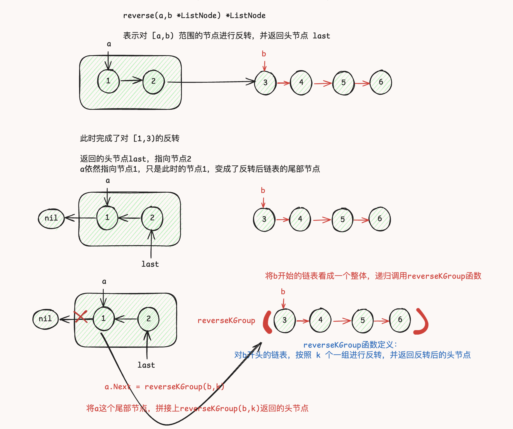

```java
class Solution {
    public ListNode reverseKGroup(ListNode head, int k) {
        int cnt = 0;
        for(ListNode cur = head; cur != null; cur = cur.next) cnt++;

        ListNode dummy = new ListNode(0, head);
        ListNode p0 = dummy;
        ListNode pre = null;
        ListNode cur = head;

        for(; cnt >= k; cnt -= k) {
            for(int i = 0; i < k; i++) {
                ListNode temp = cur.next;
                cur.next = pre;
                pre = cur;
                cur = temp;
            }

            ListNode next = p0.next;
            p0.next.next = cur;
            p0.next = pre;
            p0 = next;
        }
        return dummy.next;
    }
}
```


## [15. 三数之和](https://leetcode.cn/problems/3sum)

给你一个整数数组 `nums` ，判断是否存在三元组 `[nums[i], nums[j], nums[k]]` 满足 `i != j`、`i != k` 且 `j != k` ，同时还满足 `nums[i] + nums[j] + nums[k] == 0` 。请你返回所有和为 `0` 且不重复的三元组。

**注意：**答案中不可以包含重复的三元组。

思路：

- **排序+双指针法**：先对数组排序，固定一个数后，用双指针在剩余部分寻找两数之和等于目标值（当前数的相反数）。
- **剪枝优化**：跳过重复元素避免重复解；当最小三数和已大于0或最大三数和小于0时提前终止循环。
- **去重处理**：找到有效解后，跳过所有与当前解中相同值的元素，确保结果唯一性。

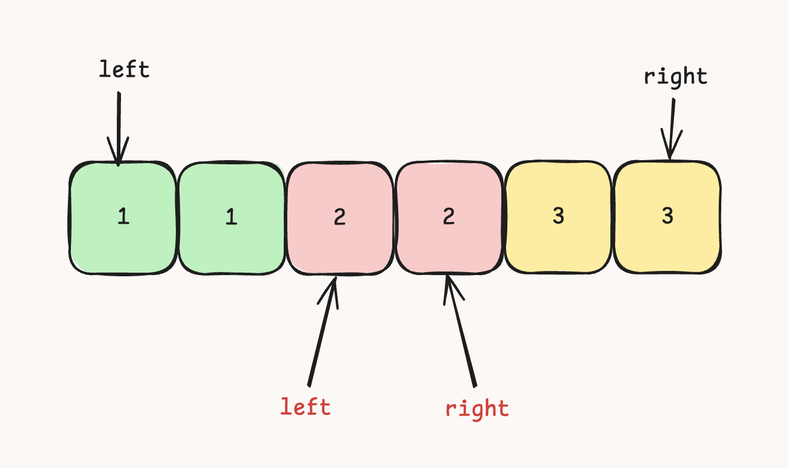

```java
class Solution {
    public List<List<Integer>> threeSum(int[] nums) {
        Arrays.sort(nums);
        int n = nums.length;
        List<List<Integer>> ans = new ArrayList<>();
        for (int i = 0; i < n - 2; i++) {
            int x = nums[i];
            if(i > 0 && x == nums[i-1]) continue;
            if(x + nums[i+1] + nums[i+2] > 0) break;
            if(x + nums[n-1] + nums[n-2] < 0) continue;
            int j = i + 1;
            int k = n - 1;
            while(j < k) {
                int sum = x + nums[j] + nums[k];
                if(sum < 0) {
                    j++;
                } else if(sum > 0){
                    k--;
                } else {
                    ans.add(List.of(x, nums[j], nums[k]));
                    for(j++; j < k && nums[j] == nums[j-1]; j++);
                    for(k--; j < k && nums[k] == nums[k+1]; k--);
                }
            }
        }
        return ans;
    }
}
```


## [53. 最大子数组和](https://leetcode.cn/problems/maximum-subarray/)

给你一个整数数组 `nums` ，请你找出一个具有最大和的连续子数组（子数组最少包含一个元素），返回其最大和。

**子数组**：是数组中的一个连续部分。

思路：

- **动态规划优化**：使用`f`记录以当前元素结尾的最大子数组和，状态转移方程为`f = max(f, 0) + x`，表示要么延续之前的，要么重新开始。

- **贪心思想**：每次计算`f`时，如果之前的和为负则舍弃（置为0），只保留当前元素或延续。
- **全局最大值**：在遍历过程中维护`ans`记录全局最大值，最终返回`ans`作为结果。

```java
class Solution {
    public int maxSubArray(int[] nums) {
        int ans = Integer.MIN_VALUE;
        int f = 0;
        for(int x : nums) {
            f = Math.max(f, 0) + x;
            ans = Math.max(ans, f);
        }
        return ans;
    }
}
```


## [912. 排序数组](https://leetcode.cn/problems/sort-an-array)

给你一个整数数组 `nums`，请你将该数组升序排列。你必须在 **不使用任何内置函数** 的情况下解决问题，时间复杂度为 `O(nlog(n))`，并且空间复杂度尽可能小。

思路：

这里提供必考的**3种排序算法（快速，堆，冒泡）**

> 快速排序

**快速排序是先将一个元素排好序，然后再将剩下的元素排好序**。

```java
class Solution {
    public int[] sortArray(int[] nums) {
        quickSort(nums, 0, nums.length - 1);
        return nums;
    }
    
    private void quickSort(int[] nums, int left, int right) {
        if (left >= right) return;
        
        int pivotIndex = partition(nums, left, right);
        quickSort(nums, left, pivotIndex - 1);
        quickSort(nums, pivotIndex + 1, right);
    }
    
    private int partition(int[] nums, int left, int right) {
        // 选择最右边的元素作为基准值
        int pivot = nums[right];
        int i = left;
        
        for (int j = left; j < right; j++) {
            if (nums[j] < pivot) {
                swap(nums, i, j);
                i++;
            }
        }
        
        // 将基准值放到正确的位置
        swap(nums, i, right);
        return i;
    }
    
    private void swap(int[] nums, int i, int j) {
        int temp = nums[i];
        nums[i] = nums[j];
        nums[j] = temp;
    }
}
```

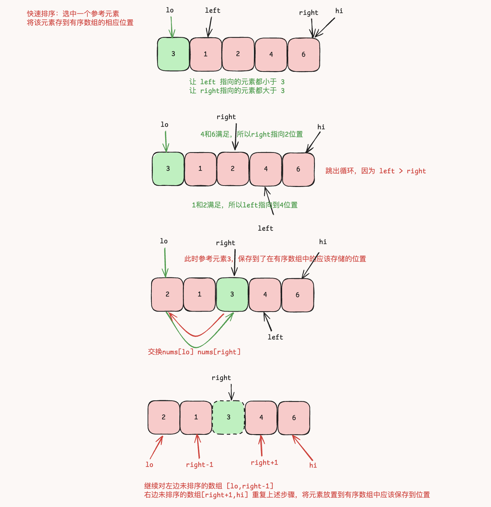

> 堆排序

利用的下沉操作sink，将数组最大元素移动到数组首部，然后和尾部元素交换（尾部元素就不用再管了，因为已经有序了）此时尾部就是最大的值；然后对剩下的数组元素进行下沉操作；保证次大的元素，成为新的首部元素；继续和尾部交换（注意这里的尾部不是最后一个，是倒数第二个了）

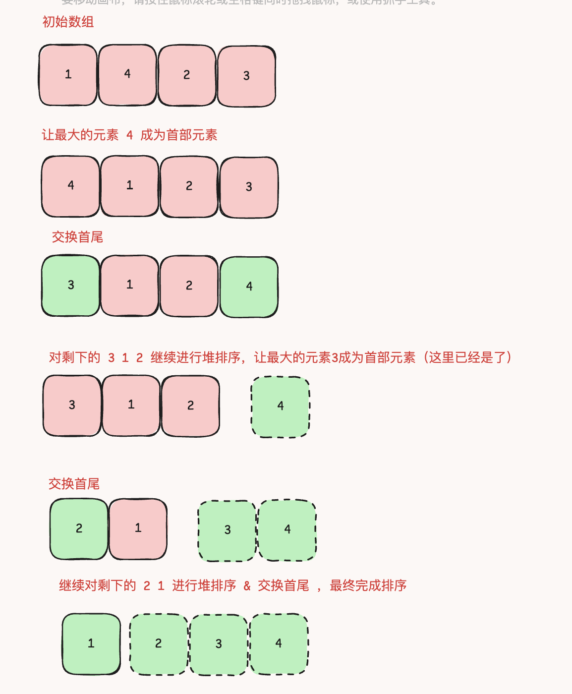

```java
class Solution {
    public int[] sortArray(int[] nums) {
        int n = nums.length;

        // 构建最大堆
        for (int i = n / 2 - 1; i >= 0; i--) {
            heapify(nums, n, i);
        }

        // 排序
        for (int i = n - 1; i > 0; i--) {
            // 将当前堆顶元素（最大值）与最后一个元素交换
            swap(nums, 0, i);
            // 对剩余的堆进行堆化
            heapify(nums, i, 0);
        }

        return nums;
    }

    // 堆化函数：确保以i为根的子树满足最大堆性质
    private void heapify(int[] nums, int n, int i) {
        int largest = i; // 初始化最大值为根节点
        int left = 2 * i + 1; // 左子节点
        int right = 2 * i + 2; // 右子节点

        // 如果左子节点大于根节点
        if (left < n && nums[left] > nums[largest]) {
            largest = left;
        }

        // 如果右子节点大于当前最大值
        if (right < n && nums[right] > nums[largest]) {
            largest = right;
        }

        // 如果最大值不是根节点
        if (largest != i) {
            swap(nums, i, largest);
            // 递归地对受影响的子树进行堆化
            heapify(nums, n, largest);
        }
    }

    // 交换数组中两个元素的位置
    private void swap(int[] nums, int i, int j) {
        int temp = nums[i];
        nums[i] = nums[j];
        nums[j] = temp;
    }
}

```

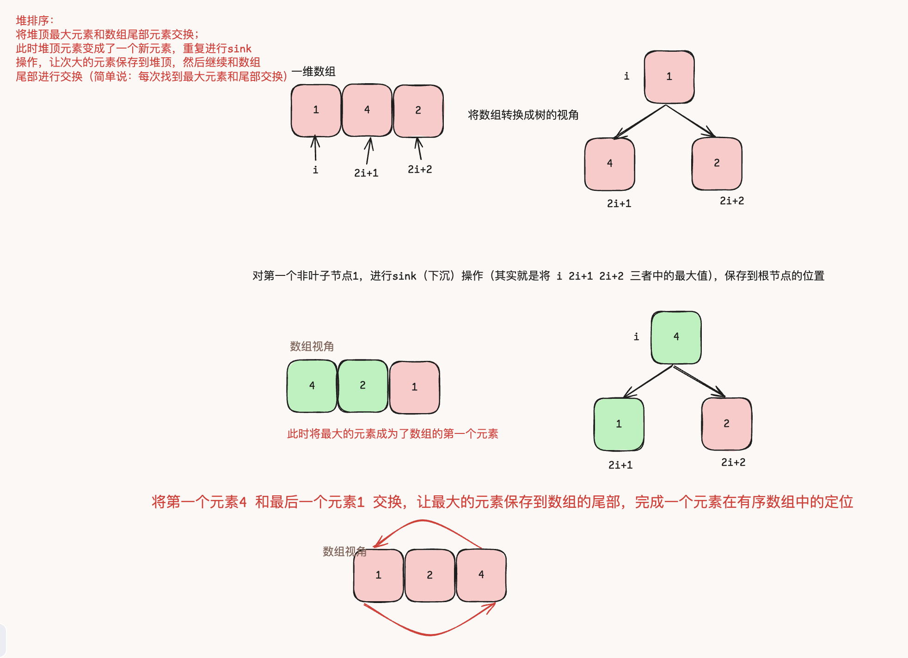

> 冒泡排序

重复地遍历数组，每次比较相邻的两个元素，如果顺序错误就交换它们，这样每一轮遍历都能把当前未排序部分的最大元素"冒泡"到正确位置。简单直观但效率较低（O(n²)时间复杂度），适合小规模数据排序，是稳定的排序算法（相等元素不会改变相对位置）。

```java
public int[] sortArray(int[] nums) {
    int n = nums.length;
    for (int i = 0; i < n - 1; i++) {
        boolean swapped = false;  // 优化：增加交换标志位
        for (int j = 0; j < n - i - 1; j++) {
            if (nums[j] > nums[j + 1]) {
                // 交换相邻元素
                int temp = nums[j];
                nums[j] = nums[j + 1];
                nums[j + 1] = temp;
                swapped = true;
            }
        }
        // 如果某一轮没有发生交换，说明已经有序，提前退出
        if (!swapped) break;
    }
    return nums;
}
```


## [21.合并两个有序链表](https://leetcode.cn/problems/merge-two-sorted-lists/)

将两个升序链表合并为一个新的 **升序** 链表并返回。新链表是通过拼接给定的两个链表的所有节点组成的。 

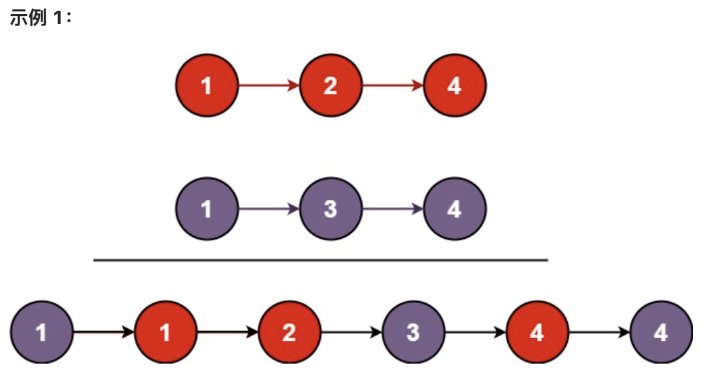

思路：

- **分治递归**：比较两链表头节点，取较小者作为当前节点，并递归合并其后续节点与另一链表。
- **终止条件**：任一链表为空时直接返回另一链表。
- **自顶向下构建**：每次递归处理当前最小节点，逐步拼接成完整有序链表。

```java
class Solution {
    public ListNode mergeTwoLists(ListNode list1, ListNode list2) {
        if(list1 == null) return list2;
        if(list2 == null) return list1;
        if(list1.val < list2.val) {
            list1.next = mergeTwoLists(list1.next, list2);
            return list1;
        } else {
            list2.next = mergeTwoLists(list1, list2.next);
            return list2;
        }
    }
}
```


## [5. 最长回文子串](https://leetcode.cn/problems/longest-palindromic-substring/)

给你一个字符串 `s`，找到 `s` 中最长的 回文 子串。

思路：

**寻找回文串的问题核心思想是：从中间开始向两边扩散来判断回文串**

```java
for 0 <= i < len(s):
    找到以 s[i] 为中心的回文串
    更新答案
```

找回文串的关键技巧是传入两个指针 `l` 和 `r` 向两边扩散，因为这样实现可以同时处理回文串长度为奇数和偶数的情况。

```java
for 0 <= i < len(s):
    // 找到以 s[i] 为中心的回文串
    palindrome(s, i, i)
    // 找到以 s[i] 和 s[i+1] 为中心的回文串
    palindrome(s, i, i + 1)
    更新答案
```

- **中心扩展法**：以每个字符（奇数长度）或每对相邻字符（偶数长度）为中心，向两边扩展寻找最长回文子串。
- **动态记录边界**：维护`start`和`end`记录当前最长回文的起止位置，每次扩展后更新这两个边界。
- **双中心处理**：分别处理奇数长度（`center(i,i)`）和偶数长度（`center(i,i+1)`）的回文情况，取较大值进行更新。

```java
class Solution {
    public String longestPalindrome(String s) {
        int start = 0, end = 0;
        for (int i = 0; i < s.length(); i++) {
            int len1 = center(s, i, i);
            int len2 = center(s, i, i + 1);
            int len = Math.max(len1, len2);
            if(len > end - start) {
                start = i - (len - 1) /2;
                end = i + len / 2;
            }
        }
        return s.substring(start, end+1);
    }

    private int center(String s, int left, int right) {
        while(left >= 0 && right < s.length() && s.charAt(left) == s.charAt(right)) {
            left--;
            right++;
        }
        return right - left - 1;
    }
}
```


## [102. 二叉树的层序遍历](https://leetcode.cn/problems/binary-tree-level-order-traversal/)

给你二叉树的根节点 `root` ，返回其节点值的 **层序遍历** 。 （即逐层地，从左到右访问所有节点）。

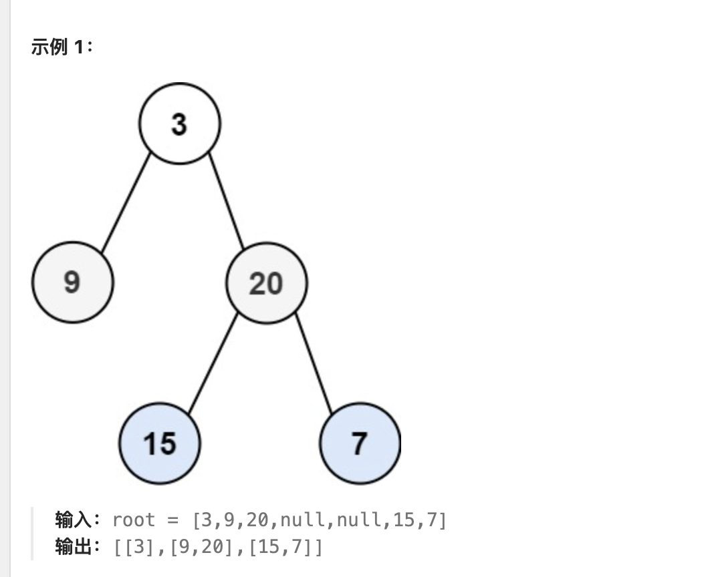

思路：

- **BFS层次遍历**：使用队列按层访问二叉树节点，每次处理完一层后将该层节点值存入结果列表。
- **队列控制层数**：通过记录当前队列大小`len`来确定当前层的节点数量，确保逐层处理。
- **子节点入队**：访问当前节点时，将其左右子节点（若存在）加入队列，为下一层遍历做准备。

```java
class Solution {
    public List<List<Integer>> levelOrder(TreeNode root) {
        if(root == null) return List.of();
        List<List<Integer>> ans = new ArrayList<>();
        Deque<TreeNode> q = new ArrayDeque<>();
        q.add(root);
        while(!q.isEmpty()) {
            int len = q.size();
            List<Integer> path = new ArrayList<>();
            while(len-- > 0) {
                TreeNode node = q.poll();
                path.add(node.val);
                if(node.left != null) q.add(node.left);
                if(node.right != null) q.add(node.right);
            }
            ans.add(path);
        }
        return ans;
    }
}
```


## [1.两数之和](https://leetcode.cn/problems/two-sum/)

给定一个整数数组 `nums` 和一个整数目标值 `target`，请你在该数组中找出 **和为目标值** *`target`* 的那 **两个** 整数，并返回它们的数组下标。你可以假设每种输入只会对应一个答案，并且你不能使用两次相同的元素。你可以按任意顺序返回答案。

思路：

- **哈希表辅助查找**：使用哈希表存储已遍历元素的值和索引，实现O(1)时间复杂度的目标值查找。
- **一次遍历求解**：遍历数组时，检查当前元素所需补数（target - 当前值）是否存在于哈希表中，存在则直接返回结果。
- **空间换时间**：牺牲O(n)空间复杂度，将时间复杂度从暴力法的O(n²)优化到O(n)。

```java
class Solution {
    public int[] twoSum(int[] nums, int target) {
        Map<Integer, Integer> map = new HashMap<>();
        for (int i = 0; i < nums.length; i++) {
            if(map.containsKey(target - nums[i])) {
                return new int[]{map.get(target - nums[i]), i};
            }
            map.put(nums[i], i);
        }
        return new int[2];
    }
}
```


## [33.搜索旋转排序数组](https://leetcode.cn/problems/search-in-rotated-sorted-array/)

整数数组 `nums` 按升序排列，数组中的值 **互不相同** 。

在传递给函数之前，`nums` 在预先未知的某个下标 `k`（`0 <= k < nums.length`）上进行了 **旋转**，使数组变为 `[nums[k], nums[k+1], ..., nums[n-1], nums[0], nums[1], ..., nums[k-1]]`（下标 **从 0 开始** 计数）。例如， `[0,1,2,4,5,6,7]` 在下标 `3` 处经旋转后可能变为 `[4,5,6,7,0,1,2]` 。

给你 **旋转后** 的数组 `nums` 和一个整数 `target` ，如果 `nums` 中存在这个目标值 `target` ，则返回它的下标，否则返回 `-1` 。

你必须设计一个时间复杂度为 `O(log n)` 的算法解决此问题。

思路：

- 题目要求时间复杂度`O(log n)` 那就要想到二分法
- **二分查找变种**：针对旋转排序数组，在每次二分时判断哪一半是有序的，再根据目标值是否落在有序区间决定搜索方向。
- **区间判断逻辑**：通过比较中间值与左边界值确定左半区是否有序，再检查目标值是否在左半有序区间内。
- **边界调整策略**：根据目标值位置动态调整左右指针，逐步缩小搜索范围直至找到目标或确定不存在。

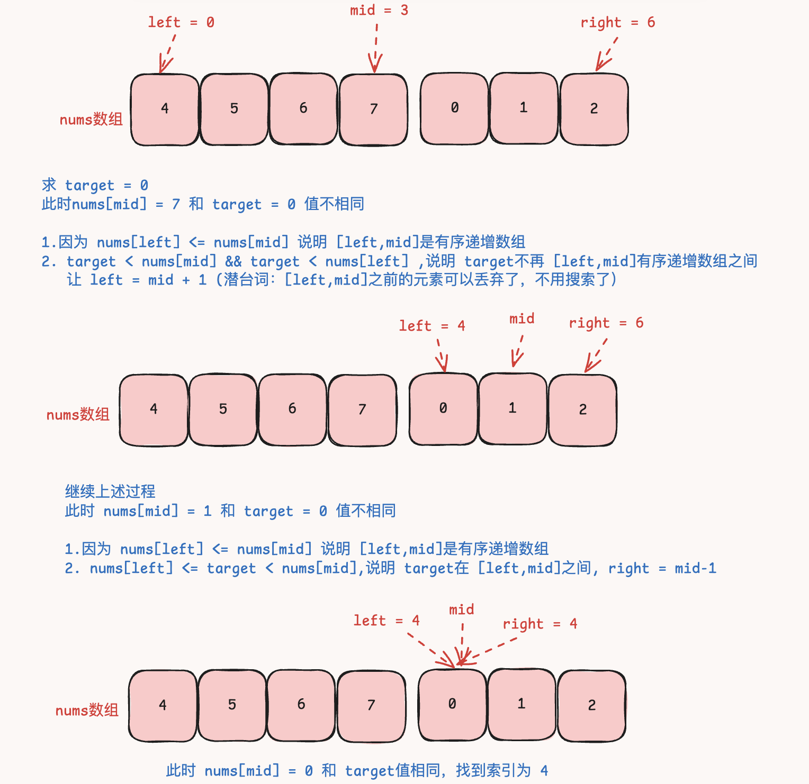

```java
class Solution {
    public int search(int[] nums, int target) {
        int left = 0, right = nums.length - 1;
        while(left <= right) {
            int mid = left + (right - left) / 2;
            if(nums[mid] == target) return mid;
            if(nums[mid] >= nums[left]) {
                if(target >= nums[left] && target < nums[mid]) {
                    right = mid - 1;
                } else {
                    left = mid + 1;
                }
            } else {
                if(target > nums[mid] && target <= nums[right]) {
                    left = mid + 1;
                } else {
                    right = mid - 1;
                }
            }
        }
        return -1;
    }
}
```


## [200.岛屿数量](https://leetcode.cn/problems/number-of-islands)

给你一个由 `'1'`（陆地）和 `'0'`（水）组成的的二维网格，请你计算网格中岛屿的数量。岛屿总是被水包围，并且每座岛屿只能由水平方向和/或竖直方向上相邻的陆地连接形成。此外，你可以假设该网格的四条边均被水包围。

思路：

- 用 DFS 算法解决岛屿题目是最常见的，每次遇到一个岛屿中的陆地，就用 DFS 算法吧这个岛屿「淹掉」。
- **深度优先搜索（DFS）**：遍历网格时，遇到陆地（'1'）就启动DFS，将相连的所有陆地标记为已访问（如'2'），避免重复计数。
- **岛屿计数逻辑**：每次启动DFS都意味着发现了一个新的岛屿，因此计数器`ans`递增。
- **边界与有效性检查**：DFS过程中检查坐标是否越界以及当前格子是否为未访问的陆地，确保搜索的正确性和安全性。

```java
class Solution {
    public int numIslands(char[][] grid) {
        int ans = 0;
        for (int i = 0; i < grid.length; i++) {
            for (int j = 0; j < grid[0].length; j++) {
                if(grid[i][j] == '1') {
                    dfs(grid, i, j);
                    ans++;
                }
            }
        }
        return ans;
    }

    private void dfs(char[][] grid, int i, int j) {
        if(i < 0 || i >= grid.length || j < 0 || j >= grid[0].length || grid[i][j] != '1') return;

        grid[i][j] = '2';
        dfs(grid, i + 1, j);
        dfs(grid, i - 1, j);
        dfs(grid, i, j + 1);
        dfs(grid, i, j - 1);
    }
}
```


## [46.全排列](https://leetcode.cn/problems/permutations/)

给定一个不含重复数字的数组 `nums` ，返回其 *所有可能的全排列* 。你可以 **按任意顺序** 返回答案。

```
示例1:
输入：nums = [1,2,3]
输出：[[1,2,3],[1,3,2],[2,1,3],[2,3,1],[3,1,2],[3,2,1]]
```

思路：

- 可以参考下👆回溯算法解题模板
- **回溯算法**：通过交换元素位置生成所有可能的排列，利用递归回溯探索所有排列组合。
- **路径维护**：使用`path`列表动态维护当前排列状态，在递归过程中不断交换元素位置生成新排列。
- **终止条件**：当`first`等于数组长度时，表示当前`path`已构成一个完整排列，将其加入结果集`ans`。

```java
class Solution {

    List<List<Integer>> ans = new ArrayList<>();
    List<Integer> path = new ArrayList<>();

    public List<List<Integer>> permute(int[] nums) {
        for(int x : nums) path.add(x);
        dfs(nums.length, 0);
        return ans;
    }

    private void dfs(int n, int first) {
        if(first == n) ans.add(new ArrayList<>(path));
        for(int i = first; i < n; i++) {
            Collections.swap(path, first, i);
            dfs(n, first + 1);
            Collections.swap(path, first, i);
        }
    }
}
```


## [88.合并两个有序数组](https://leetcode.cn/problems/merge-sorted-array/)

给你两个按 **非递减顺序** 排列的整数数组 `nums1` 和 `nums2`，另有两个整数 `m` 和 `n` ，分别表示 `nums1` 和 `nums2` 中的元素数目。请你 **合并** `nums2` 到 `nums1` 中，使合并后的数组同样按 **非递减顺序** 排列。

**注意：**最终，合并后数组不应由函数返回，而是存储在数组 `nums1` 中。为了应对这种情况，`nums1` 的初始长度为 `m + n`，其中前 `m` 个元素表示应合并的元素，后 `n` 个元素为 `0` ，应忽略。`nums2` 的长度为 `n` 。

思路：

- 很像前文中讲过的 [21. 合并两个有序链表](https://leetcode.cn/problems/merge-two-sorted-lists)，这里让你合并两个有序数组。

- 对于单链表来说，我们直接用双指针从头开始合并即可，但对于数组来说会出问题。因为题目让我直接把结果存到 `nums1` 中，而 `nums1` 的开头有元素，如果我们无脑复制单链表的逻辑，会覆盖掉 `nums1` 的原始元素，导致错误。但 `nums1` 后面是空的呀，所以这道题需要我们稍微变通一下：**将双指针初始化在数组的尾部，然后从后向前进行合并**，这样即便覆盖了 `nums1` 中的元素，这些元素也必然早就被用过了，不会影响答案的正确性。

  

- **逆向双指针合并**：从两个数组的末尾开始比较，将较大的元素依次放入nums1的末尾，避免覆盖未处理的元素。

- **原地修改**：直接在nums1数组上进行操作，无需额外空间，利用nums1末尾的空闲位置存储合并结果。

- **终止条件**：当nums2的所有元素都被处理完毕（p2 < 0）时，合并完成，此时nums1的前m+n个元素即为最终结果。

```java
class Solution {
    public void merge(int[] nums1, int m, int[] nums2, int n) {
        int p1 = m - 1;
        int p2 = n - 1;
        int p = m + n - 1;
        while(p2 >= 0) {
            if(p1 >= 0 && nums1[p1] > nums2[p2]) {
                nums1[p--] = nums1[p1--];
            } else {
                nums1[p--] = nums2[p2--];
            }
        }
    }
}
```


## [20.有效的括号](https://leetcode.cn/problems/valid-parentheses/)

给定一个只包括 `'('`，`')'`，`'{'`，`'}'`，`'['`，`']'` 的字符串 `s` ，判断字符串是否有效。

有效字符串需满足：

1. 左括号必须用相同类型的右括号闭合。
2. 左括号必须以正确的顺序闭合。
3. 每个右括号都有一个对应的相同类型的左括号。

思路：

- 栈是一种先进后出的数据结构，处理括号问题的时候尤其有用。

- 假设字符串中只有圆括号 **（）**，如果想让括号字符串有效，那么必须做到：

  **每个右括号 `)` 的左边必须有一个左括号 `(` 和它匹配**。

  比如说字符串 `()))((` 中，中间的两个右括号**左边**就没有左括号匹配，所以这个括号组合是无效的。

- 利用栈，保证完成匹配的括号，不会存在在栈中，最后栈中剩下的就是没有完成匹配的；


```java
class Solution {
    public boolean isValid(String s) {
        Deque<Character> deque = new LinkedList<>();
        for(int i = 0; i < s.length(); i++) {
            char ch = s.charAt(i);
            if(ch == '(') {
                deque.push(')');
            } else if(ch == '{') {
                deque.push('}');
            } else if(ch == '[') {
                deque.push(']');
            } else if(deque.isEmpty() || deque.peek() != ch) {
                return false;
            } else {
                deque.pop();
            }
        }
        return deque.isEmpty();
    }
}
```


## [121.买卖股票的最佳时机](https://leetcode.cn/problems/best-time-to-buy-and-sell-stock/)

给定一个数组 `prices` ，它的第 `i` 个元素 `prices[i]` 表示一支给定股票第 `i` 天的价格。你只能选择 **某一天** 买入这只股票，并选择在 **未来的某一个不同的日子** 卖出该股票。设计一个算法来计算你所能获取的最大利润。

返回你可以从这笔交易中获取的最大利润。如果你不能获取任何利润，返回 `0` 。

思路：

买卖股票类的题目有一套**通用的解题方案**：

- `dp`数组定义：

> `dp[i][k][0 or 1]` 
>
> `0 <= i <= n - 1, 1 <= k <= K`      
>
>   n 为天数，大 K 为完成交易数的上限，0 和 1 代表是否持有股票

所以，`dp[i][k][0 or 1]` 的含义就是：在从 `0`到 `i`天，完成了`k`笔交易，不持有`0` or 持有 `1`股票，能获取的最大利润

- `dp`的递推关系定义：

```java

dp[i][k][0] = max(dp[i-1][k][0], dp[i-1][k][1] + prices[i])
//dp[i][k][0] 表示 从 0 到 第i天，完成k笔交易，不持有股票，能获取的最大利润
分成两种情况：
// dp[i-1][k][0] 								表示 从 0 到i-1天（也就是前一天），也没有持有股票
// dp[i-1][k][1] + prices[i]  	表示 从 0 到i-1天（也就是前一天），持有了股票，但是今天选择卖出，那么今天不就不持有股票了


dp[i][k][1] = max(dp[i-1][k][1], dp[i-1][k-1][0] - prices[i])
// dp[i][k][1]  表示从 0 到第i天，完成k笔交易，持有股票，能获取的最大利润
分成两种情况：
// dp[i-1][k][1] 							 	表示从 0 到 i-1天（也就是前一天），也持有股票
// dp[i-1][k-1][0] - prices[i] 	表示从 0 到 i-1天（也就是前一天），未持有了股票，但是今天选择买入，那么不就持有股票了。因为是今天买入股票，完成了一笔交易，今天的交易次数是k的前提下，那么前一天的交易次数就是 k-1


最终答案：因为要求最大利润，那只有不持有股票的利润最大 dp[n-1][k][0] （从 0到 n-1，完成了k笔交易后，不持有股票）
```

本题答案：

注意理解这句话的含义：【你只能选择 **某一天** 买入这只股票，并选择在 **未来的某一个不同的日子** 卖出该股票】，意思就是只进行一次交易，能获取的最大利润是多少。（不需要考虑之前的历史交易行为，因为只有一次交易，那也就是没有其他的历史交易行为）

- 对于上面的`dp`递推模板，可以省略 `k`，因为只有一次交易
- `dp[i][k][1] = max(dp[i-1][k][1], dp[i-1][k-1][0] - prices[i])`对于这个递推关系，我们需要去掉`dp[i-1][k-1][0]`，将递推关系变为：`dp[i][k][1] = max(dp[i-1][k][1],  - prices[i])`，因为带上`dp[i-1][k-1][0]`就表示要考虑之前的历史交易行为。如果想不明白为什么，先理解下`dp`的定义：表示从 0 到 i-1天（也就是前一天），未持有了股票（为啥没有持有股票？可能是因为本来就没有持有过，也可能是之前持有了，到了第`i-1`天卖掉了，等价于没有持有了），如果是第二种卖掉了，导致的没有持有，说明之前有过历史的交易行为。那就不能算是题目限定的，只能有一次交易行为了。

```java
// 这里比较简单，我就直接记录 从 cost 和 profit 了
class Solution {
    public int maxProfit(int[] prices) {
        int cost = Integer.MAX_VALUE, profit = 0;
        for (int price : prices) {
            cost = Math.min(cost, price);
            profit = Math.max(profit, price - cost);
        }
        return profit;
    }
}
```


## [103.二叉树的锯齿形层序遍历](https://leetcode.cn/problems/binary-tree-zigzag-level-order-traversal/)

给你二叉树的根节点 `root` ，返回其节点值的 **锯齿形层序遍历** 。（即先从左往右，再从右往左进行下一层遍历，以此类推，层与层之间交替进行）。

思路：

- **BFS遍历**：使用队列按层遍历二叉树，每次处理一层的所有节点。
- **方向交替**：通过检查当前层数的奇偶性决定是否反转当前层的节点值列表（奇数层反转，偶数层保持原序）。

```java
class Solution {
    public List<List<Integer>> zigzagLevelOrder(TreeNode root) {
        if(root == null) return List.of();
        List<List<Integer>> ans = new ArrayList<>();
        Deque<TreeNode> q = new ArrayDeque<>();
        q.add(root);
        while (!q.isEmpty()) {
            int len = q.size();
            List<Integer> path = new ArrayList<>(len);
            while (len-- > 0) {
                TreeNode node = q.poll();
                path.add(node.val);
                if(node.left != null) q.add(node.left);
                if(node.right != null) q.add(node.right);
            }
            if(ans.size() % 2 == 1) Collections.reverse(path);
            ans.add(path);
        }
        return ans;
    }
}
```


## [235.二叉树的最近公共祖先](https://leetcode.cn/problems/lowest-common-ancestor-of-a-binary-tree/)

给定一个二叉树, 找到该树中两个指定节点的最近公共祖先。

[百度百科](https://baike.baidu.com/item/最近公共祖先/8918834?fr=aladdin)中最近公共祖先的定义为：“对于有根树 T 的两个节点 p、q，最近公共祖先表示为一个节点 x，满足 x 是 p、q 的祖先且 x 的深度尽可能大（**一个节点也可以是它自己的祖先**）。

思路：

- 给出递归函数的定义：给该函数输入三个参数 `root`，`p`，`q`，它会返回一个节点：
- 情况 1，如果 `p` 和 `q` 都在以 `root` 为根的树中，那么 `left` 和 `right` 一定分别是 `p` 和 `q`。
- 情况 2，如果 `p` 和 `q` 都不在以 `root` 为根的树中，直接返回 `null`。
- 情况 3，如果 `p` 和 `q` 只有一个存在于 `root` 为根的树中，函数返回该节点。

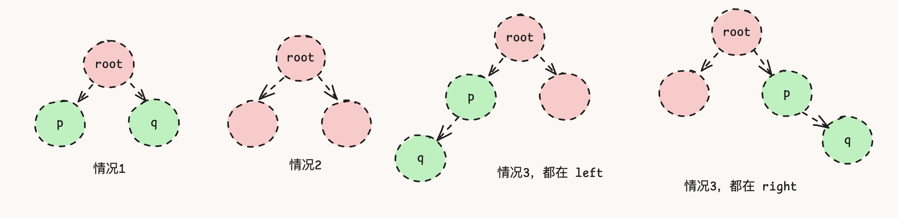

```java
class Solution {
    public TreeNode lowestCommonAncestor(TreeNode root, TreeNode p, TreeNode q) {
        if(root == null || root == p || root == q) return root;

        TreeNode left = lowestCommonAncestor(root.left, p, q);
        TreeNode right = lowestCommonAncestor(root.right, p, q);
        if(left == null) return right;
        if(right == null) return left;
        return root;
    }
}
```


## [141.环形链表](https://leetcode.cn/problems/linked-list-cycle/)

给你一个链表的头节点 `head` ，判断链表中是否有环。

如果链表中有某个节点，可以通过连续跟踪 `next` 指针再次到达，则链表中存在环。 为了表示给定链表中的环，评测系统内部使用整数 `pos` 来表示链表尾连接到链表中的位置（索引从 0 开始）。**注意：`pos` 不作为参数进行传递** 。仅仅是为了标识链表的实际情况。

*如果链表中存在环* ，则返回 `true` 。 否则，返回 `false` 。

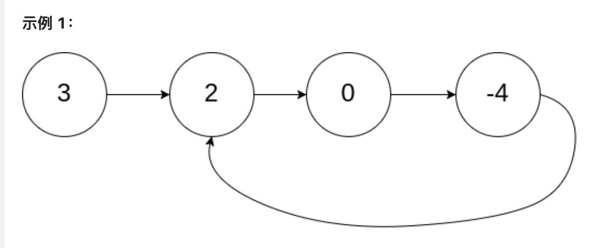

思路：

- **快慢指针法**：使用两个指针（`slow`和`fast`），`slow`每次移动一步，`fast`每次移动两步。
- **环检测**：如果链表存在环，`fast`最终会追上`slow`（即`slow == fast`），返回`true`；否则`fast`会先到达链表末尾，返回`false`。

```java
public class Solution {
    public boolean hasCycle(ListNode head) {
        ListNode slow = head, fast = head;
        while(fast != null && fast.next != null) {
            slow = slow.next;
            fast = fast.next.next;
            if(slow == fast) return true;
        }
        return false;
    }
}
```


## [92.反转链表 II](https://leetcode.cn/problems/reverse-linked-list-ii/)

给你单链表的头指针 `head` 和两个整数 `left` 和 `right` ，其中 `left <= right` 。请你反转从位置 `left` 到位置 `right` 的链表节点，返回 **反转后的链表** 。

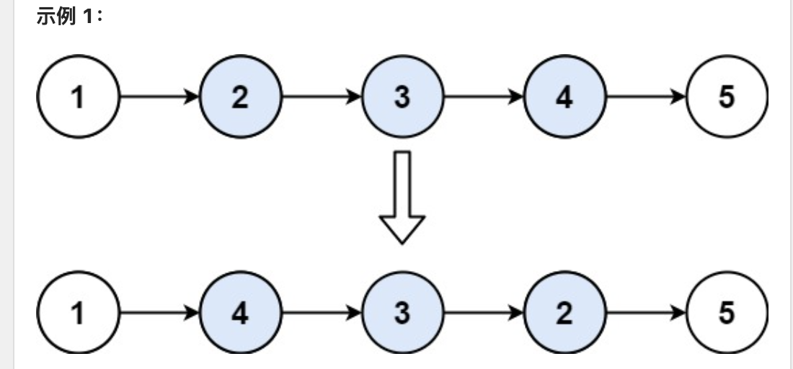

思路：

- 递归解法：

  迭代解法很简单，用一个 for 循环即可，但这道题经常用来考察递归思维，让你用纯递归的形式来解决。

  要想真正理解递归操作链表的代码思路，关键点还是要明确递归函数的定义，推导出递归翻转前 `N` 个节点的算法，最后改写出递归翻转区间内的节点的解法代码

  

  ```java
  class Solution {
      private ListNode nextNode = null;
  
      public ListNode reverseBetween(ListNode head, int left, int right) {
          if (left == 1) {
              return reverseN(head, right);
          }
          head.next = reverseBetween(head.next, left - 1, right - 1);
          return head;
      }
  
      private ListNode reverseN(ListNode head, int n) {
          if (n == 1) {
              nextNode = head.next; // 保存反转部分之后的链表
              return head;
          }
          ListNode last = reverseN(head.next, n - 1);
          head.next.next = head;
          head.next = nextNode; // 连接剩余部分
          return last;
      }
  }
  ```

  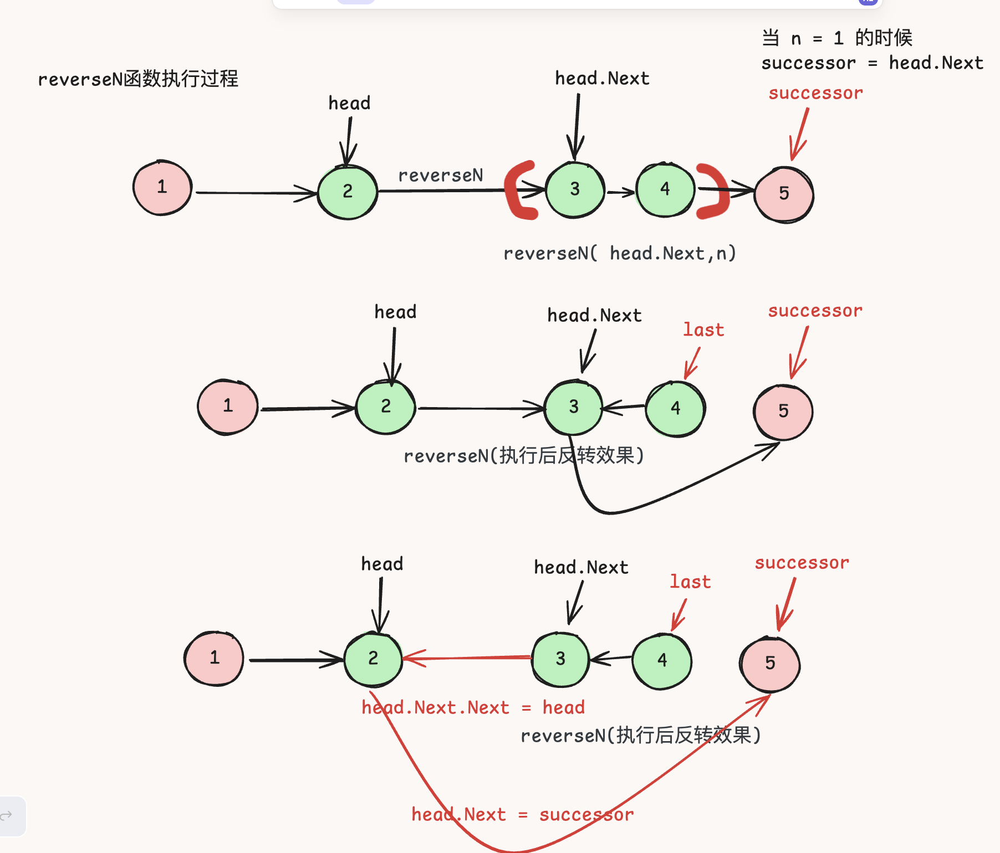

- 迭代解法：

  > dummy 定义虚拟节点
  >
  > 遍历整个链表，cur指向正在访问的节点，i 记录指向的节点是第几个。如果cur指向的节点不是要反转的节点，不断的追加到p.Next同时p也不断的移动
  >
  > 如果cur指向的节点是要反转的节点，不断的追加到p.Next同时p 不移动
  >
  > leftNode 用来记录第一个反转的节点（因为反转后，第一个节点，变成反转后的最后一个节点），如上中的节点2，变成反转后最后一个节点

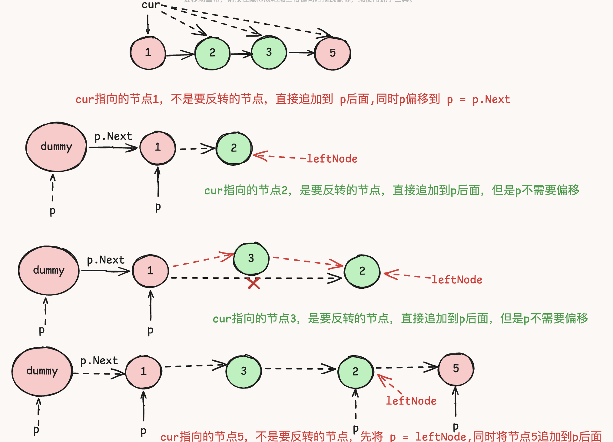

```java
class Solution {
    public ListNode reverseBetween(ListNode head, int left, int right) {
        ListNode dummy = new ListNode(0, head);
        ListNode p0 = dummy;
        for (int i = 0; i < left - 1; i++) p0 = p0.next;

        ListNode cur = p0.next, pre = null;
        for (int i = 0; i < right - left + 1; i++) {
            ListNode temp = cur.next;
            cur.next = pre;
            pre = cur;
            cur = temp;
        }

        p0.next.next = cur;
        p0.next = pre;
        return dummy.next;
    }
}

```


## [54.螺旋矩阵](https://leetcode.cn/problems/spiral-matrix/)

给你一个 `m` 行 `n` 列的矩阵 `matrix` ，请按照 **顺时针螺旋顺序** ，返回矩阵中的所有元素。

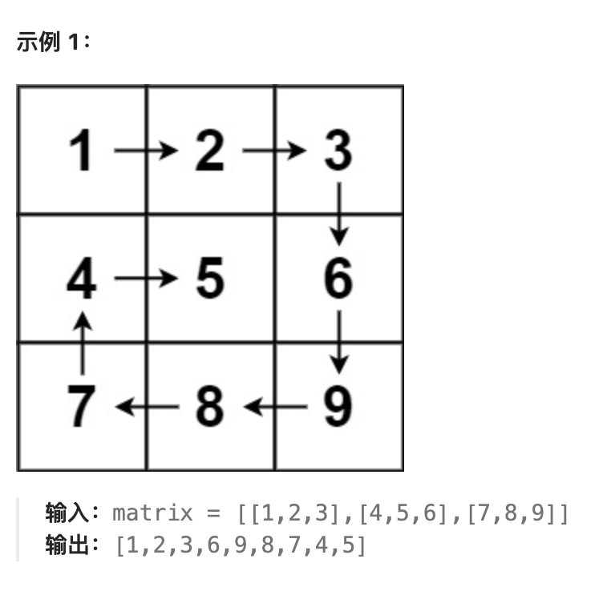

思路：

- **边界控制**：使用四个指针（`top`, `bottom`, `left`, `right`）动态缩小遍历范围，每次完成一行或一列后调整对应边界。
- **方向顺序**：按“右→下→左→上”的固定螺旋顺序遍历，每次完成一个方向后检查边界是否越界，若越界则终止循环。

```java
class Solution {
    public List<Integer> spiralOrder(int[][] matrix) {
        List<Integer> ans = new ArrayList<>();
        int top = 0, bottom = matrix.length - 1, left = 0, right = matrix[0].length - 1;
        while(true) {
            for(int i = left; i <= right; i++) ans.add(matrix[top][i]);
            if(++top > bottom) break;

            for(int i = top; i <= bottom; i++) ans.add(matrix[i][right]);
            if(--right < left) break;

            for(int i = right; i >= left; i--) ans.add(matrix[bottom][i]);
            if(--bottom < top) break;

            for(int i = bottom; i >= top; i--) ans.add(matrix[i][left]);
            if(++left > right) break;
        }
        return ans;
    }
}
```


## [300.最长递增子序列](https://leetcode.cn/problems/longest-increasing-subsequence)

给你一个整数数组 `nums` ，找到其中最长严格递增子序列的长度。

**子序列** 是由数组派生而来的序列，删除（或不删除）数组中的元素而不改变其余元素的顺序。例如，`[3,6,2,7]` 是数组 `[0,3,1,6,2,2,7]` 的子序列

思路：

- **动态维护递增子序列**：使用数组 `dp` 动态记录当前找到的最长递增子序列的末尾元素，`len` 表示当前子序列的长度。

- **二分查找优化插入位置**：对于每个新元素 `nums[i]`，通过二分查找在 `dp` 中找到第一个不小于它的位置 `idx`，替换该位置的值以保持 `dp` 的递增性。
- **动态扩展子序列长度**：如果 `idx` 等于当前长度 `len`，说明找到了更长的子序列，直接扩展 `len`。

```java
class Solution {
    public int lengthOfLIS(int[] nums) {
        int[] dp = new int[nums.length];
        int len = 0;
        for(int i = 0; i < nums.length; i++) {
            int idx = findTarget(dp, len, nums[i]);
            dp[idx] = nums[i];

            if(idx == len) len++;
        }
        return len;
    }

    private int findTarget(int[] dp, int len, int target) {
        int left = 0, right = len - 1;
        while(left <= right) {
            int mid = left + (right - left) / 2;
            if(dp[mid] >= target) {
                right = mid - 1;
            } else {
                left = mid + 1;
            }
        }
        return left;
    }
}
```


## [23.合并K个升序链表](https://leetcode.cn/problems/merge-k-sorted-lists/)

给你一个链表数组，每个链表都已经按升序排列。请你将所有链表合并到一个升序链表中，返回合并后的链表。

思路：

- **分治合并策略**：将 `k` 个链表两两合并，逐步减少链表数量，直到只剩一个链表。
- **递归合并两个链表**：`merge2List` 方法递归地比较两个链表的节点值，按升序合并。
- **迭代优化合并过程**：通过循环和索引 `idx` 控制合并轮次，避免重复创建新数组，提升效率。

```java
class Solution {
    public ListNode mergeKLists(ListNode[] lists) {
        if(lists.length < 1) return null;
        int len = lists.length;
        while(len > 1) {
            int idx = 0;
            for (int i = 0; i < len; i+=2) {
                if(i == len - 1) {
                    lists[idx++] = lists[i];
                    break;
                }

                lists[idx++] = merge2List(lists[i], lists[i + 1]);
            }
            len = idx;
        }
        return lists[0];
    }

    private ListNode merge2List(ListNode l1, ListNode l2) {
        if(l1 == null) return l2;
        if(l2 == null) return l1;
        if(l1.val < l2.val) {
            l1.next = merge2List(l1.next, l2);
            return l1;
        } else {
            l2.next = merge2List(l1, l2.next);
            return l2;
        }
    }
}
```


## [143.重排链表](https://leetcode.cn/problems/reorder-list/)

给定一个单链表 `L` 的头节点 `head` ，单链表 `L` 表示为：

```
L0 → L1 → … → Ln - 1 → Ln
```

请将其重新排列后变为：

```
L0 → Ln → L1 → Ln - 1 → L2 → Ln - 2 → …
```

不能只是单纯的改变节点内部的值，而是需要实际的进行节点交换。

思路：

- **快慢指针找中点**：使用快慢指针定位链表中点，将链表分为前后两部分。
- **反转后半部分链表**：将后半部分链表反转，便于后续交叉合并。
- **交叉合并链表**：交替连接前半部分和反转后的后半部分节点，完成重排。

```java
class Solution {
    public void reorderList(ListNode head1) {
        ListNode mid = findMid(head1);
        ListNode head2 = reverse(mid);
        while(head2.next != null) {
            ListNode temp1 = head1.next;
            ListNode temp2 = head2.next;
            head1.next = head2;
            head2.next = temp1;
            head1 = temp1;
            head2 = temp2;
        }
    }

    private ListNode findMid(ListNode head) {
        ListNode slow = head, fast = head;
        while(fast != null && fast.next != null) {
            slow = slow.next;
            fast = fast.next.next;
        }
        return slow;
    }

    private ListNode reverse(ListNode head) {
        ListNode cur = head, pre = null;
        while(cur != null) {
            ListNode temp = cur.next;
            cur.next = pre;
            pre = cur;
            cur = temp;
        }
        return pre;
    }
}
```


## [415.字符串相加](https://leetcode.cn/problems/add-strings/)

给定两个字符串形式的非负整数 `num1` 和`num2` ，计算它们的和并同样以字符串形式返回。

你不能使用任何內建的用于处理大整数的库（比如 `BigInteger`）， 也不能直接将输入的字符串转换为整数形式。

思路：

- **从低位到高位逐位相加**：从字符串末尾开始遍历，模拟手工加法过程。
- **处理进位**：计算当前位的和及进位值，将当前位结果存入StringBuilder。
- **反转结果字符串**：由于是从低位开始计算，最后需要反转字符串得到正确结果。

```java
class Solution {
    public String addStrings(String num1, String num2) {
        StringBuilder ans= new StringBuilder();
        int i = num1.length() - 1, j = num2.length() - 1;
        int carry = 0;
        while(i >= 0 || j >= 0) {
            int n1 = i >= 0 ? num1.charAt(i--) - '0' : 0;
            int n2 = j >= 0 ? num2.charAt(j--) - '0' : 0;
            int val = n1 + n2 + carry;
            carry = val / 10;
            ans.append(val % 10);
        }
        if(carry == 1) ans.append(1);
        return ans.reverse().toString();
    }
}
```


## [160.相交链表](https://leetcode.cn/problems/intersection-of-two-linked-lists/)

给你两个单链表的头节点 `headA` 和 `headB` ，请你找出并返回两个单链表相交的起始节点。如果两个链表不存在相交节点，返回`null`。

图示两个链表在节点 `c1` 开始相交**：**

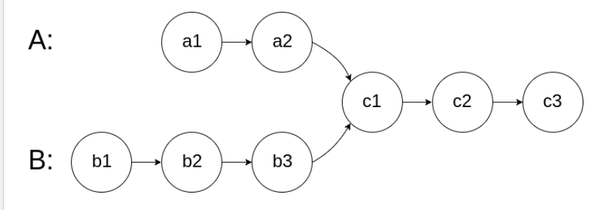

题目数据 **保证** 整个链式结构中不存在环。

**注意**，函数返回结果后，链表必须 **保持其原始结构** 

思路：

- **解决这个问题的关键是，通过某些方式，让 `p1` 和 `p2` 能够同时到达相交节点 `c1`。**
- 如果用两个指针 `p1` 和 `p2` 分别在两条链表上前进，我们可以让 `p1` 遍历完链表 `A` 之后开始遍历链表 `B`，让 `p2` 遍历完链表 `B` 之后开始遍历链表 `A`，这样相当于「逻辑上」两条链表接在了一起。
- 如果这样进行拼接，就可以让 `p1` 和 `p2` 同时进入公共部分，也就是同时到达相交节点 `c1`：

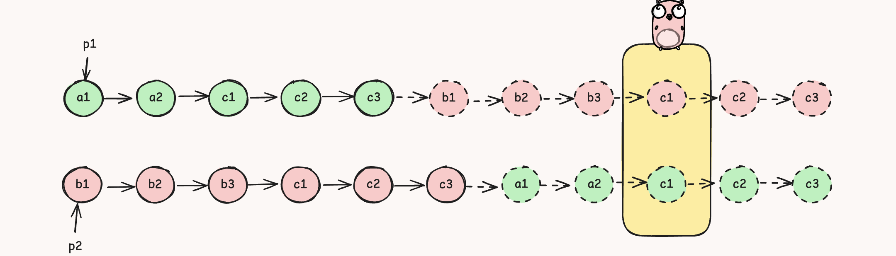

```java
public class Solution {
    public ListNode getIntersectionNode(ListNode headA, ListNode headB) {
        ListNode pa = headA, pb = headB;
        while(pa != pb) {
            pa = pa != null ? pa.next : headB;
            pb = pb != null ? pb.next : headA;
        }
        return pa;
    }
}
```


## [56.合并区间](https://leetcode.cn/problems/merge-intervals/)

以数组 `intervals` 表示若干个区间的集合，其中单个区间为 `intervals[i] = [start, end]` 。请你合并所有重叠的区间，并返回 *一个不重叠的区间数组，该数组需恰好覆盖输入中的所有区间* 。

思路：

- **按起始点排序**：首先对所有区间按照起始点进行升序排序，确保后续合并操作有序进行。
- **遍历合并区间**：初始化结果列表，遍历每个区间，若当前区间与结果列表最后一个区间重叠，则合并；否则直接加入结果列表。
- **返回结果数组**：将结果列表转换为二维数组并返回。

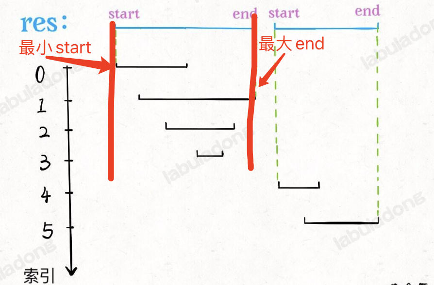

```java
class Solution {
    public int[][] merge(int[][] intervals) {
        Arrays.sort(intervals, (p, q) -> p[0] - q[0]);
        List<int[]> ans = new ArrayList<>();
        for(int[] p : intervals) {
            int m = ans.size();
            if(m > 0 && ans.get(m-1)[1] >= p[0]) {
                ans.get(m-1)[1] = Math.max(ans.get(m-1)[1], p[1]);
            } else {
                ans.add(p);
            }
        }
        return ans.toArray(new int[ans.size()][]);
    }
}
```


## [42.接雨水](https://leetcode.cn/problems/trapping-rain-water/)

给定 `n` 个非负整数表示每个宽度为 `1` 的柱子的高度图，计算按此排列的柱子，下雨之后能接多少雨水。

思路：

- **双指针法**：使用左右指针分别从数组两端向中间遍历，动态维护左右最大值。
- **比较左右最大值**：每次移动较小最大值对应的指针，计算当前位置可接雨水量（当前最大值 - 当前高度）。
- 对于任意一个位置 `i`，能够装的水为：

```java
water[i] = 		// 左右两边的最高值的最小值 -  height[i]
							min(
  						// 0到i的最高值
  						max(height[0..i]) , 
  						// i 到 end的最高值
  						max(height[i..end])  )   - height[i]
```

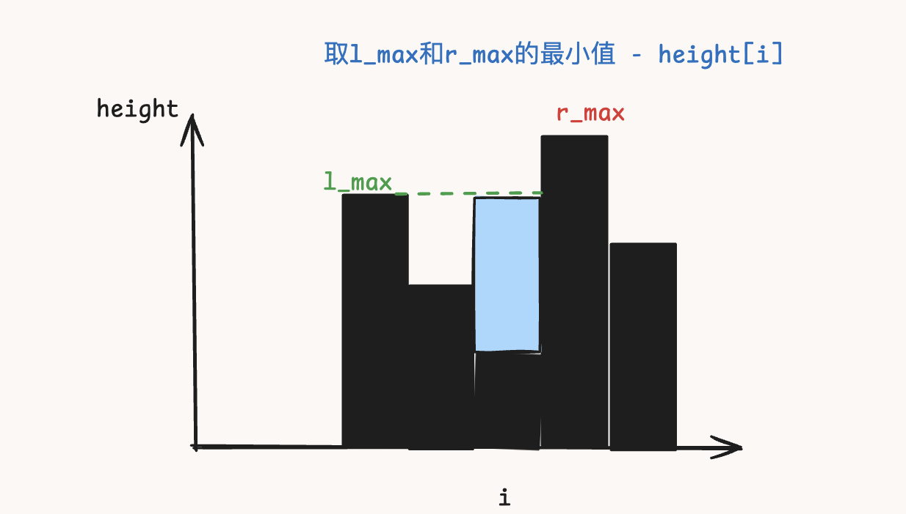

```java
class Solution {
    public int trap(int[] height) {
        int ans = 0;
        int preMax = 0;
        int sufMax = 0;
        int i = 0, j = height.length - 1;
        while(i <= j) {
            preMax = Math.max(preMax, height[i]);
            sufMax = Math.max(sufMax, height[j]);
            if(preMax < sufMax) {
                ans += preMax - height[i++];
            } else {
                ans += sufMax - height[j--];
            }
        }
        return ans;
    }
}
```


## [72. 编辑距离](https://leetcode.cn/problems/edit-distance/)

给你两个单词 `word1` 和 `word2`， *请返回将 `word1` 转换成 `word2` 所使用的最少操作数* 。

你可以对一个单词进行如下三种操作：

- 插入一个字符
- 删除一个字符
- 替换一个字符

思路：

- 解决两个字符串的动态规划问题，一般都是用两个指针 `i, j` 分别指向两个字符串的最后，然后一步步往前走，缩小问题的规模。
- **动态规划表初始化**：创建`(n+1)×(m+1)`的DP表，初始化第一行和第一列为编辑距离（全部插入或删除操作）。
- **状态转移计算**：
  - 字符相等时直接继承左上角值（无需操作）
  - 字符不等时取左/上/左上三个方向的最小值+1（对应插入/删除/替换操作）
- **返回最终结果**：DP表右下角的值即为两个字符串的最小编辑距离。


对于每对字符 `s1[i]` 和 `s2[j]`，可以有四种操作：

```
if s1[i] == s2[j]:
    啥都别做（skip）
    i, j 同时向前移动
else:
    三选一：
        插入（insert）
        删除（delete）
        替换（replace）
```

- `dp`数组定义： `i`和`j`表示字符串长度，`dp[i][j]`表示最小操作数

- 递推关系： `i`和`j`表示字符串长度， `i-1` 和 `j-1`才表示最后一个字符的索引

  ```java
  if word1[i-1] == word2[j-1] {
  	dp[i][j] = dp[i-1][j-1] //不需要操作
  } else {
    dp[i-1][j] // i删除 j不变
    dp[i][j-1] // i不变，在i后面新增一个元素和j相同(也可以理解为 i不变，删除j)
    dp[i-1][j-1] // i和j同时replace为同一个元素
    
    dp[i][j] = min( dp[i-1][j]+1, dp[i][j-1]+1, dp[i-1][j-1]+1 )
  }
  ```

代码实现：

```java
class Solution {
    public int minDistance(String word1, String word2) {
        int n = word1.length(), m = word2.length();
        int[][] dp = new int[n+1][m+1];
        for(int i = 0; i <= n; i++) dp[i][0] = i;
        for(int j = 0; j <= m; j++) dp[0][j] = j;

        for(int i = 1; i <= n; i++) {
            for(int j = 1; j <= m; j++) {
                if(word1.charAt(i-1) == word2.charAt(j-1)) {
                    dp[i][j] = dp[i-1][j-1];
                } else {
                    dp[i][j] = Math.min(Math.min(dp[i-1][j], dp[i][j-1]), dp[i-1][j-1]) + 1;
                }
            }
        }
        return dp[n][m];
    }
}
```


## [124. 二叉树中的最大路经和](https://leetcode.cn/problems/binary-tree-maximum-path-sum)

二叉树中的 **路径** 被定义为一条节点序列，序列中每对相邻节点之间都存在一条边。同一个节点在一条路径序列中 **至多出现一次** 。该路径 **至少包含一个** 节点，且不一定经过根节点。

**路径和** 是路径中各节点值的总和。给你一个二叉树的根节点 `root` ，返回其 **最大路径和** 。

思路：

- **后序遍历计算子树贡献**：通过深度优先搜索（DFS）后序遍历二叉树，计算每个节点的左右子树的最大路径和。
- **更新全局最大值**：在遍历过程中，计算当前节点作为路径转折点时的路径和（左+右+当前节点值），并更新全局最大值`ans`。
- **返回单边最大贡献值**：每个节点返回其左右子树中较大的贡献值加上当前节点值（若为负则取0），供父节点计算使用。

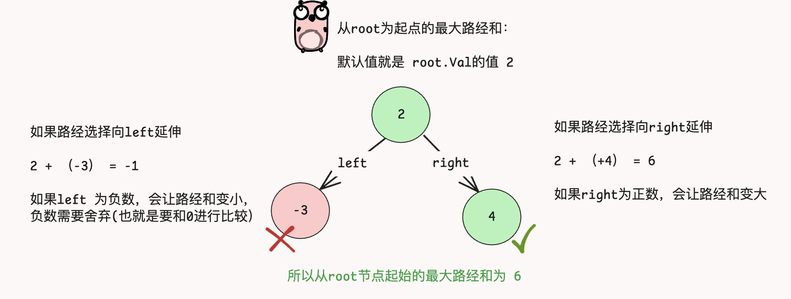

-   但是题目要求的是：【经过root】的最大路径和，注意和上面的区别，一个是从 root出发，题目要求的是经过 root 。

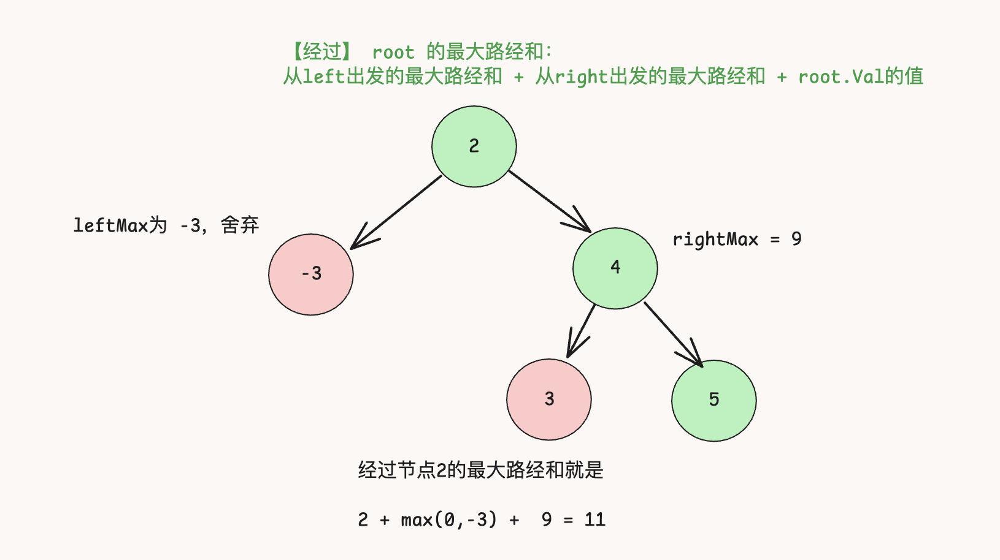

```java
class Solution {
    private int ans = Integer.MIN_VALUE;

    public int maxPathSum(TreeNode root) {
        dfs(root);
        return ans;
    }

    private int dfs(TreeNode root) {
        if(root == null) return 0;

        int leftMax = dfs(root.left);
        int rightMax = dfs(root.right);
        ans = Math.max(ans, leftMax + rightMax + root.val);
        return Math.max(0, Math.max(leftMax, rightMax) + root.val);
    }
}
```


## [142.环形链表 II](https://leetcode.cn/problems/linked-list-cycle-ii/)

给定一个链表的头节点  `head` ，返回链表开始入环的第一个节点。 *如果链表无环，则返回 `null`。*

如果链表中有某个节点，可以通过连续跟踪 `next` 指针再次到达，则链表中存在环。 为了表示给定链表中的环，评测系统内部使用整数 `pos` 来表示链表尾连接到链表中的位置（**索引从 0 开始**）。如果 `pos` 是 `-1`，则在该链表中没有环。**注意：`pos` 不作为参数进行传递**，仅仅是为了标识链表的实际情况。

**不允许修改** 链表。


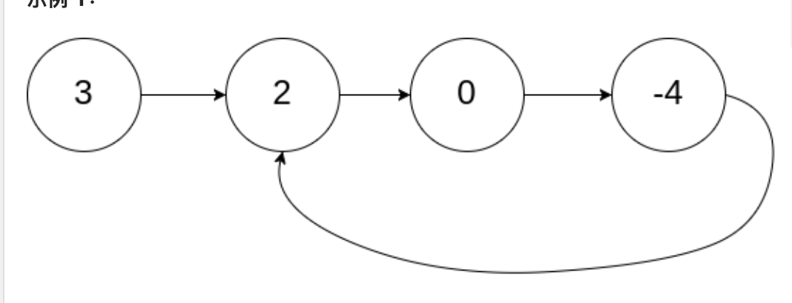

思路：

我们假设快慢指针相遇时，慢指针 `slow` 走了 `k` 步，那么快指针 `fast` 一定走了 `2k` 步：

因为 `fast` 一次跳跃距离为`2` ，`slow` 一次跳跃距离为 `1`

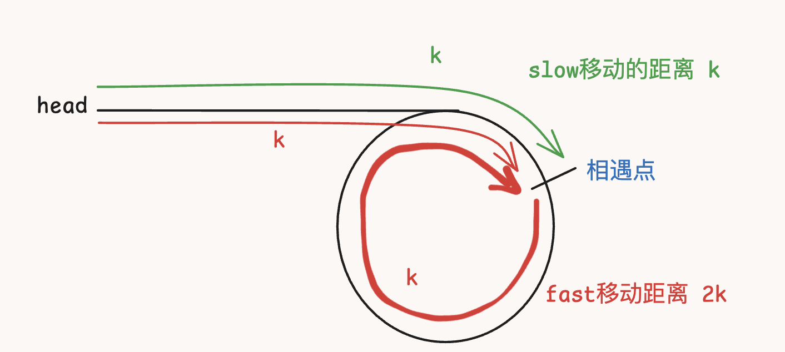

假设【相遇点】距环【相交点】的距离为 `m`，那么结合下图的 `slow` 指针，环的【相交点】距头结点 `head` 的距离为 `k - m`，也就是说如果从 `head` 前进 `k - m` 步就能到达环起点。

巧的是，如果从【相遇点】继续前进 `k - m` 步，也恰好到达环【相交点】：

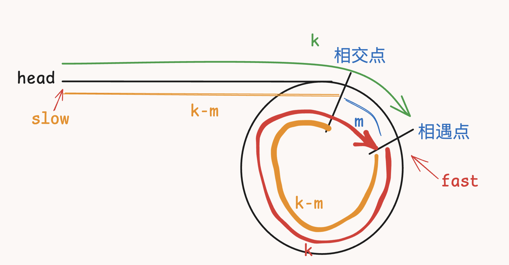

所以，只要我们把快慢指针中的任一个重新指向 `head`，然后两个指针同速前进，`k - m` 步后一定会相遇，相遇之处就是环的起点了。

```java
public class Solution {
    public ListNode detectCycle(ListNode head) {
        ListNode slow = head, fast = head;
        while(fast != null && fast.next != null) {
            slow = slow.next;
            fast = fast.next.next;
            if(slow == fast) {
                while (head != fast) {
                    head = head.next;
                    fast = fast.next;
                }
                return head;
            }
        }
        return null;
    }
}
```


## [93.复原IP地址](https://leetcode.cn/problems/restore-ip-addresses/)

**有效 IP 地址** 正好由四个整数（每个整数位于 `0` 到 `255` 之间组成，且不能含有前导 `0`），整数之间用 `'.'` 分隔。

- 例如：`"0.1.2.201"` 和` "192.168.1.1"` 是 **有效** IP 地址，但是 `"0.011.255.245"`、`"192.168.1.312"` 和 `"192.168@1.1"` 是 **无效** IP 地址。

给定一个只包含数字的字符串 `s` ，用以表示一个 IP 地址，返回所有可能的**有效 IP 地址**，这些地址可以通过在 `s` 中插入 `'.'` 来形成。你 **不能** 重新排序或删除 `s` 中的任何数字。你可以按 **任何** 顺序返回答案。

思路：

- **回溯法生成IP段**：通过深度优先搜索（DFS）递归生成所有可能的IP地址段组合。
- **剪枝优化**：
  - 当剩余字符不足或超过剩余段数时终止搜索
  - 跳过以0开头且长度大于1的无效段（如"012"）
  - 过滤数值超过255的无效段
- **结果拼接**：当生成4个有效段且用完所有字符时，将路径拼接为IP地址加入结果列表。

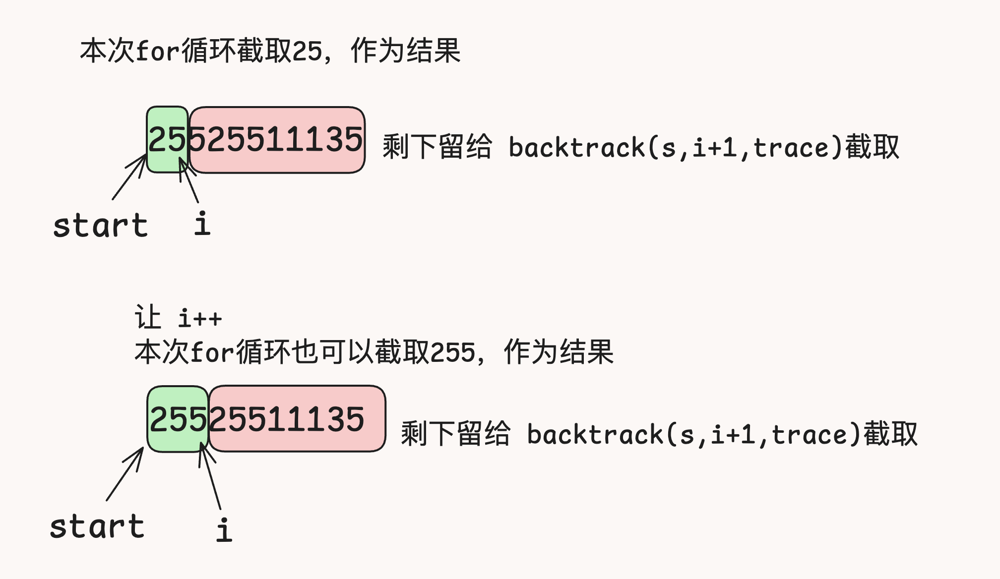

```java
class Solution {

    List<String> ans = new ArrayList<>();
    List<String> path = new ArrayList<>();

    public List<String> restoreIpAddresses(String s) {
        dfs(s, 0, 4);
        return ans;
    }

    private void dfs(String s, int i, int k) {
       if(k == 0) {
           if(i == s.length()) ans.add(String.join(".", path));
           return;
       }

       for(int j = i; j < s.length() && j < i + 3; j++) {
           if(s.charAt(i) == '0' && j > i) return;
           int val = Integer.parseInt(s.substring(i, j + 1));
           if(val <= 255) {
               path.add(s.substring(i, j + 1));
               dfs(s, j + 1, k - 1);
               path.remove(path.size() - 1);
           }
       }
    }
}

```


## [19.删除链表的倒数第N个结点](https://leetcode.cn/problems/remove-nth-node-from-end-of-list/)

给你一个链表，删除链表的倒数第 `n` 个结点，并且返回链表的头结点。

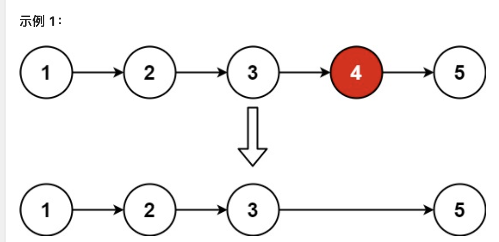

思路：

要删除倒数第 `n` 个节点，就得获得倒数第 `n + 1` 个节点的引用。

- 第一步，我们先让一个指针 `p1` 指向链表的头节点 `head`，然后走 `k` 步：

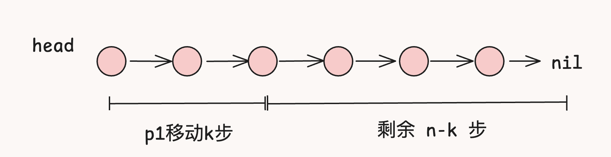

- 第二步，用一个指针 `p2` 指向链表头节点 `head`：

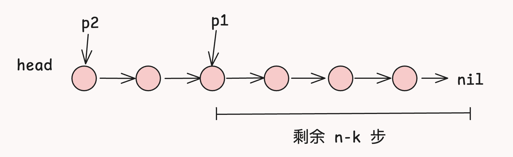

- 第三步，让 `p1` 和 `p2` 同时向前走，`p1` 走到链表末尾的空指针时走了 `n - k` 步，`p2` 也走了 `n - k` 步，也就是链表的倒数第 `k` 个节点：

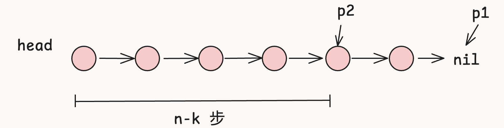

这样，只遍历了一次链表，就获得了倒数第 `k` 个节点 `p2`。

解法中在链表头部接一个虚拟节点 `dummy` 是为了避免删除倒数第一个元素时出现空指针异常，在头部加入 `dummy` 节点并不影响尾部倒数第 `k` 个元素是什么。

```java
class Solution {
    public ListNode removeNthFromEnd(ListNode head, int n) {
        ListNode dummy = new ListNode(0, head);
        ListNode fast = dummy, slow = dummy;
        for(int i = 0; i < n; i++) fast = fast.next;
        while(fast != null && fast.next != null) {
            slow = slow.next;
            fast = fast.next;
        }
        slow.next = slow.next.next;
        return dummy.next;
    }
}
```


## [1143.最长公共子序列](https://leetcode.cn/problems/longest-common-subsequence/)

给定两个字符串 `text1` 和 `text2`，返回这两个字符串的最长 **公共子序列** 的长度。如果不存在 **公共子序列** ，返回 `0` 。

一个字符串的 **子序列** 是指这样一个新的字符串：它是由原字符串在不改变字符的相对顺序的情况下删除某些字符（也可以不删除任何字符）后组成的新字符串。

- 例如，`"ace"` 是 `"abcde"` 的子序列，但 `"aec"` 不是 `"abcde"` 的子序列。

两个字符串的 **公共子序列** 是这两个字符串所共同拥有的子序列。

思路：

- 动态规划：和 [72. 编辑距离](https://leetcode.cn/problems/edit-distance) 同为经典的双字符串动态规划问题。

- `dp[i][j]`定义：表示`text1`中`[0,i-1]`长度为`i`字符串 和`text2`中`[0,j-1`]长度为`j`字符串，公共子序列的最长长度

- 递推关系：

  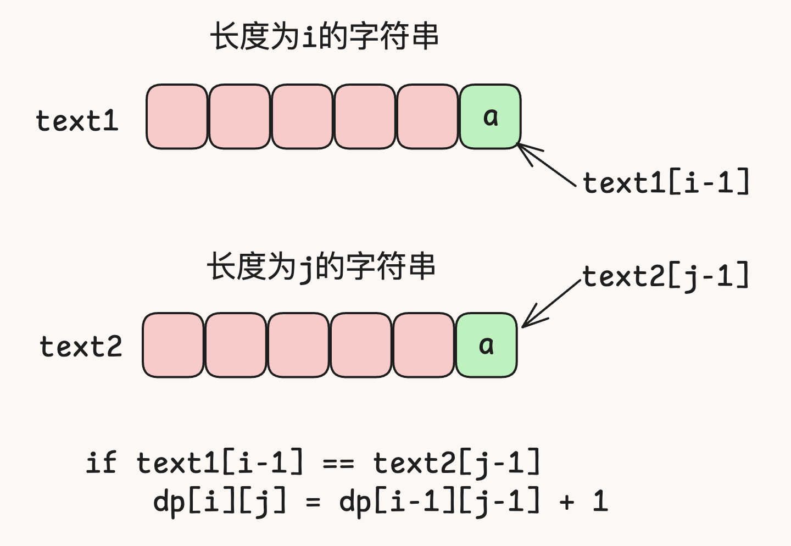

  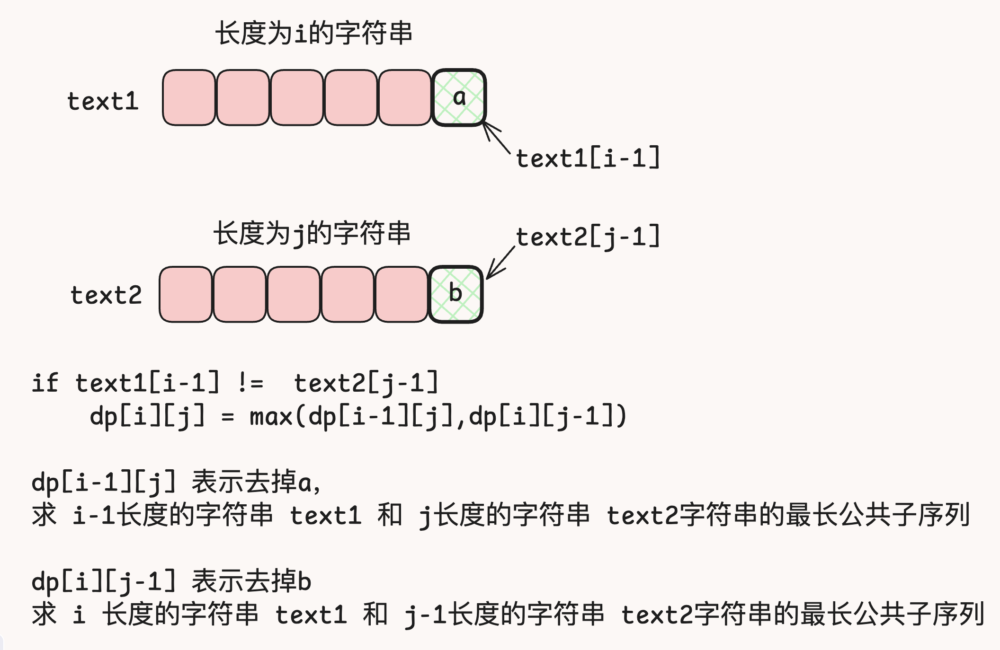

```java
class Solution {
    public int longestCommonSubsequence(String text1, String text2) {
        int n = text1.length(), m = text2.length();
        int[][] dp = new int[n + 1][m + 1];
        for (int i = 0; i < n; i++) {
            for (int j = 0; j < m; j++) {
                if(text1.charAt(i) == text2.charAt(j)) {
                    dp[i+1][j+1] = dp[i][j] + 1;
                } else {
                    dp[i+1][j+1] = Math.max(dp[i+1][j], dp[i][j+1]);
                }
            }
        }
        return dp[n][m];
    }
}
```


## [82.删除排序链表中的重复元素II](https://leetcode.cn/problems/remove-duplicates-from-sorted-list-ii/)

给定一个已排序的链表的头 `head` ， *删除原始链表中所有重复数字的节点，只留下不同的数字* 。返回 *已排序的链表* 。

思路：

- **虚拟头节点简化操作**：使用虚拟头节点`dummy`避免处理头节点可能被删除的特殊情况。
- **快慢指针遍历链表**：`cur`指针用于遍历链表，检查当前节点与下个节点的值是否相等。
- **删除重复节点**：当发现重复值时，跳过所有值相同的节点，直接连接到下一个不同值的节点。

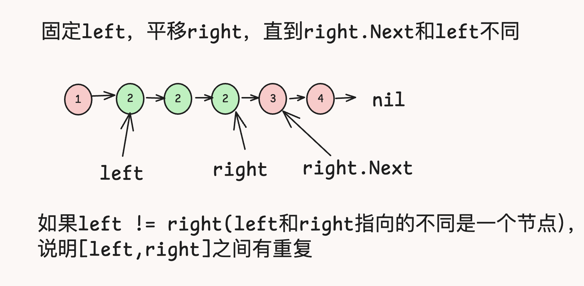

```java
class Solution {
    public ListNode deleteDuplicates(ListNode head) {
        ListNode dummy = new ListNode(0, head);
        ListNode cur = dummy;
        while(cur.next != null && cur.next.next != null) {
            if(cur.next.val == cur.next.next.val) {
                int deleteVal = cur.next.val;
                while(cur.next != null && cur.next.val == deleteVal) {
                    cur.next = cur.next.next;
                }
            } else {
                cur = cur.next;
            }
        }
        return dummy.next;
    }
}
```


## [4. 寻找两个正序数组的中位数](https://leetcode.cn/problems/median-of-two-sorted-arrays/)

给定两个大小分别为 `m` 和 `n` 的正序（从小到大）数组 `nums1` 和 `nums2`。请你找出并返回这两个正序数组的 **中位数** 。

思路：

- **分治法求第K小元素**：通过递归将两个有序数组合并问题转化为求第K小元素的问题。
- **二分查找优化**：
  - 每次比较两个数组的第k/2个元素，排除不可能包含第K小元素的部分
  - 递归处理剩余部分，减少搜索范围
- **处理奇偶长度**：根据合并后数组长度的奇偶性，分别计算中位数（奇数取中间值，偶数取中间两数平均值）

```java
class Solution {
    public double findMedianSortedArrays(int[] nums1, int[] nums2) {
        int n = nums1.length, m = nums2.length;
        int sum = n + m;
        if(sum % 2 == 1) {
            return (double) findKArrays(sum / 2 + 1, nums1, 0, n-1, nums2, 0, m-1);
        } else {
            return (double) (findKArrays(sum / 2 + 1, nums1, 0, n-1, nums2, 0, m-1) +
                    findKArrays(sum / 2, nums1, 0, n-1, nums2, 0, m-1)) / 2;
        }
    }

    private int findKArrays(int k, int[] num1, int start1, int end1, int[] num2, int start2, int end2) {
        if(start1 > end1) return num2[start2 + k - 1];
        if(start2 > end2) return num1[start1 + k - 1];
        if(k == 1) return Math.min(num1[start1], num2[start2]);

        int i1 = Math.min(start1 + k / 2 - 1, end1);
        int i2 = Math.min(start2 + k / 2 - 1, end2);

        if(num1[i1] < num2[i2]) {
            return findKArrays(k - (i1 - start1 + 1), num1, i1 + 1, end1, num2, start2, end2);
        } else {
            return findKArrays(k - (i2 - start2 + 1), num1, start1, end1, num2, i2 + 1, end2);
        }
    }
}
```


## [199.二叉树的右视图](https://leetcode.cn/problems/binary-tree-right-side-view/)

给定一个二叉树的 **根节点** `root`，想象自己站在它的右侧，按照从顶部到底部的顺序，返回从右侧所能看到的节点值。

思路：

- 上面出现了多次的层序遍历的题目，这个题目只是要得到每层的最右边的节点值
- **深度优先搜索（DFS）**：采用后序遍历方式（先右后左）访问二叉树节点。
- **记录最右节点**：当当前深度等于结果列表大小时，说明该节点是当前深度的最右可见节点，将其加入结果列表。
- **优先访问右子树**：通过先递归右子树再递归左子树的顺序，确保每次记录的都是当前深度的最右侧节点。

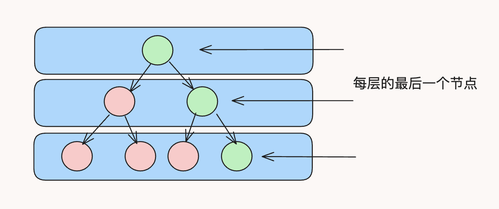

```java
class Solution {
    List<Integer> ans = new ArrayList<>();

    public List<Integer> rightSideView(TreeNode root) {
        dfs(root, 0);
        return ans;
    }

    private void dfs(TreeNode root, int depth) {
        if(root == null) return;

        if(depth == ans.size()) ans.add(root.val);
        dfs(root.right, depth + 1);
        dfs(root.left, depth + 1);
    }
}

```


## [94. 二叉树的中序遍历](https://leetcode.cn/problems/binary-tree-inorder-traversal/)

给定一个二叉树的根节点 `root` ，返回 *它的 **中序** 遍历* 。

思路：

中序遍历结果的特点是 `root.val` 在中间，左右子树在两侧：

```java
class Solution {
    List<Integer> ans = new ArrayList<>();

    public List<Integer> inorderTraversal(TreeNode root) {
        dfs(root);
        return ans;
    }

    private void dfs(TreeNode root) {
        if(root == null) return;

        dfs(root.left);
        ans.add(root.val);
        dfs(root.right);
    }
}
```

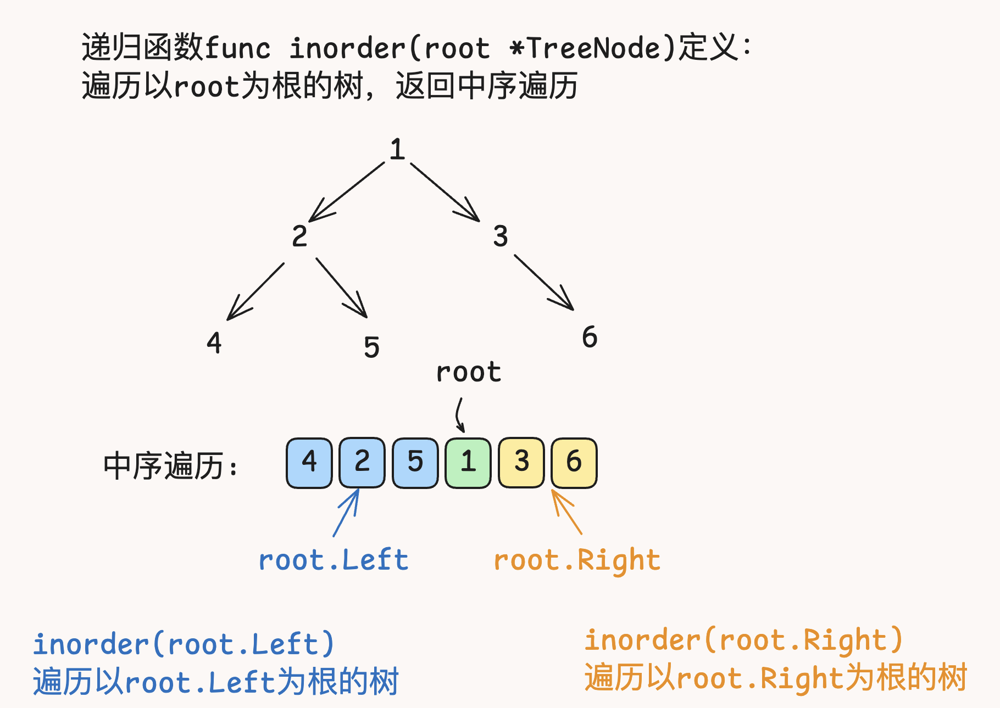


## [74.二分查找](https://leetcode.cn/problems/binary-search/)

给定一个 `n` 个元素有序的（升序）整型数组 `nums` 和一个目标值 `target` ，写一个函数搜索 `nums` 中的 `target`，如果目标值存在返回下标，否则返回 `-1`。

思路：

- **二分查找算法**：在有序数组中通过不断缩小搜索范围来查找目标值。
- **中间值比较**：
  - 若中间值大于目标值，则在左半部分继续查找
  - 若中间值小于目标值，则在右半部分继续查找
  - 若相等则直接返回当前索引
- **边界处理**：当搜索范围缩小到左边界超过右边界时，说明目标值不存在，返回-1。

```java
class Solution {
    public int search(int[] nums, int target) {
        int left = 0, right = nums.length - 1;
        while(left <= right) {
            int mid = left + (right - left) / 2;
            if(nums[mid] > target) {
                right = mid - 1;
            } else if (nums[mid] < target){
                left = mid + 1;
            } else {
                return mid;
            }
        }
        return -1;
    }
}
```


## [232.用栈实现队列](https://leetcode.cn/problems/implement-queue-using-stacks/)

请你仅使用两个栈实现先入先出队列。队列应当支持一般队列支持的所有操作（`push`、`pop`、`peek`、`empty`）：

实现 `MyQueue` 类：

- `void push(int x)` 将元素 x 推到队列的末尾
- `int pop()` 从队列的开头移除并返回元素
- `int peek()` 返回队列开头的元素
- `boolean empty()` 如果队列为空，返回 `true` ；否则，返回 `false`

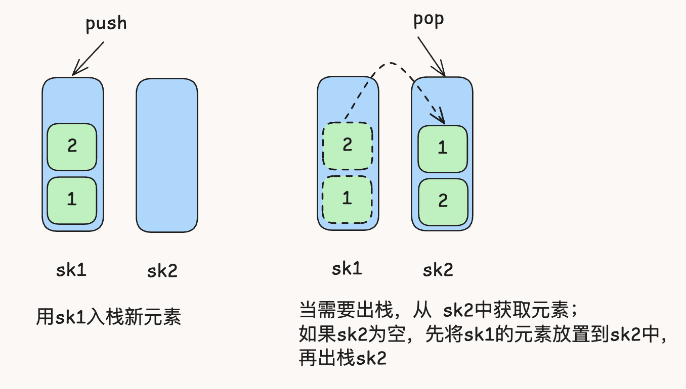

思路：

- **双栈模拟队列**：使用两个栈（inStack和outStack）来模拟队列的先进先出特性。
- **数据迁移机制**：
  - 入队时直接压入inStack
  - 出队或查看队首元素时，若outStack为空，则将inStack所有元素依次弹出并压入outStack
- **高效操作**：
  - 入队操作时间复杂度为O(1)
  - 出队和查看队首操作均摊时间复杂度为O(1)

```java
class MyQueue {

    Stack<Integer> inStack, outStack;

    public MyQueue() {
        inStack = new Stack<>();
        outStack = new Stack<>();
    }

    private void dumpStackIn() {
        if(!outStack.isEmpty()) return;
        while(!inStack.isEmpty()) {
            outStack.push(inStack.pop());
        }
    }
    
    public void push(int x) {
        inStack.push(x);
    }
    
    public int pop() {
        dumpStackIn();
        return outStack.pop();
    }
    
    public int peek() {
        dumpStackIn();
        return outStack.peek();
    }
    
    public boolean empty() {
        return inStack.isEmpty() && outStack.isEmpty();
    }
}
```


## [165. 比较版本号](https://leetcode.cn/problems/compare-version-numbers/description/)

给你两个 **版本号字符串** `version1` 和 `version2` ，请你比较它们。版本号由被点 `'.'` 分开的修订号组成。**修订号的值** 是它 **转换为整数** 并忽略前导零。

比较版本号时，请按 **从左到右的顺序** 依次比较它们的修订号。如果其中一个版本字符串的修订号较少，则将缺失的修订号视为 `0`。

返回规则如下：

- 如果 `version1 < version2` 返回 `-1`，
- 如果 `version1 > version2` 返回 `1`，
- 除此之外返回 `0`。

思路：

这是一个比较实用的题目，工作中也可能出现

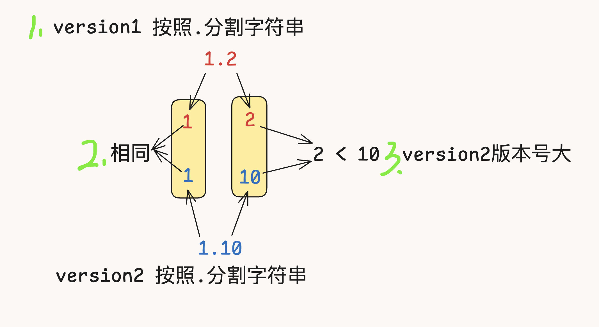

- **版本号分割**：使用`.`作为分隔符将两个版本号字符串分割成数字数组。
- **逐位比较**：
  - 从左到右依次比较每个数字段的整数值
  - 处理不同长度的版本号（自动补0比较）
- **返回比较结果**：
  - 遇到不相等数值立即返回比较结果（1或-1）
  - 全部相等则返回0

```java
class Solution {
    public int compareVersion(String version1, String version2) {
        String[] s1 = version1.split("\\."), s2 = version2.split("\\.");
        int n = s1.length, m = s2.length;
        int i = 0, j = 0;
        while(i < n || j < m) {
            int a = 0, b = 0;
            if(i < n) a = Integer.parseInt(s1[i++]);
            if(j < m) b = Integer.parseInt(s2[j++]);
            if(a != b) return a > b ? 1 : -1;
        }
        return 0;
    }
}
```


## [148. 排序链表](https://leetcode.cn/problems/sort-list/)

给你链表的头结点 `head` ，请将其按 **升序** 排列并返回 **排序后的链表** 。

思路：

- **分治递归**：将链表不断二分拆解为更小的子链表，直到子链表长度为1或0（天然有序）。
- **快慢指针找中点**：通过快慢指针定位中间节点，断开链表为左右两部分，保证分治的正确性。
- **归并合并**：递归合并两个已排序的子链表，通过比较节点值按顺序拼接成最终结果。

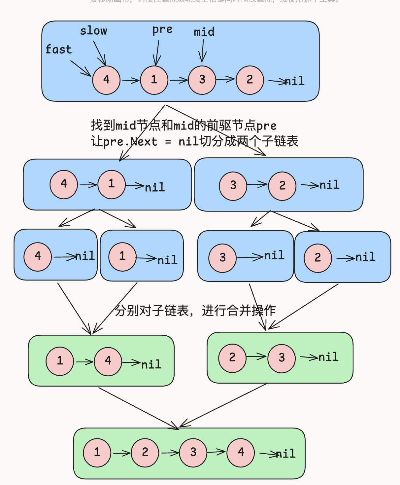

```java
class Solution {
    public ListNode sortList(ListNode head) {
        if(head == null || head.next == null) return head;
        ListNode mid = findMid(head);
        ListNode head1 = sortList(head);
        ListNode head2 = sortList(mid);
        return mergeList(head1, head2);
    }

    private ListNode findMid(ListNode head) {
        ListNode pre = null;
        ListNode slow = head, fast = head;
        while(fast != null && fast.next != null) {
            pre = slow;
            slow = slow.next;
            fast = fast.next.next;
        }
        pre.next = null;
        return slow;
    }

    private ListNode mergeList(ListNode l1, ListNode l2) {
        if(l1 == null) return l2;
        if(l2 == null) return l1;
        if(l1.val < l2.val) {
            l1.next = mergeList(l1.next, l2);
            return l1;
        } else {
            l2.next = mergeList(l1, l2.next);
            return l2;
        }
    }
}

```


## [31.下一个排列](https://leetcode.cn/problems/next-permutation/)

整数数组的一个 **排列** 就是将其所有成员以序列或线性顺序排列。

- 例如，`arr = [1,2,3]` ，以下这些都可以视作 `arr` 的排列：`[1,2,3]`、`[1,3,2]`、`[3,1,2]`、`[2,3,1]` 。

整数数组的 **下一个排列** 是指其整数的下一个字典序更大的排列。更正式地，如果数组的所有排列根据其字典顺序从小到大排列在一个容器中，那么数组的 **下一个排列** 就是在这个有序容器中排在它后面的那个排列。如果不存在下一个更大的排列，那么这个数组必须重排为字典序最小的排列（即，其元素按升序排列）。

- 例如，`arr = [1,2,3]` 的下一个排列是 `[1,3,2]` 。
- 类似地，`arr = [2,3,1]` 的下一个排列是 `[3,1,2]` 。
- 而 `arr = [3,2,1]` 的下一个排列是 `[1,2,3]` ，因为 `[3,2,1]` 不存在一个字典序更大的排列。

给你一个整数数组 `nums` ，找出 `nums` 的下一个排列。

必须**[ 原地 ](https://baike.baidu.com/item/原地算法)**修改，只允许使用额外常数空间。

思路：

以 `1,2,3,4,5,6` 为例，其排列依次为：

```java
123456
123465
123546
...
654321
```

可以看到有这样的关系：`123456 < 123465 < 123546 < ... < 654321`。

- 我们希望下一个数 比当前数大，这样才满足 “下一个排列” 的定义。因此只需要 将后面的「大数」与前面的「小数」交换，就能得到一个更大的数。比如 123456，将 5 和 6 交换就能得到一个更大的数 123465

- 我们还希望下一个数 增加的幅度尽可能的小，这样才满足“下一个排列与当前排列紧邻“的要求。为了满足这个要求，我们需要：

  - 在尽可能**靠右的低位**进行交换，需要**从后向前**查找

  - 将一个 尽可能小的「大数」 与前面的「小数」交换。比如 123465，下一个排列应该把 5 和 4 交换而不是把 6 和 4 交换
  - 将「大数」换到前面后，需要将「大数」后面的所有数 重置为升序，升序排列就是最小的排列。以 123465 为例：首先按照上一步，交换 5 和 4，得到 1235 64；然后需要将 5 之后的数重置为升序，得到 1235 46。显然 1235 46 比 1235 64 更小，123546 就是 123465 的下一个排列


这个就是推到下一个排列的基本规则

1. **从后向前寻找下降点**：找到第一个满足 `nums[i] < nums[i+1]` 的位置 `i`，确定需要调整的起始位置。
- **交换相邻更大元素**：在 `i` 之后的升序部分中，找到第一个大于 `nums[i]` 的元素 `nums[j]` 并交换，使序列尽可能小地增大。
- **反转后续升序部分**：将 `i+1` 到末尾的升序部分反转，使其变为降序，得到最小的下一个排列。

```java
class Solution {
    public void nextPermutation(int[] nums) {
        int i = nums.length - 2;
        // 找到第一个要下降的元素
        while(i >= 0 && nums[i] >= nums[i+1]) i--;

        if(i >= 0) {
            int j = nums.length - 1;
            // 找到第一个比 nums[i] 小的元素，没有就一直循环找
            while(j >= 0 && nums[j] <= nums[i]) j--;
            swap(nums, i, j);
        }

        int left = i + 1, right = nums.length - 1;
        while(left < right) swap(nums, left++, right--);
    }

    private void swap(int[] nums, int i, int j) {
        int temp = nums[i];
        nums[i] = nums[j];
        nums[j] = temp;
    }
}
```


## [22.括号生成](https://leetcode.cn/problems/generate-parentheses)

数字 `n` 代表生成括号的对数，请你设计一个函数，用于能够生成所有可能的并且 **有效的** 括号组合。

思路：

- 利用回溯算法，在每个位置选择【左括号】或者【右括号】，组成括号组合
- 为了减少不必要的穷举，我们要知道合法括号串有以下性质

  - **一个「合法」括号组合的左括号数量一定等于右括号数量，这个很好理解**。
  - **对于一个「合法」的括号字符串组合 `p`，必然对于任何 `0 <= i < len(p)` 都有：子串 `p[0..i]` 中左括号的数量都大于或等于右括号的数量**。

因为从左往右算的话，肯定是左括号多嘛，到最后左右括号数量相等，说明这个括号组合是合法的。


- **回溯法生成所有可能组合**：通过深度优先搜索（DFS）递归构建所有可能的括号组合。
- **剪枝优化**：当右括号数量超过左括号时直接返回，避免无效分支（`right > left` 时终止）。
- **逐步构建并回溯**：使用 `StringBuilder` 动态添加/删除括号字符，确保每次递归后恢复状态。

```java
class Solution {

    List<String> ans = new ArrayList<>();
    StringBuilder sb = new StringBuilder();

    public List<String> generateParenthesis(int n) {
        dfs(0, 0, n);
        return ans;
    }

    private void dfs(int left, int right, int n) {
        if(left == n && right == n) {
            ans.add(sb.toString());
            return;
        }

        if(right > left) return;
        if(left < n) {
            sb.append("(");
            dfs(left + 1, right, n);
            sb.deleteCharAt(sb.length() - 1);
        }
        if(right < n) {
            sb.append(")");
            dfs(left, right + 1, n);
            sb.deleteCharAt(sb.length() - 1);
        }
    }
}
```


## [69. x的平方根](https://leetcode.cn/problems/sqrtx/)

给你一个非负整数 `x` ，计算并返回 `x` 的 **算术平方根** 。由于返回类型是整数，结果只保留 **整数部分** ，小数部分将被 **舍去 。**

**注意：**不允许使用任何内置指数函数和算符，例如 `pow(x, 0.5)` 或者 `x ** 0.5` 。

思路：

- 这里其实是一道数学题。比如 求数字 `4` 的平方根，转换成求两个数的乘积，就是 `2*2=4`。
- **二分查找确定平方根范围**：在 `1` 到 `x` 的范围内使用二分查找，寻找满足 `mid² ≤ x` 的最大整数 `mid`。
- **避免溢出技巧**：使用 `x / mid` 替代 `mid * mid` 进行比较，防止整数溢出。
- **更新搜索边界**：若 `mid² ≤ x`，则尝试更大的值（`left = mid + 1`）；否则尝试更小的值（`right = mid - 1`），最终返回满足条件的最大 `mid`。

```java
class Solution {
    public int mySqrt(int x) {
        int left = 1, right = x;
        int ans = 0;
        while(left <= right) {
            int mid = (left + right) >>> 1;
            if(x / mid >= mid) {
                ans = mid;
                left = mid + 1;
            } else {
                right = mid - 1;
            }
        }
        return ans;
    }
}
```


## [239. 滑动窗口最大值](https://leetcode.cn/problems/sliding-window-maximum/)

给你一个整数数组 `nums`，有一个大小为 `k` 的滑动窗口从数组的最左侧移动到数组的最右侧。你只可以看到在滑动窗口内的 `k` 个数字。滑动窗口每次只向右移动一位。

返回 *滑动窗口中的最大值* 。

思路：

使用【队列】充当不断滑动的窗口，每次滑动记录【队列】的最大值：

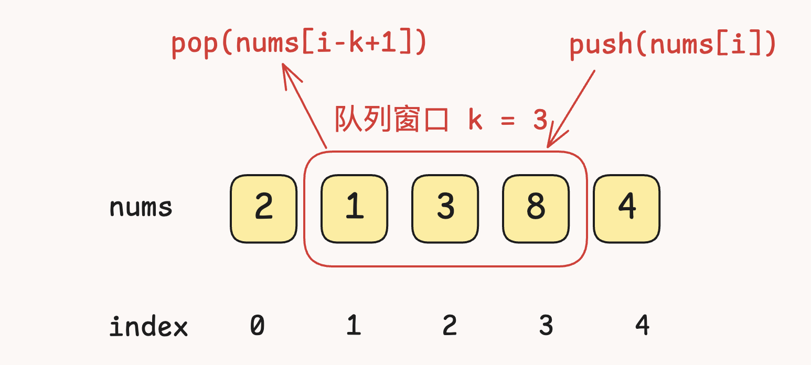

如何在 `O(1)` 时间计算最大值，只需要一个特殊的数据结构「单调队列」，`push` 方法依然在队尾添加元素，但是要把前面比自己小的元素都删掉，直到遇到更大的元素才停止删除。

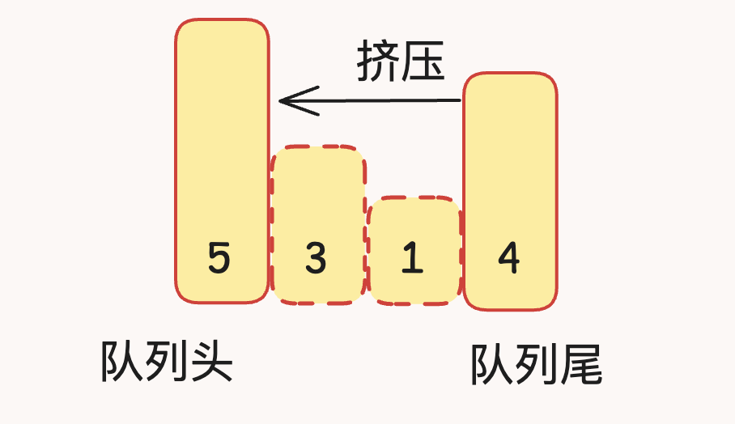

使用单调队列数据结构就能完成本题，队列头部元素就是最大值。

```java
class Solution {
    public int[] maxSlidingWindow(int[] nums, int k) {
        int n = nums.length;
        int[] ans = new int[n - k + 1];
        Deque<Integer> q = new ArrayDeque<>();
        for (int i = 0; i < n; i++) {
            while(!q.isEmpty() && nums[i] >= nums[q.getLast()]) {
                q.removeLast();
            }
            q.addLast(i);
            if(i - q.getFirst() >= k) {
                q.removeFirst();
            }
            if(i - k + 1 >= 0) {
                ans[i - k + 1] = nums[q.getFirst()];
            }
        }
        return ans;
    }
}
```


## [2. 两数相加](https://leetcode.cn/problems/add-two-numbers/)

给你两个 **非空** 的链表，表示两个非负的整数。它们每位数字都是按照 **逆序** 的方式存储的，并且每个节点只能存储 **一位** 数字。

请你将两个数相加，并以相同形式返回一个表示和的链表。你可以假设除了数字 0 之外，这两个数都不会以 0 开头。

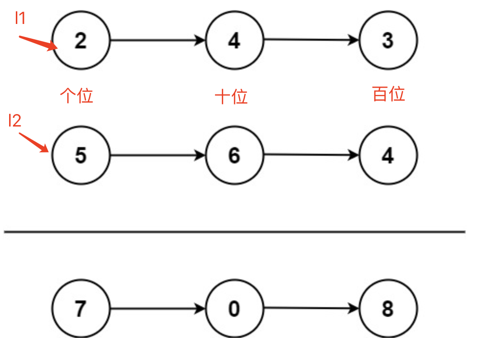

思路：

- **模拟手工加法**：从最低位开始逐位相加，处理进位（carry），直到两个链表都遍历完且没有进位剩余。

- **链表动态构建**：使用哑节点（dummy）简化结果链表的构建过程，直接在遍历过程中创建新节点。
- **统一处理不等长链表**：通过 `l1 != null || l2 != null || carry != 0` 条件，确保处理完所有位数和可能的最高位进位。

```java
class Solution {
    public ListNode addTwoNumbers(ListNode l1, ListNode l2) {
        ListNode dummy = new ListNode();
        ListNode cur = dummy;
        int carry = 0;
        while(l1 != null || l2 != null || carry != 0) {
            if(l1 != null) {
                carry += l1.val;
                l1 = l1.next;
            }
            if(l2 != null) {
                carry += l2.val;
                l2 = l2.next;
            }

            cur = cur.next = new ListNode(carry % 10);
            carry /= 10;
        }
        return dummy.next;
    }
}
```


## [8. 字符串转换整数](https://leetcode.cn/problems/string-to-integer-atoi/)

请你来实现一个 `myAtoi(string s)` 函数，使其能将字符串转换成一个 32 位有符号整数。

函数 `myAtoi(string s)` 的算法如下：

1. **空格：**读入字符串并丢弃无用的前导空格（`" "`）
2. **符号：**检查下一个字符（假设还未到字符末尾）为 `'-'` 还是 `'+'`。如果两者都不存在，则假定结果为正。
3. **转换：**通过跳过前置零来读取该整数，直到遇到非数字字符或到达字符串的结尾。如果没有读取数字，则结果为0。
4. **舍入：**如果整数数超过 32 位有符号整数范围 `[−231, 231 − 1]` ，需要截断这个整数，使其保持在这个范围内。具体来说，小于 `−231` 的整数应该被舍入为 `−231` ，大于 `231 − 1` 的整数应该被舍入为 `231 − 1` 。

返回整数作为最终结果。

思路：

- **预处理阶段**：
  - 跳过前导空格字符
  - 处理可选的正负号（默认为正）
- **数字转换阶段**：
  - 逐个字符检查是否为数字
  - 将有效数字转换为整数并累加
  - 实时检查溢出情况（超过Integer范围时立即返回边界值）

- **返回结果**：
  - 根据符号位返回最终结果
  - 自动处理溢出情况（返回Integer.MAX_VALUE或Integer.MIN_VALUE）

```java
class Solution {
    public int myAtoi(String s) {
        int len = s.length(), index = 0, sign = 1, ans = 0;

        // 空格
        while(index < len && s.charAt(index) == ' ') index++;

        // 符号位
        if(index < len) {
            if(s.charAt(index) == '+') {
                sign = 1;
                index++;
            } else if(s.charAt(index) == '-'){
                sign = -1;
                index++;
            }
        }

        while(index < len && s.charAt(index) >= '0' && s.charAt(index) <= '9') {
            int digit = s.charAt(index) - '0';

            if(ans > Integer.MAX_VALUE / 10 ||
                    (ans == Integer.MAX_VALUE / 10 && digit > Integer.MAX_VALUE % 10) ) {
                return sign == 1 ? Integer.MAX_VALUE : Integer.MIN_VALUE;
            }

            ans = ans * 10 + digit;
            index++;
        }

        return sign * ans;
    }
}
```


## [70. 爬楼梯](https://leetcode.cn/problems/climbing-stairs/)

假设你正在爬楼梯。需要 `n` 阶你才能到达楼顶。

每次你可以爬 `1` 或 `2` 个台阶。你有多少种不同的方法可以爬到楼顶呢？

思路：

-  动态规划题型
- `dp[i]`含义：到达 `i`阶，可以有 `dp[i]`种不同的方法
- 递推关系：到达 `i-1`阶，有 `dp[i-1]`种方法，到达 `i-2`阶，有 `dp[i-2]`种方法，到达 `i`阶【可以从 `i-1`阶，爬 `1`个台阶直接到达】 或者 【可以从 `i-2`阶，爬 `2`个台阶直接到达】，有 `dp[i] = dp[i-1] + dp[i-2]`种方法

```java
class Solution {
    public int climbStairs(int n) {
        int[] dp = new int[n+1];
        dp[0] = dp[1] = 1;
        for (int i = 2; i <= n; i++) {
            dp[i] = dp[i-2] + dp[i-1];
        }
        return dp[n];
    }
}
```


## [32. 最长有效括号](https://leetcode.cn/problems/longest-valid-parentheses/)

给你一个只包含 `'('` 和 `')'` 的字符串，找出最长有效（格式正确且连续）括号子串的长度。

思路：

- 最值问题：就要想到 动态规划

  `dp[i]`表示以` s[i]` 结尾的字符串的长度

  如果 `s[i] == '(' `，不是一个有效字符串，`dp[i]`长度为`0`

  如果 `s[i] == ')'`，如果能找到 左括号，说明当前的右括号作为字符串的结尾，能找到左括号和自己一起组成一个有效的字符串，否则，右括号，作为结尾，不是一个有效的字符串

- 涉及到括号的问题：就需要想到 **栈**

  当遇到左括号，直接入栈 左括号的索引值

  如果遇到右括号，看下栈中是否为空，不为空，说明可以找到左括号和右括号一起组成有效字符串，否则，不能组成有效字符串（右括号需要入栈）


- **栈辅助计算**：使用栈来记录括号的索引位置，初始压入-1作为基准。
- **动态更新有效长度**：
  - 遇到 '(' 时压入当前索引
  - 遇到 ')' 时弹出栈顶，若栈为空则压入当前索引作为新基准，否则计算当前有效长度（当前索引 - 新栈顶）
- **维护最大值**：每次计算有效长度后更新全局最大值。

```java
class Solution {
    public int longestValidParentheses(String s) {
        if(s.length() < 2) return 0;
        Deque<Integer> q = new ArrayDeque<>();
        q.push(-1);
        int ans = 0;
        for (int i = 0; i < s.length(); i++) {
            if(s.charAt(i) == '(') {
                q.push(i);
            } else {
                q.pop();
                if(q.isEmpty()) {
                    q.push(i);
                } else {
                    ans = Math.max(ans, i - q.peek());
                }
            }
        }
        return ans;
    }
}
```


## [322. 零钱兑换](https://leetcode.cn/problems/coin-change/)

给你一个整数数组 `coins` ，表示不同面额的硬币；以及一个整数 `amount` ，表示总金额。计算并返回可以凑成总金额所需的 **最少的硬币个数** 。如果没有任何一种硬币组合能组成总金额，返回 `-1` 。

你可以认为每种硬币的数量是无限的。

思路：

- 动态规划题型

- 定义`dp`数组：`dp[i]`表示凑成金额`i` 所需要的**最少的硬币个数**为 `dp[i]`

- 递推关系：

  为了凑成金额 `i`，可以供我们选择的硬币有`coins[0....]`不同面额的硬币；

  如果选择某个硬币 `coins[j]`，那么剩余金额变为`i - coins[j]` ；

  继续选择某个硬币 `coins[x]`，那么剩余的金额变为 `i -coins[j] - coins[x]`

  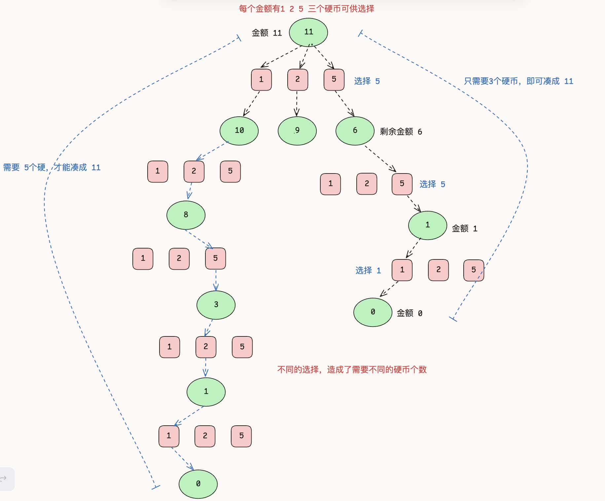

  最终的递推关系为：`dp[i] = min(dp[i], dp[i-coins[0...] + 1])`

  `dp[i-coins[0...] + 1 ` 含义： `coins[0...]` 每次选择，所有的硬币可供选择，如果选择某个硬币`coins[j]`后，凑成剩余金额`i-coins[j]`需要 `dp[i-coins[j]]`最少硬币个数  +1 表示选中了硬币`coins[j]`

  `min`表示，金额 `i`可以选的硬币有很多种`coins[0...]`，我们只需 硬币最小的结果

  *还有个前提，选中的硬币的面额，不能大于要凑的金额`i`*


- **动态规划解法**：使用一维数组`dp`记录凑成金额`j`所需的最少硬币数。
- **初始化设置**：
  - `dp[0] = 0`（金额为0不需要硬币）
  - 其他位置初始化为`Integer.MAX_VALUE`（表示不可达）
- **状态转移**：
  - 遍历每个硬币面值
  - 对于每个金额`j`，若`j - coins[i]`可达，则更新`dp[j]`为`min(dp[j], dp[j - coins[i]] + 1)`
- **结果判断**：若`dp[amount]`仍为`MAX_VALUE`则返回-1，否则返回`dp[amount]`

```java
class Solution {
    public int coinChange(int[] coins, int amount) {
        int[] dp = new int[amount + 1];
        Arrays.fill(dp, Integer.MAX_VALUE);
        dp[0] = 0;
        for(int i = 0; i < coins.length; i++) {
            for(int j = coins[i]; j <= amount; j++) {
                if(dp[j - coins[i]] != Integer.MAX_VALUE) dp[j] = Math.min(dp[j], dp[j - coins[i]] + 1);
            }
        }
        return dp[amount] == Integer.MAX_VALUE ? -1 : dp[amount];
    }
}
```


## [76. 最小覆盖子串](https://leetcode.cn/problems/minimum-window-substring/)

给你一个字符串 `s` 、一个字符串 `t` 。返回 `s` 中涵盖 `t` 所有字符的最小子串。如果 `s` 中不存在涵盖 `t` 所有字符的子串，则返回空字符串 `""` 。

**注意：**

- 对于 `t` 中重复字符，我们寻找的子字符串中该字符数量必须不少于 `t` 中该字符数量。
- 如果 `s` 中存在这样的子串，我们保证它是唯一的答案。

思路：

这题就是典型的滑动窗口类题目，一般来说难度略高。

题目要求 返回 `s` 中涵盖 `t` 所有字符的最小子串。

- 需要知道 `t`中有哪些字符

- 在 `s`中找到包含`t`中所有字符的字符串（注意是包含，不是相等），

  比如  `s = abc t = ac`，字符串 `s`是包含 `t`的所有字符的；

  比如 `s = abc   t = aa`，字符串 `s`是不包含 `t`中的所有字符的，因为`t`中有两个 `a`, `s`中只有一个 `a`


- **滑动窗口算法**：使用双指针（i和j）维护一个动态窗口，寻找包含目标字符串t所有字符的最小窗口。
- **频率统计**：
  - 使用两个数组hs和ht分别记录当前窗口和目标字符串t的字符频率
  - 通过比较hs和ht来判断窗口是否包含t的所有字符
- **窗口调整策略**：
  - 扩展右边界i，将新字符加入窗口
  - 当窗口满足条件时，收缩左边界j以寻找更小的窗口
  - 实时更新最小窗口结果

```java
class Solution {
    public String minWindow(String s, String t) {
        // 初始化两个频率数组，用于记录字符出现次数
        int[] hs = new int[128];  // 当前窗口字符频率
        int[] ht = new int[128];  // 目标字符串t的字符频率
        String ans = null;        // 存储最终结果

        // 统计t中各字符的出现频率
        for(int i = 0; i < t.length(); i++) {
            ht[t.charAt(i)]++;
        }

        // 滑动窗口过程
        for(int i = 0, j = 0, cnt = 0; i < s.length(); i++) {
            // 扩展右边界，将s[i]加入窗口
            hs[s.charAt(i)]++;

            // 如果当前字符在t中，且窗口中的该字符数量不超过t中的数量，则计数增加
            if(hs[s.charAt(i)] <= ht[s.charAt(i)]) {
                cnt++;
            }

            // 当窗口包含t所有字符时，尝试收缩左边界
            while(hs[s.charAt(j)] > ht[s.charAt(j)] && cnt == t.length()) {
                hs[s.charAt(j)]--;  // 减少左边界字符计数
                j++;                // 移动左边界
            }

            // 如果当前窗口包含t所有字符，检查是否是最小窗口
            if(cnt == t.length()) {
                if(ans == null || ans.length() > i - j + 1) {
                    ans = s.substring(j, i + 1);  // 更新最小窗口
                }
            }
        }

        return ans == null ? "" : ans;  // 返回结果，如果没有则返回空字符串
    }
}
```


## [43. 字符串相乘](https://leetcode.cn/problems/multiply-strings/)

给定两个以字符串形式表示的非负整数 `num1` 和 `num2`，返回 `num1` 和 `num2` 的乘积，它们的乘积也表示为字符串形式。

**注意：**不能使用任何内置的 BigInteger 库或直接将输入转换为整数。

思路：

- 定义两个指针`i j`，分别指向 `num1` 和 `num2`的尾部，从个位开始计算乘积
- 计算的结果累加，保存到 `res`的索引 `i+j+1`位置处

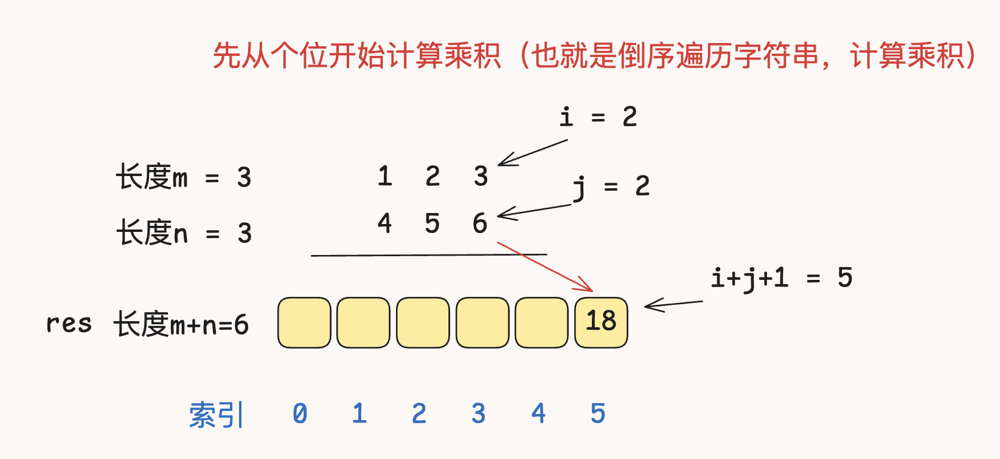

- 最后，将`res`中的结果，从尾部到首部（也就是从个位）依次进位，得到最终的结果

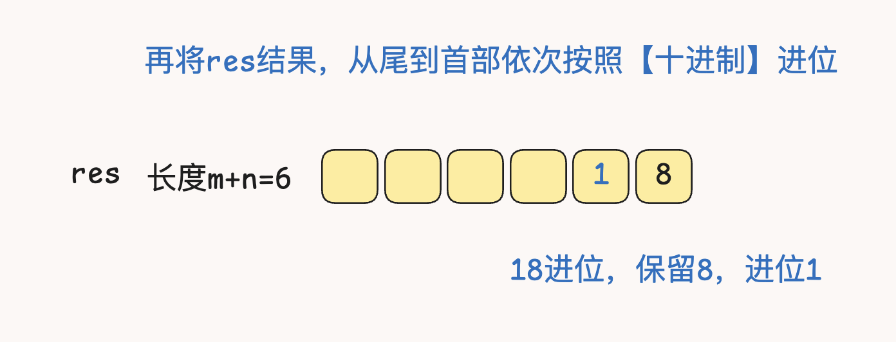


- **模拟竖式乘法**：将两个大数字符串的每一位相乘，并将结果累加到对应位置。
- **处理进位**：从低位到高位依次处理进位，确保每一位都在0-9范围内。
- **构建结果字符串**：跳过前导零，将数字数组转换为最终的字符串结果，处理全零的特殊情况。

```java
class Solution {
    public String multiply(String num1, String num2) {
        // 1. 初始化结果数组
        int m = num1.length(), n = num2.length();
        int[] result = new int[m + n];

        // 2. 计算每一位的乘积并累加到对应位置
        for (int i = m - 1; i >= 0; i--) {
            for (int j = n - 1; j >= 0; j--) {
                result[i + j + 1] += (num1.charAt(i) - '0') * (num2.charAt(j) - '0');
            }
        }

        // 3. 处理进位
        for (int i = result.length - 1; i >= 0; i--) {
            if (result[i] >= 10) {
                result[i - 1] += result[i] / 10;
                result[i] %= 10;
            }
        }

        // 4. 将结果数组转换为字符串
        StringBuilder res = new StringBuilder();
        boolean zero = true;
        for (int v : result) {
            if (v == 0 && zero) continue;
            zero = false;
            res.append((char) ('0' + v));
        }
        return res.length() == 0 ? "0" : res.toString();
    }
}
```


## [41. 缺失的第一个正数](https://leetcode.cn/problems/first-missing-positive/)

给你一个未排序的整数数组 `nums` ，请你找出其中没有出现的最小的正整数。请你实现时间复杂度为 `O(n)` 并且只使用常数级别额外空间的解决方案。

思路：

这题如果第一次做，会感觉很绕。其实本质目的就是让数值：比如 `1`放到索引 `0`， `2` 放到索引`1`，数值`3`放到索引`2` 。 这样就形成了，随着索引`i`的递增，元素值也是顺序递增的（并且之间是 `+1` 的关系）

题目要求【缺失的最小正整数】：将数组中的元素，按照 1，2，3，4，5，6.... 这个顺序排列。（同时观察到1,2,3,4,5和数组索引的关系 0,1,2,3,4，是相差`1`的关系）

- 数组的长度为`n`，如果数组中的元素都是按照1，2，3，4，5，6.... 这个顺序排列，也就是【`1～n`】，那么最小的正整数就是`n+1`

- 如果数组中的元素出现跳空（也就是缺失某一个）那么索引位置 `i`对应的元素值 `nums[i]`，之间不满足 `i+1 == nums[i]`

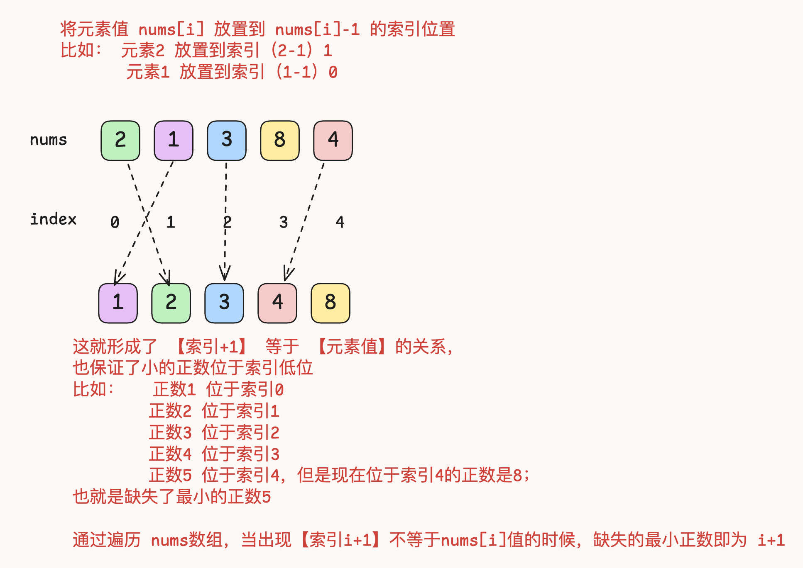


- **原地哈希思想**：利用数组本身作为哈希表，将数字放到其值对应的索引位置上（如数字3放在索引2处）
- **两轮遍历**：
  1. 第一轮遍历：通过交换操作将每个有效数字（1到n范围内）放到正确位置
  2. 第二轮遍历：检查每个位置i上的数字是否为i+1，第一个不符合的位置即为缺失的最小正整数
- **边界处理**：如果所有位置都正确，则缺失的最小正整数为n+1

```java
class Solution {
    public int firstMissingPositive(int[] nums) {
        int n = nums.length;

        // 第一次遍历：将每个数字放到它应该在的位置上
        for(int i = 0; i < n; i++) {
            // 当数字在1到n范围内，并且不在正确位置时，进行交换
            while(nums[i] > 0 && nums[i] <= n && nums[nums[i] - 1] != nums[i]) {
                // 交换nums[i]和nums[nums[i]-1]
                int temp = nums[nums[i] - 1];
                nums[nums[i] - 1] = nums[i];
                nums[i] = temp;
            }
        }

        // 第二次遍历：查找第一个位置不正确的数字
        for(int i = 0; i < n; i++) {
            if(nums[i] != i + 1) {
                return i + 1;  // 找到缺失的最小正整数
            }
        }

        // 如果所有位置都正确，返回n+1
        return n + 1;
    }
}
```


## [LCR 140. 训练计划 II - 力扣（LeetCode）|| 链表中倒数第 K 个节点](https://leetcode.cn/problems/lian-biao-zhong-dao-shu-di-kge-jie-dian-lcof/)

给定一个头节点为 `head` 的链表用于记录一系列核心肌群训练项目编号，请查找并返回倒数第 `cnt` 个训练项目编号。

思路：

- **快慢指针初始化**：同时从链表头部开始，快指针先移动`cnt`步
- **快慢指针同步移动**：当快指针未到达末尾时，快慢指针同步移动
- **返回结果节点**：当快指针到达末尾时，慢指针指向的节点即为倒数第`cnt+1`个节点（即训练计划起始节点）

```java
class Solution {
    public ListNode trainingPlan(ListNode head, int cnt) {
        ListNode slow = head, fast = head;
        for(int i = 0; i < cnt; i++) {
            if(fast == null) return null;
            fast = fast.next;
        }
        while(fast != null) {
            fast = fast.next;
            slow = slow.next;
        }
        return slow;
    }
}
```


## [105. 从前序与中序遍历序列构造二叉树](https://leetcode.cn/problems/construct-binary-tree-from-preorder-and-inorder-traversal/)

给定两个整数数组 `preorder` 和 `inorder` ，其中 `preorder` 是二叉树的**先序遍历**， `inorder` 是同一棵树的**中序遍历**，请构造二叉树并返回其根节点。

思路：

**构造二叉树，第一件事一定是找根节点，然后想办法构造左右子树**。

二叉树的前序和中序遍历结果的特点如下：

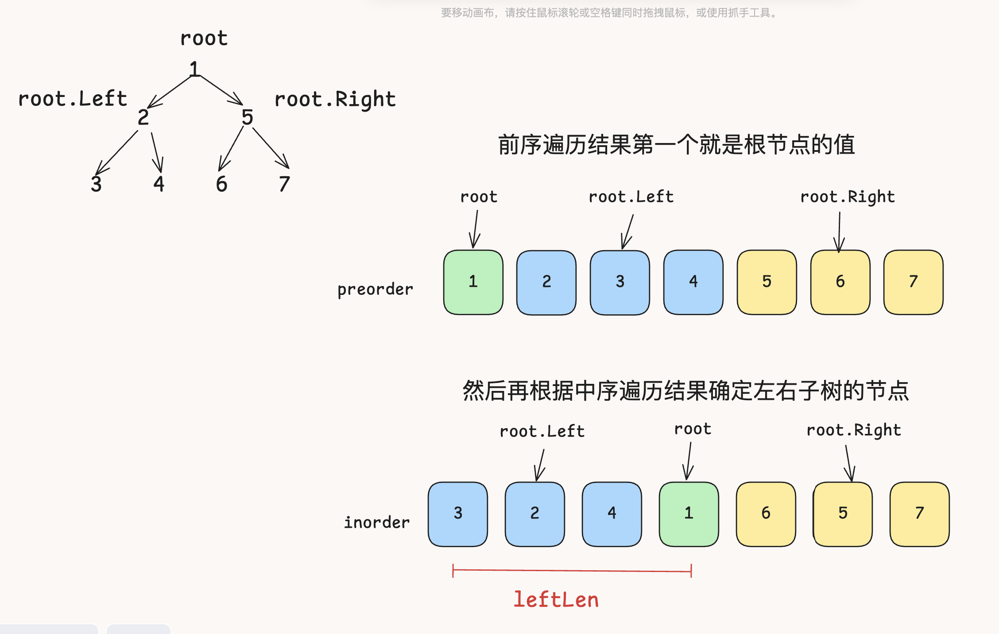


- **哈希表优化查找**：预先构建中序遍历值的索引映射，实现O(1)时间复杂度的根节点位置查找
- **递归构建二叉树**：
  - 前序遍历的第一个元素是当前子树的根节点
  - 根据根节点在中序遍历中的位置划分左右子树
  - 递归构建左子树和右子树
- **边界条件处理**：当preStart等于preEnd时返回null，表示当前子树为空

```java
class Solution {
    public TreeNode buildTree(int[] preorder, int[] inorder) {
        Map<Integer, Integer> inorderMap = new HashMap<>();
        for (int i = 0; i < inorder.length; i++) {
            inorderMap.put(inorder[i], i);
        }
        return build(preorder, 0, preorder.length, inorder, 0, inorder.length, inorderMap);
    }

    private TreeNode build(int[] preorder, int preStart, int preEnd,
                           int[] inorder, int inStart, int inEnd,
                           Map<Integer, Integer> inorderMap) {
        if (preStart == preEnd) return null;

        int rootVal = preorder[preStart];
        int rootIndex = inorderMap.get(rootVal);
        int leftSize = rootIndex - inStart;

        TreeNode root = new TreeNode(rootVal);
        root.left = build(preorder, preStart + 1, preStart + 1 + leftSize,
                inorder, inStart, rootIndex, inorderMap);
        root.right = build(preorder, preStart + 1 + leftSize, preEnd,
                inorder, rootIndex + 1, inEnd, inorderMap);

        return root;
    }
}
```


## [78. 子集](https://leetcode.cn/problems/subsets/)

给你一个整数数组 `nums` ，数组中的元素 **互不相同** 。返回该数组所有可能的子集（幂集）。解集 **不能** 包含重复的子集。你可以按 **任意顺序** 返回解集。

思路：

回溯算法：类似于遍历这棵树

- **回溯法生成子集**：通过深度优先搜索（DFS）递归生成所有可能的子集组合。
- **路径记录与回溯**：
  - 每次递归调用前将当前路径加入结果集
  - 遍历可选元素，依次添加到当前路径
  - 递归处理后续元素后移除最后添加的元素（回溯）
- **自然包含空集**：初始调用时直接加入空路径，自动包含空集结果。

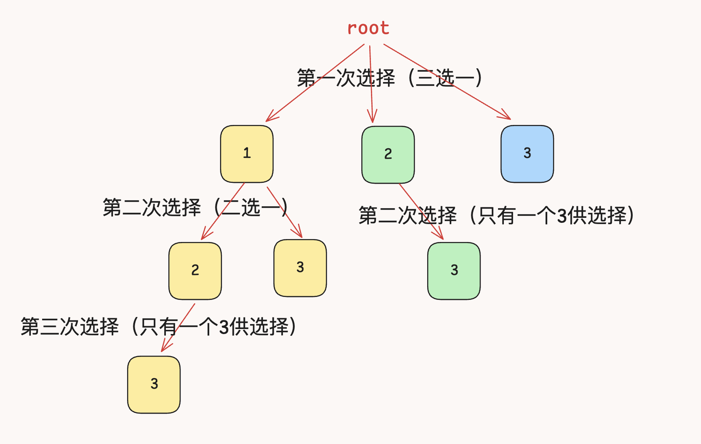

```java
class Solution {
    List<List<Integer>> ans = new ArrayList<>();
    List<Integer> path = new ArrayList<>();

    public List<List<Integer>> subsets(int[] nums) {
        dfs(nums, 0);
        return ans;
    }

    private void dfs(int[] nums, int i) {
        ans.add(new ArrayList<>(path));
        for(int j = i; j < nums.length; j++) {
            path.add(nums[j]);
            dfs(nums, j + 1);
            path.remove(path.size() - 1);
        }
    }
}
```


## [151. 反转字符串中的单词](https://leetcode.cn/problems/reverse-words-in-a-string/)

给你一个字符串 `s` ，请你反转字符串中 **单词** 的顺序。**单词** 是由非空格字符组成的字符串。`s` 中使用至少一个空格将字符串中的 **单词** 分隔开。返回 **单词** 顺序颠倒且 **单词** 之间用单个空格连接的结果字符串。

**注意：**输入字符串 `s`中可能会存在前导空格、尾随空格或者单词间的多个空格。返回的结果字符串中，单词间应当仅用单个空格分隔，且不包含任何额外的空格。

**示例 1：**

```
输入：s = "the sky is blue"
输出："blue is sky the"
```

思路：

- **三步处理法**：
  1. 清理多余空格（首尾及中间连续空格）
  2. 整体翻转字符串
  3. 逐个翻转每个单词
- **核心方法**：
  - `cleanSpaces()`：去除多余空格并返回新字符数组
  - `reverse()`：辅助方法，用于翻转指定区间的字符
  - `reverseWords()`：识别单词边界并翻转每个单词

- **高效处理**：通过原地修改字符数组减少空间复杂度

```java
public class Solution {
    public String reverseWords(String s) {
        // 1. 清理空格
        char[] chars = cleanSpaces(s.toCharArray());

        // 2. 翻转整个字符串
        reverse(chars, 0, chars.length - 1);

        // 3. 翻转每个单词
        reverseWords(chars);

        return new String(chars);
    }

    private char[] cleanSpaces(char[] chars) {
        int n = chars.length;
        char[] result = new char[n];
        int index = 0;
        boolean space = true; // 标记前一个字符是否是空格

        for (int i = 0; i < n; i++) {
            if (chars[i] != ' ') {
                result[index++] = chars[i];
                space = false;
            } else if (!space) {
                result[index++] = ' ';
                space = true;
            }
        }

        // 处理末尾可能的空格
        if (index > 0 && result[index - 1] == ' ') {
            index--;
        }

        return Arrays.copyOf(result, index);
    }

    private void reverseWords(char[] chars) {
        int n = chars.length;
        int i = 0, j = 0;

        while (i < n) {
            while (j < n && chars[j] != ' ') {
                j++;
            }
            reverse(chars, i, j - 1);
            i = j + 1;
            j = i;
        }
    }

    private void reverse(char[] chars, int i, int j) {
        while (i < j) {
            char temp = chars[i];
            chars[i] = chars[j];
            chars[j] = temp;
            i++;
            j--;
        }
    }
}
```


## [155. 最小栈](https://leetcode.cn/problems/min-stack/description/)

设计一个支持 `push` ，`pop` ，`top` 操作，并能在常数时间内检索到最小元素的栈。

实现 `MinStack` 类:

- `MinStack()` 初始化堆栈对象。
- `void push(int val)` 将元素val推入堆栈。
- `void pop()` 删除堆栈顶部的元素。
- `int top()` 获取堆栈顶部的元素。
- `int getMin()` 获取堆栈中的最小元素。

思路：

我们知道栈是一种操作受限的数据结构，只能从栈顶插入或弹出元素，所以对于标准的栈来说，如果想实现本题的 `getMin` 方法，只能老老实实把所有元素弹出来然后找最小值。**想提高时间效率，那肯定要通过空间换时间的思路**。

所以这道题的关键就是，**每个元素入栈时，还要记下来当前栈中的最小值**。比方说，可以用一个额外的栈 `minstack` 来记录栈中每个元素入栈时的**栈中的最小元素**是多少，这样每次获取元素时就能快速得到剩余栈中的最小元素了。


- **双栈辅助设计**：使用主栈存储元素，辅助栈实时维护当前最小值
- **高效最小值获取**：
  - 每次push时，辅助栈同步压入当前最小值（与主栈新元素比较）
  - 每次pop时，两个栈同步弹出顶部元素
  - getMin直接返回辅助栈栈顶元素
- **初始化处理**：构造函数初始化辅助栈为最大值，确保首次push时能正确计算最小值

```java
class MinStack {
    LinkedList<Integer> stack = new LinkedList<>();
    LinkedList<Integer> min = new LinkedList<>();

    public MinStack() {
        min.push(Integer.MAX_VALUE);
    }

    public void push(int val) {
        stack.push(val);
        min.push(Math.min(val, min.peek()));
    }

    public void pop() {
        if(stack.isEmpty()) return;
        stack.pop();
        min.pop();
    }

    public int top() {
        return stack.peek();
    }

    public int getMin() {
        return min.peek();
    }
}
```


## [129. 求根节点到叶子节点数字之和](https://leetcode.cn/problems/sum-root-to-leaf-numbers/)

给你一个二叉树的根节点 `root` ，树中每个节点都存放有一个 `0` 到 `9` 之间的数字。

每条从根节点到叶节点的路径都代表一个数字：

- 例如，从根节点到叶节点的路径 `1 -> 2 -> 3` 表示数字 `123` 。

计算从根节点到叶节点生成的 **所有数字之和** 。

**叶节点** 是指没有子节点的节点。

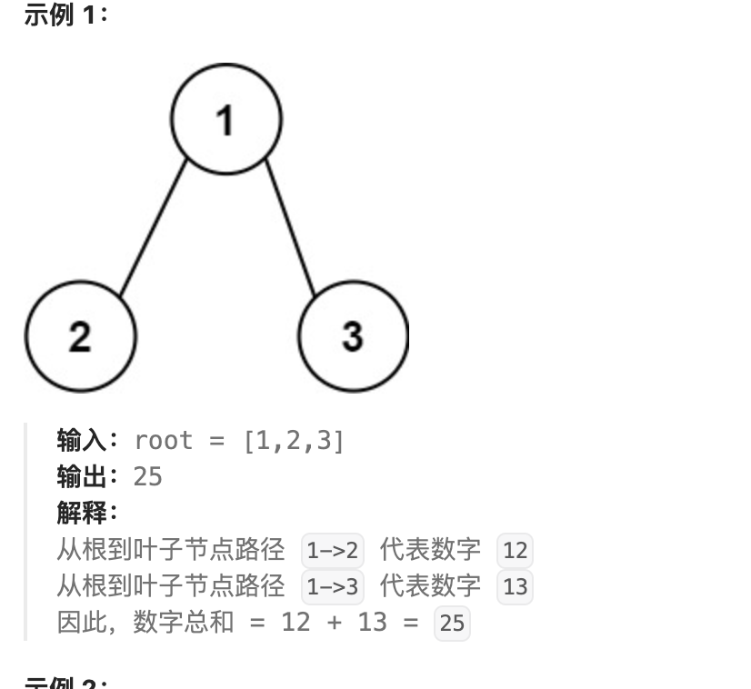

思路：

- **深度优先搜索（DFS）**：递归遍历二叉树的每个节点。
- **路径数值计算**：
  - 每访问一个节点，将当前路径数值乘以10并加上当前节点值
  - 当到达叶子节点时，将完整路径数值累加到结果中
- **递归终止条件**：遇到空节点或叶子节点时终止递归

```java
class Solution {

    private int ans = 0;

    public int sumNumbers(TreeNode root) {
        dfs(root, 0);
        return ans;
    }

    private void dfs(TreeNode root, int val) {
        if(root == null) return;

        val = val * 10 + root.val;
        if(root.left == root.right) {
            ans += val;
            return;
        }

        dfs(root.left, val);
        dfs(root.right, val);
    }
}
```


## [101. 对称二叉树](https://leetcode.cn/problems/symmetric-tree/)

给你一个二叉树的根节点 `root` ， 检查它是否轴对称。

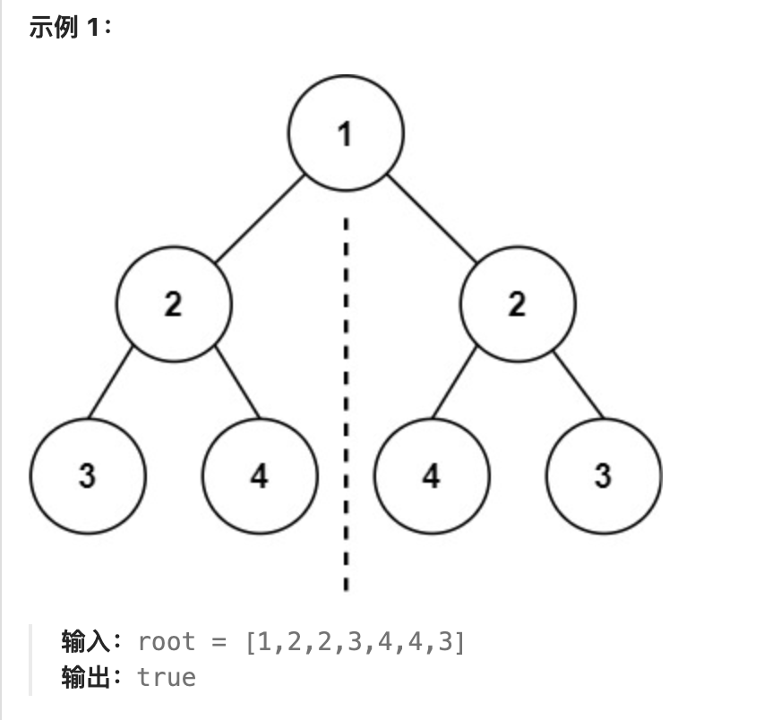

思路：

- 观察下上面的示例，【对称】就是左右两颗树是镜像。对称的检查过程，就是二叉树的遍历过程。
- 先检查左右两个根节点`root.Left root.Right`是否相同；
- 如果相同，再检查【左节点的左树 和 右节点的右树】 以及【左节点的右树 和 右节点的左树】是否对称

```java
class Solution {
    public boolean isSymmetric(TreeNode root) {
        return dfs(root.left, root.right);
    }

    private boolean dfs(TreeNode p, TreeNode q) {
        if(p == null || q == null) return p == q;

        return p.val == q.val && dfs(p.left, q.right) && dfs(p.right, q.left);
    }
}
```

## 34. 在排序数组中查找元素的第一个和最后一个位置

给你一个按照非递减顺序排列的整数数组 `nums`，和一个目标值 `target`。请你找出给定目标值在数组中的开始位置和结束位置。

如果数组中不存在目标值 `target`，返回 `[-1, -1]`。你必须设计并实现时间复杂度为 `O(log n)` 的算法解决此问题。

思路：

二分搜索的难点就在于如何搜索左侧边界和右侧边界，代码的边界的控制非常考验你的微操，这也是很多人知道二分搜索原理但是很难写对代码的原因。写对二分搜索的关键在于搞清楚搜索边界，到底应该往左侧收敛还是应该往右侧收敛？

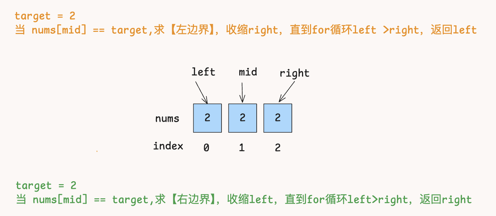

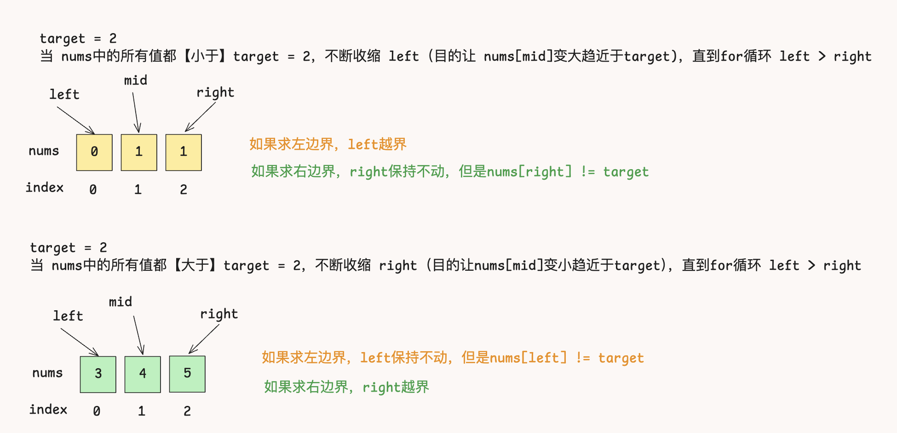

```java
func searchRange(nums []int, target int) []int {

    return []int{left_bound(nums,target),right_bound(nums,target)}
}

// 求左边界
func left_bound(nums []int ,target int) int {

    left,right := 0,len(nums)-1
		// 闭区间[left,right]
    for left <= right {
				// 中间值
        mid := left + (right-left)/2

        if nums[mid] == target { // 相等的时候，收缩right；【因为我们要求的是左边界】
            right = mid -1
        } else if nums[mid] > target { // 说明 target值位于nums[mid]的左侧，收缩right
            right = mid -1
        } else if nums[mid] < target { // 说明 target 位于 nums[mid]的右侧，收缩left
            left = mid + 1
        }
    }
    
    // 当所有的值都比target小的时候，left会越界
    // 当所有的值都比target大的时候，left此时是不会移动，所以要看下left指向的值是否是target
    if left >= len(nums) || nums[left] != target { // 做边界检测
        return -1
    }
    return left
}

// 求右边界
func right_bound(nums []int ,target int) int {

    left,right := 0,len(nums)-1

    for left <= right {
				// 中间值
        mid := left + (right-left)/2

        if nums[mid] == target { // 求右边界，当相等的时候，收缩左边界
            left = mid + 1
        } else if nums[mid] > target { // 说明 target值位于nums[mid]的左侧，收缩right
            right = mid - 1
        } else if nums[mid] < target { // 说明 target 位于 nums[mid]的右侧，收缩left
            left = mid + 1
        }
    }
    
    // 当所有的数都大于target的时候，right就会一直-1，最后会越界
    // 当所有的数都小于target的时候，right保持不动；所以要看下right指向的值是否是target
    if right < 0 || nums[right] != target { // 做边界检测
        return -1
    }
    return right
}
```


## [104. 二叉树的最大深度](https://leetcode.cn/problems/maximum-depth-of-binary-tree/)

给定一个二叉树 `root` ，返回其最大深度。二叉树的 **最大深度** 是指从根节点到最远叶子节点的最长路径上的节点数。

思路：

- **递归深度计算**：通过递归遍历二叉树的每个节点。
- **深度计算逻辑**：
  - 空节点返回深度0
  - 非空节点返回1（当前节点）加上左右子树的最大深度
- **分治策略**：分别计算左右子树的深度，取较大值作为当前节点的深度贡献

```java
class Solution {
    public int maxDepth(TreeNode root) {
        if(root == null) return 0;

        return  1 + Math.max(maxDepth(root.left), maxDepth(root.right));
    }
}

```


## [144. 二叉树的前序遍历](https://leetcode.cn/problems/binary-tree-preorder-traversal/)

给你二叉树的根节点 `root` ，返回它节点值的 **前序** 遍历。

```java
class Solution {
    private List<Integer> ans = new ArrayList<>();

    public List<Integer> preorderTraversal(TreeNode root) {
        dfs(root);
        return ans;
    }

    private void dfs(TreeNode root) {
        if(root == null) return;

        ans.add(root.val);
        dfs(root.left);
        dfs(root.right);
    }
}
```


## [394. 字符串解码](https://leetcode.cn/problems/decode-string/)

给定一个经过编码的字符串，返回它解码后的字符串。

编码规则为: `k[encoded_string]`，表示其中方括号内部的 `encoded_string` 正好重复 `k` 次。注意 `k` 保证为正整数。你可以认为输入字符串总是有效的；输入字符串中没有额外的空格，且输入的方括号总是符合格式要求的。此外，你可以认为原始数据不包含数字，所有的数字只表示重复的次数 `k` ，例如不会出现像 `3a` 或 `2[4]` 的输入。

思路：

首先要理解题目的意思：比如`3[a]`解码的结果为`aaa`。 `3`表示 `a`重复的次数。这题如果第一次做，还是挺难，一般遇到字符串带括号的问题，就要想到**栈**。利用栈记录上次的解码结果

这里以 `a6[c]`为例子演示一下：

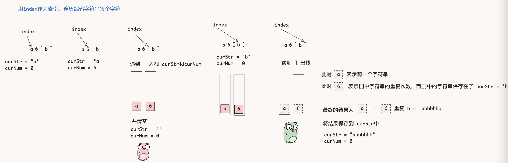

- **双栈辅助解码**：使用数字栈和字符串栈来处理嵌套的编码结构
- **分段处理逻辑**：
  - 遇到数字时累加当前重复次数
  - 遇到 '[' 时保存当前字符串和重复次数，并重置临时变量
  - 遇到 ']' 时弹出栈顶元素，将当前字符串重复指定次数后拼接到上层字符串
  - 普通字符直接追加到当前构建的字符串中
- **递归式处理**：通过栈结构隐式实现递归解码，处理任意层级的嵌套编码

```java
class Solution {
    public String decodeString(String s) {
        Deque<String> stringStack = new ArrayDeque<>();
        Deque<Integer> numStack = new ArrayDeque<>();
        StringBuilder text = new StringBuilder();
        int num = 0;
        for(char c : s.toCharArray()) {
            if(Character.isDigit(c)) {
                num = num * 10 + (c - '0');
            } else if(c == '[') {
                numStack.push(num);
                stringStack.push(text.toString());
                text = new StringBuilder();
                num = 0;
            } else if(c == ']') {
                int loopTimes = numStack.pop();
                StringBuilder temp = new StringBuilder(stringStack.pop());
                for (int i = 0; i < loopTimes; i++) temp.append(text);
                text = temp;
            } else {
                text.append(c);
            }
        }
        return text.toString();
    }
}
```


## [101. 平衡二叉树](https://leetcode.cn/problems/balanced-binary-tree/)

给定一个二叉树，判断它是否是 平衡二叉树 

思路：

- **平衡二叉树** 是指该树所有节点的左右子树的高度相差不超过 1。其实这题是**求树的最大深度**的一个扩展，多了一步求左右子树的高度差。
- **后序遍历检查平衡性**：通过递归后序遍历计算每个节点的左右子树高度
- **提前终止机制**：
  - 若任一子树不平衡（返回-1），则整棵树不平衡
  - 检查当前节点左右子树高度差是否超过1
- **高度计算与平衡检查结合**：
  - 正常节点返回当前子树高度（1 + max(左高, 右高)）
  - 不平衡节点返回-1作为标记

```java
class Solution {
    public boolean isBalanced(TreeNode root) {
        return height(root) != -1;
    }

    private int height(TreeNode root) {
        if(root == null) return 0;

        int leftHeight = height(root.left);
        if(leftHeight == -1) return -1;

        int rightHeight = height(root.right);
        if(rightHeight == -1) return -1;

        if(Math.abs(rightHeight - leftHeight) > 1) return -1;
        else return 1 + Math.max(leftHeight, rightHeight);
    }
}

```


## [39. 组合总和](https://leetcode.cn/problems/combination-sum/)

给你一个 **无重复元素** 的整数数组 `candidates` 和一个目标整数 `target` ，找出 `candidates` 中可以使数字和为目标数 `target` 的 所有 **不同组合** ，并以列表形式返回。你可以按 **任意顺序** 返回这些组合。

`candidates` 中的 **同一个** 数字可以 **无限制重复被选取** 。如果至少一个数字的被选数量不同，则两种组合是不同的。 

对于给定的输入，保证和为 `target` 的不同组合数少于 `150` 个。

思路：

- **回溯法搜索组合**：通过深度优先搜索（DFS）递归探索所有可能的组合。
- **剪枝优化**：
  - 先对候选数组排序，便于提前终止无效搜索
  - 当当前和超过目标值时立即终止当前分支的搜索
- **允许重复使用元素**：通过传递当前索引`j`（而非`j+1`）实现同一元素可被多次选取

实际代码如下：

```java
class Solution {
    List<List<Integer>> ans = new ArrayList<>();
    List<Integer> path = new ArrayList<>();

    public List<List<Integer>> combinationSum(int[] candidates, int target) {
        Arrays.sort(candidates);
        dfs(candidates, target, 0, 0);
        return ans;
    }

    private void dfs(int[] candidates, int target, int sum, int i) {
        if(sum == target) {
            ans.add(new ArrayList<>(path));
            return;
        }

        for(int j = i; j < candidates.length; j++) {
            if(sum + candidates[j] > target) break;
            path.add(candidates[j]);
            dfs(candidates, target, sum + candidates[j], j);
            path.remove(path.size() - 1);
        }
    }
}
```


## [64.最小路径和](https://leetcode.cn/problems/minimum-path-sum/)

给定一个包含非负整数的 `m x n` 网格 `grid` ，请找出一条从左上角到右下角的路径，使得路径上的数字总和为最小。

**说明：**每次只能向下或者向右移动一步。

思路：

一般来说，让你在二维矩阵中求最优化问题（最大值或者最小值），就要考虑动态规划。先定义 `dp`数组，然后寻找相邻`dp[i] dp[i-1]`之间的关系。

- `dp`数组定义：从`[0,0]`到 `[i,j]`的最小路径和为 `dp[i][j]`

- 递推关系：因为题目说：每次只能向下或者向右移动一步。

  那么到达 `[i,j]`位置有两种选择

  从`[i-1,j]`向下移动一步 

  从`[i,j-1]`向右移动一步

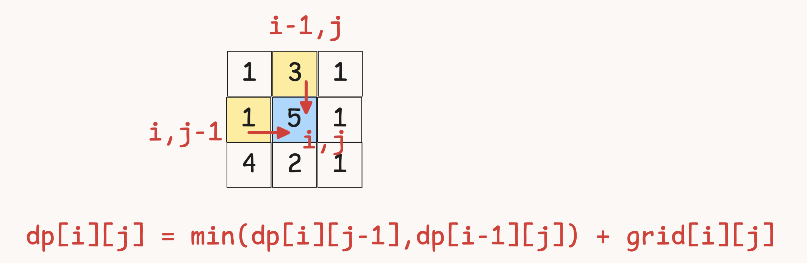

`dp[i][j-1]`表示 从`[0,0]`到 `[i,j-1]`的最小路径和

`dp[i-1][j]`表示 从`[0,0]`到 `[i-1,j]`的最小路径和

取两个中的`min`最小值 `+ grid[i][j]` 即为从`[0,0]`到 `[i,j]`的最小路径和


- **动态规划原地修改**：直接在原网格上修改数值，避免使用额外空间
- **状态转移方程**：
  - 第一行和第一列只能从左或从上累加
  - 其他位置取上方或左方最小值累加
- **结果获取**：最终右下角节点即为最小路径和

```java
class Solution {
    public int minPathSum(int[][] grid) {
        int n = grid.length, m = grid[0].length;
        for (int i = 0; i < n; i++) {
            for (int j = 0; j < m; j++) {
                if(i == 0 && j == 0) continue;
                else if(i == 0) grid[i][j] += grid[i][j-1];
                else if(j == 0) grid[i][j] += grid[i-1][j];
                else grid[i][j] += Math.min(grid[i-1][j], grid[i][j-1]);
            }
        }
        return grid[n-1][m-1];
    }
}
```


## [48. 旋转图像](https://leetcode.cn/problems/rotate-image/)

给定一个 *n* × *n* 的二维矩阵 `matrix` 表示一个图像。请你将图像顺时针旋转 90 度。你必须在**[ 原地](https://baike.baidu.com/item/原地算法)** 旋转图像，这意味着你需要直接修改输入的二维矩阵。**请不要** 使用另一个矩阵来旋转图像。

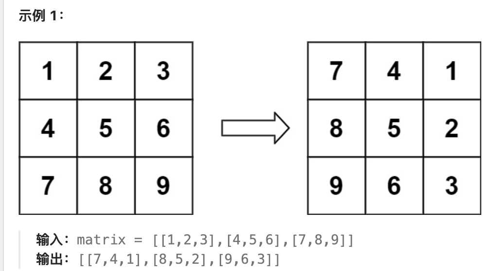

思路：

- 这题其实就是**瞪眼法**找到数字之间的交换规则。先把二维矩阵沿对角线反转，然后反转矩阵的每一行，结果就是顺时针反转整个矩阵。
- **分层旋转法**：将矩阵视为多层同心环，逐层进行旋转操作
- **元素位置映射关系**：
  - [i, j] → [j, n-1-i] → [n-1-i, n-1-j] → [n-1-j, i] → [i, j]
  - 每个元素按顺时针方向移动到相邻位置
- **循环控制**：
  - 外层循环控制层数（n/2次）
  - 内层循环控制每层的元素数量（(n+1)/2个）
  - 通过临时变量完成四个位置元素的循环交换

```java
class Solution {
    public void rotate(int[][] matrix) {
        int n = matrix.length;
        for (int i = 0; i < n / 2; i++) {
            for (int j = 0; j < (n + 1) / 2; j++) {
                int temp = matrix[i][j];
                matrix[i][j] = matrix[n-1-j][i];
                matrix[n-1-j][i] = matrix[n-1-i][n-1-j];
                matrix[n-1-i][n-1-j] = matrix[j][n-1-i];
                matrix[j][n-1-i] = temp;
            }
        }
    }
}
```


## [221. 最大正方形](https://leetcode.cn/problems/maximal-square/)

在一个由 `'0'` 和 `'1'` 组成的二维矩阵内，找到只包含 `'1'` 的最大正方形，并返回其面积。

思路：

动态规划：

- `dp[i][j] `表示 `matrix[i][j]`为正方形右下角的**边长**，上边，左边，左上的边长 `>1`，才能组成一个更大完整的正方形；

- 递推关系：

  如果`matrx[i][j] == 0`，说明无法组成只包含 `'1'` 的正方形，`dp[i][j] = 0`即边长为`0`

  如果 `matrx[i][j] == 1`，看下上边，左边，左上 边长 `> 1`，才能组成一个更大的正方形，所以 `dp[i][j] = min(dp[i-1][j],dp[i][j-1],dp[i-1][j-1]) + 1`

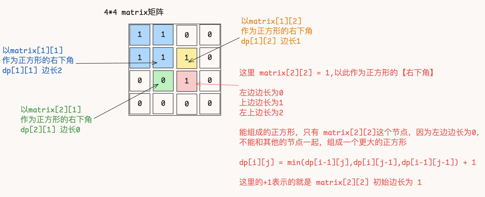


- **动态规划表定义**：`dp[i][j]`表示以`(i,j)`为右下角的最大正方形边长
- **状态转移规则**：
  - 边界条件：首行首列直接取矩阵值（0或1）
  - 递推关系：`dp[i][j] = min(dp[i-1][j], dp[i][j-1], dp[i-1][j-1]) + 1`（当当前值为'1'时）
- **结果计算**：遍历过程中记录最大边长`len`，最终返回`len * len`即最大面积

```java
class Solution {
    public int maximalSquare(char[][] matrix) {
        int n = matrix.length, m = matrix[0].length;
        int[][] dp = new int[n][m];
        int len = 0;

        for (int i = 0; i < n; i++) {
            for (int j = 0; j < m; j++) {
                if (i == 0 || j == 0) {
                    dp[i][j] = matrix[i][j] - '0';
                } else if (matrix[i][j] == '1') {
                    dp[i][j] = Math.min(Math.min(dp[i - 1][j], dp[i][j - 1]), dp[i - 1][j - 1]) + 1;
                }
                len = Math.max(len, dp[i][j]);
            }
        }
        return len * len;
    }
}
```


## [470. 用 Rand7()实现Rand10()](https://leetcode.cn/problems/implement-rand10-using-rand7/)

给定方法 `rand7` 可生成 `[1,7]` 范围内的均匀随机整数，试写一个方法 `rand10` 生成 `[1,10]` 范围内的均匀随机整数。

你只能调用 `rand7()` 且不能调用其他方法。请不要使用系统的 `Math.random()` 方法。

每个测试用例将有一个内部参数 `n`，即你实现的函数 `rand10()` 在测试时将被调用的次数。请注意，这不是传递给 `rand10()` 的参数。

思路：

- **拒绝采样法**：利用rand7()生成均匀分布的随机数，通过拒绝采样得到目标分布
- **随机数生成**：
  - `(rand7()-1)*7 + rand7()`生成1-49的均匀随机数
  - 只保留1-40的数（覆盖40/49的概率空间）
- **结果映射**：将1-40的数映射为1-10的均匀随机数（`num % 10 + 1`）

```java
/**
 * The rand7() API is already defined in the parent class SolBase.
 * public int rand7();
 * @return a random integer in the range 1 to 7
 */
class Solution extends SolBase {
    public int rand10() {
        while (true) {
            int num = (rand7() - 1) * 7 + rand7();
            if (num <= 40) return num % 10 + 1;
        }
    }
}
```


## [122. 买卖股票的最佳时机II](https://leetcode.cn/problems/best-time-to-buy-and-sell-stock-ii/)

给你一个整数数组 `prices` ，其中 `prices[i]` 表示某支股票第 `i` 天的价格。

在每一天，你可以决定是否购买和/或出售股票。你在任何时候 **最多** 只能持有 **一股** 股票。你也可以先购买，然后在 **同一天** 出售。

返回 *你能获得的 **最大** 利润* 。

思路：

买卖股票类的题目有一套**通用的解题方案**：

- `dp`数组定义：

> `dp[i][k][0 or 1]` 
>
> `0 <= i <= n - 1, 1 <= k <= K`      
>
> n 为天数，大 K 为完成交易数的上限，0 和 1 代表是否持有股票

所以，`dp[i][k][0 or 1]` 的含义就是：在从 `0`到 `i`天，完成了`k`笔交易，不持有`0` or 持有 `1`股票，能获取的最大利润

- `dp`的递推关系定义：

```java
dp[i][k][0] = max(dp[i-1][k][0], dp[i-1][k][1] + prices[i])
//dp[i][k][0] 表示 从 0 到 第i天，完成k笔交易，不持有股票，能获取的最大利润
分成两种情况：
// dp[i-1][k][0] 								表示 从 0 到i-1天（也就是前一天），也没有持有股票
// dp[i-1][k][1] + prices[i]  	表示 从 0 到i-1天（也就是前一天），持有了股票，但是今天选择卖出，那么今天不就不持有股票了


dp[i][k][1] = max(dp[i-1][k][1], dp[i-1][k-1][0] - prices[i])
// dp[i][k][1]  表示从 0 到第i天，完成k笔交易，持有股票，能获取的最大利润
分成两种情况：
// dp[i-1][k][1] 							 	表示从 0 到 i-1天（也就是前一天），也持有股票
// dp[i-1][k-1][0] - prices[i] 	表示从 0 到 i-1天（也就是前一天），未持有了股票，但是今天选择买入，那么不就持有股票了。因为是今天买入股票，完成了一笔交易，今天的交易次数是k的前提下，那么前一天的交易次数就是 k-1


最终答案：因为要求最大利润，那只有不持有股票的利润最大 dp[n-1][k][0] （从 0到 n-1，完成了k笔交易后，不持有股票）
```

本题答案：

注意：本题是每一天都可以进行交易（可以完成无数次交易 ）。而 121题只能在某一天交易，另外一天卖出（也就是只能完成一次交易）

- 对于本题，去掉`k`这个限定，因为可以进行无数次（没有交易次数上限）

- 最终的地推关系为：

  ```java
  dp[i][0] = max(dp[i-1][0],dp[i-1][1] + prices[i])
  dp[i][1] = max(dp[i-1][1],dp[i-1][0] - prices[i])
  ```


- **动态规划状态定义**：
  - `dp[i][0]` 表示第i天不持有股票时的最大利润
  - `dp[i][1]` 表示第i天持有股票时的最大利润
- **状态转移方程**：
  - 不持有股票：`dp[i][0] = max(前一天不持有, 前一天持有今天卖出)`
  - 持有股票：`dp[i][1] = max(前一天持有, 前一天不持有今天买入)`

- **初始条件**：
  - 第0天不持有：`dp[0][0] = 0`
  - 第0天持有：`dp[0][1] = -prices[0]`（买入成本）

```java
class Solution {
    public int maxProfit(int[] prices) {
        int n = prices.length;
        int[][] dp = new int[n][2];

        for (int i = 0; i < n; i++) {
            if (i == 0) {
                dp[i][0] = 0;
                dp[i][1] = -prices[i];
            } else {
                dp[i][0] = Math.max(dp[i-1][0], dp[i-1][1] + prices[i]);
                dp[i][1] = Math.max(dp[i-1][1], dp[i-1][0] - prices[i]);
            }
        }
        return dp[n-1][0];
    }
}
```


## [128. 最长连续序列](https://leetcode.cn/problems/longest-consecutive-sequence/)

给定一个未排序的整数数组 `nums` ，找出数字连续的最长序列（不要求序列元素在原数组中连续）的长度。请你设计并实现时间复杂度为 `O(n)` 的算法解决此问题。

思路：

这道题最直接的想法就是排序，排序之后连续的序列就很容易找到了。不过排序的时间复杂度是 `O(NlogN)`，而题目要求我们时间复杂度为 `O(N)`，这就得另想办法了。

想找连续序列，首先要找到这个连续序列的开头元素，然后递增，看看之后有多少个元素还在 `nums` 中，即可得到最长连续序列的长度了。可以用空间换时间的思路，把数组元素放到哈希集合里面，然后去寻找连续序列的第一个元素，即可在 `O(N)` 时间找到答案。

这里有疑问，为什么要找连续序列**开头的元素**，然后记录长度？

比方说 `nums = [8,4,9,1,3,2]`，我们先找到 1，然后递增，找到了 2, 3, 4，这就是一个长度为 4 的序列。

如果，先找到2，然后递增，找到 3,4 ，这是一个长度为3的序列。肯定是没有上面的从1 开始的长度长的，也就是干了无效的长度计数。所以，要找开头的元素，再来计数，才有实际意义。

再比如，又找到 8，往上递增找到了 9，这是一个长度为 2 的序列。 8 就是连续序列开头的元素（因为没有比8更小的数字7），这是一个有意的结果。


- **哈希集合去重**：先将所有数字存入HashSet，实现O(1)时间的存在性查询
- **序列起点检测**：对于每个数字，只有当它的前驱数字不存在时，才作为连续序列的起点
- **序列长度计算**：从起点开始，不断检查后继数字是否存在，统计连续序列长度
- **结果更新**：在所有检测到的序列中，记录最长的连续序列长度

```java
public class Solution {
    public int longestConsecutive(int[] nums) {
        Set<Integer> set = new HashSet<>();
        for (int num : nums) {
            set.add(num);
        }

        int ans = 0;
        for (int num : set) {
            if (!set.contains(num - 1)) {
                int maxLen = 1;
                while (set.contains(num + 1)) {
                    num++;
                    maxLen++;
                }
                ans = Math.max(ans, maxLen);
            }
        }
        return ans;
    }
}
```


## [240. 搜索二维矩阵II](https://leetcode.cn/problems/search-a-2d-matrix-ii/)

编写一个高效的算法来搜索 `m x n` 矩阵 `matrix` 中的一个目标值 `target` 。该矩阵具有以下特性：

- 每行的元素从左到右升序排列。
- 每列的元素从上到下升序排列。

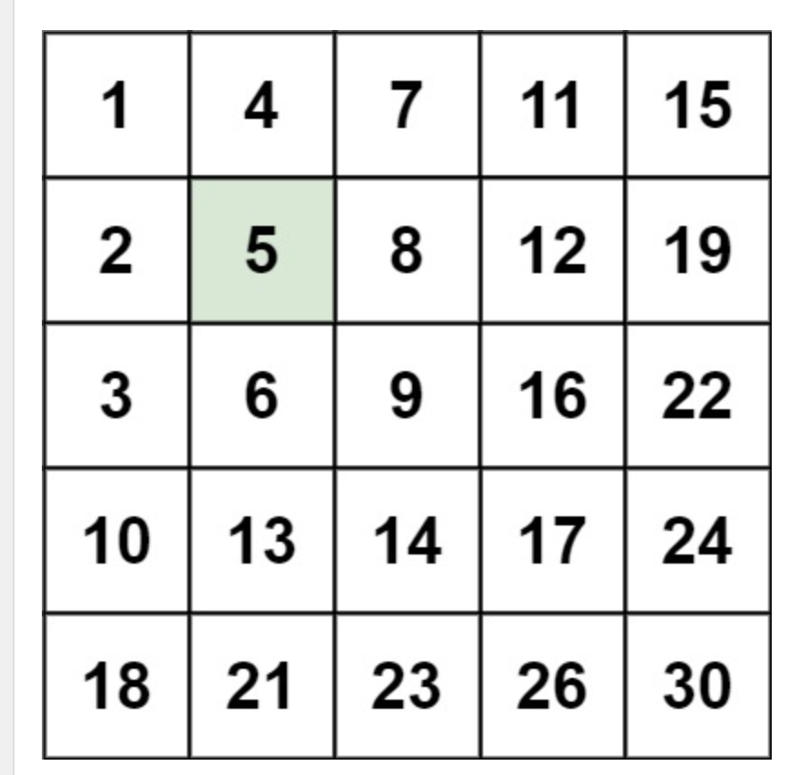

思路：

这道题说 `matrix` 从上到下递增，从左到右递增，显然左上角是最小元素，右下角是最大元素。**我们如果想高效在 `matrix` 中搜索一个元素，肯定需要从某个角开始**，比如说从左上角开始，然后每次只能向右或向下移动，不要走回头路。

如果真从左上角开始的话，就会发现无论向右还是向下走，元素都会增加，那么到底向右还是向下？不确定

但实际上不用这么麻烦，我们不要从左上角开始，而是从右上角开始，规定只能向左或向下移动。

你注意，如果向左移动，元素在减小，如果向下移动，元素在增大，这样的话我们就可以根据当前的元素值和 `target` 的相对大小来判断应该往哪移动，不断接近从而找到 `target` 的位置。

当然，如果你想从左下角开始，规定只能向右或向上移动也可以


- **矩阵特性利用**：利用矩阵"每行升序且每列升序"的特性进行高效搜索
- **起始位置选择**：从矩阵右上角(或左下角)开始搜索
- **搜索过程**：
  - 若当前值等于目标值，返回true
  - 若当前值大于目标值，向左移动一列（排除当前列）
  - 若当前值小于目标值，向下移动一行（排除当前行）
- **终止条件**：当行或列超出矩阵边界时，说明目标值不存在

```java
class Solution {
    public boolean searchMatrix(int[][] matrix, int target) {
        int m = matrix.length;
        int n = matrix[0].length;
        int i = 0, j = n - 1;

        while (i < m && j >= 0) {
            if (matrix[i][j] == target) {
                return true;
            } else if (matrix[i][j] > target) {
                j--;
            } else {
                i++;
            }
        }
        return false;
    }
}
```


## [98. 验证二叉搜索树](https://leetcode.cn/problems/validate-binary-search-tree/)

给你一个二叉树的根节点 `root` ，判断其是否是一个有效的二叉搜索树。

**有效** 二叉搜索树定义如下：

- 节点的左子树只包含小于 当前节点的数。
- 节点的右子树只包含 **大于** 当前节点的数。
- 所有左子树和右子树自身必须也是二叉搜索树。

思路：

初学者做这题很容易有误区：`BST`（二叉搜索树） 不是左小右大么，那我只要检查 `root.val > root.left.val` 且 `root.val < root.right.val` 不就行了？

这样是不对的，因为 `BST` 左小右大的特性是指 `root.val` 要比【左子树的**所有节点**都更大】，要比【右子树的**所有节点**都小】，你只检查左右两个子节点当然是不够的。

正确解法是通过使用辅助函数，增加函数参数列表，在参数中携带额外信息，将这种约束传递给子树的所有节点，这也是二叉搜索树算法的一个小技巧吧。

```java
class Solution {
    public boolean isValidBST(TreeNode root) {
        return isValid(root, null, null);
    }

    private boolean isValid(TreeNode root, TreeNode min, TreeNode max) {
        if (root == null) return true;
        if (min != null && root.val <= min.val) return false;
        if (max != null && root.val >= max.val) return false;
        return isValid(root.left, min, root) && isValid(root.right, root, max);
    }
}
```


## [543. 二叉树的直径](https://leetcode.cn/problems/diameter-of-binary-tree/)

给你一棵二叉树的根节点，返回该树的 **直径** 。二叉树的 **直径** 是指树中任意两个节点之间最长路径的 **长度** 。这条路径可能经过也可能不经过根节点 `root` 。

两节点之间路径的 **长度** 由它们之间边数表示。

思路：

- 所谓二叉树的直径，就是左右子树的最大深度之和，那么直接的想法是对每个节点计算左右子树的最大高度，得出每个节点的直径，从而得出最大的那个直径。
- **后序遍历计算深度**：通过递归后序遍历每个节点，计算其左右子树的深度（当前节点到叶子节点的边数）。
- **更新最大直径**：在遍历过程中，当前节点的直径为左右子树深度之和，全局维护最大值`ans`。
- **返回当前深度**：递归函数返回当前节点的深度（左右子树深度的较大值 + 1），供上层节点计算使用。

```java
class Solution {
    private int ans;
    public int diameterOfBinaryTree(TreeNode root) {
        dfs(root);
        return ans;
    }

    private int dfs(TreeNode root) {
        if(root == null) return -1;

        int lLen = dfs(root.left) + 1;
        int rLen = dfs(root.right) + 1;
        ans = Math.max(ans, lLen + rLen);
        return Math.max(rLen, lLen);
    }
}
```


## [234. 回文链表](https://leetcode.cn/problems/palindrome-linked-list/)

给你一个单链表的头节点 `head` ，请你判断该链表是否为回文链表。如果是，返回 `true` ；否则，返回 `false` 。

思路：

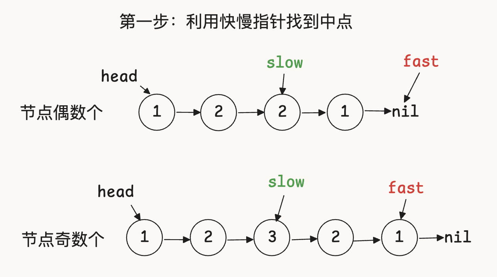

如果 `fast != nil`，说明节点个数为**奇数**，`slow`还需要再移动一步

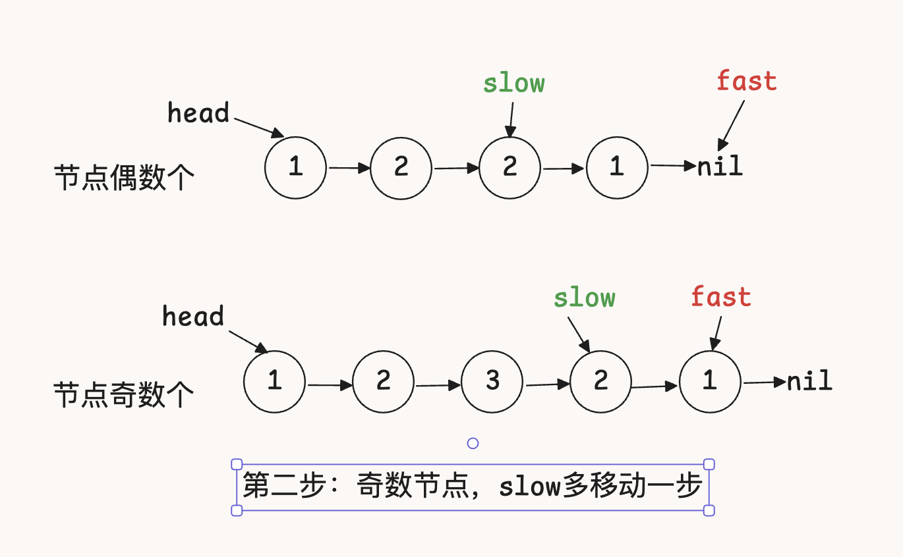

从 `slow` 开始反转后面的链表，现在就可以开始比较回文串了：

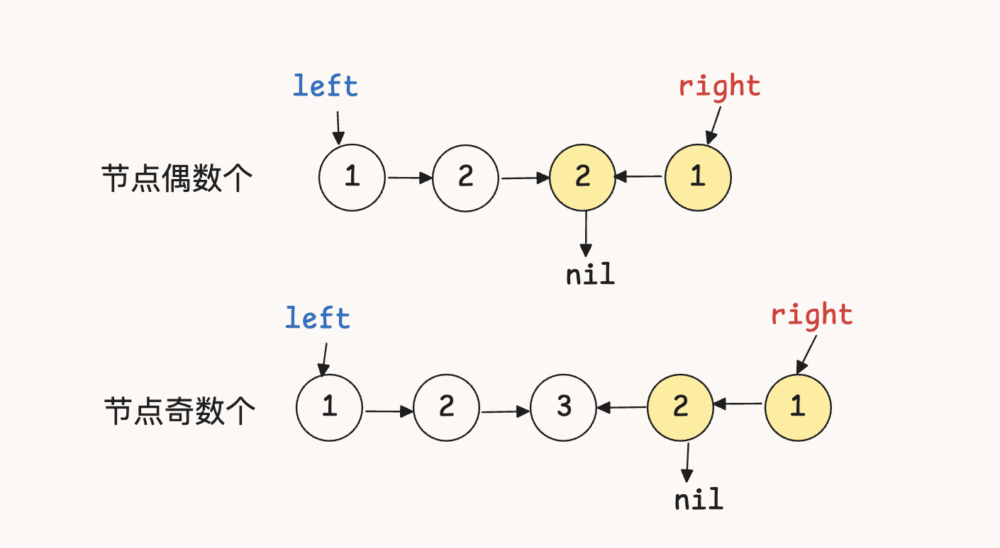


- **快慢指针找中点**：使用快慢指针定位链表中点，奇数长度时跳过中间节点。
- **反转后半部分链表**：将链表后半部分反转，便于与前端比较。
- **双指针比较回文**：前后两半链表逐节点比较值是否相同，判断是否为回文。

```java
class Solution {
    public boolean isPalindrome(ListNode head) {
        if (head == null) return true;

        // 找到中点
        ListNode mid = findMid(head);
        // 反转后半部分
        ListNode reversedHalf = reverse(mid);

        // 比较前后两部分
        while (reversedHalf != null) {
            if (head.val != reversedHalf.val) return false;
            head = head.next;
            reversedHalf = reversedHalf.next;
        }
        return true;
    }

    private ListNode findMid(ListNode head) {
        ListNode slow = head, fast = head;
        while (fast != null && fast.next != null) {
            slow = slow.next;
            fast = fast.next.next;
        }
        // 如果是奇数个节点，跳过中间节点
        return fast != null ? slow.next : slow;
    }

    private ListNode reverse(ListNode head) {
        ListNode prev = null, curr = head;
        while (curr != null) {
            ListNode next = curr.next;
            curr.next = prev;
            prev = curr;
            curr = next;
        }
        return prev;
    }
}

```


## [14. 最长公共前缀](https://leetcode.cn/problems/longest-common-prefix/)

编写一个函数来查找字符串数组中的最长公共前缀。如果不存在公共前缀，返回空字符串 `""`。

思路：

这个题没什么难度，你把字符串列表看成一个二维数组，然后用一个嵌套 `for` 循环计算这个二维数组前面有多少列的元素完全相同即可。

- **以首字符串为基准**：将第一个字符串作为初始公共前缀，逐个字符与其他字符串对比。
- **逐字符检查匹配**：对每个字符位置，检查其他字符串是否在该位置有相同字符或已结束。
- **提前终止返回**：一旦发现不匹配或字符串结束，立即返回当前已匹配的前缀部分。

```java
class Solution {
    public String longestCommonPrefix(String[] strings) {
        char[] first = strings[0].toCharArray();
        for(int i = 0; i < first.length; i++) {
            char ch = first[i];
            for(int j = 1; j < strings.length; j++) {
                if(i == strings[j].length() || ch != strings[j].charAt(i)) {
                    return new String(first, 0, i);
                }
            }
        }
        return strings[0];
    }
}
```


## [162. 寻找峰值](https://leetcode.cn/problems/find-peak-element/)

峰值元素是指其值严格大于左右相邻值的元素。

给你一个整数数组 `nums`，找到峰值元素并返回其索引。数组可能包含多个峰值，在这种情况下，返回 **任何一个峰值** 所在位置即可。

你可以假设 `nums[-1] = nums[n] = -∞` 。

思路：

- **二分查找定位峰值**：利用二分搜索高效缩小搜索范围，寻找局部最大值。
- **比较中间与右侧元素**：若中间元素大于右侧，则峰值在左侧（含中间）；否则峰值在右侧。
- **收敛到唯一峰值**：当左右指针相遇时，即为峰值位置（数组存在至少一个峰值）。

```java
class Solution {
    public int findPeakElement(int[] nums) {
        int left = 0;
        int right = nums.length - 1;
        while (left < right) {
            int mid = left + (right - left) / 2;
            if (nums[mid] > nums[mid + 1]) {
                right = mid;
            } else {
                left = mid + 1;
            }
        }
        return left;
    }
}
```


## 695. 岛屿的最大面积

给你一个大小为 `m x n` 的二进制矩阵 `grid` 。

**岛屿** 是由一些相邻的 `1` (代表土地) 构成的组合，这里的「相邻」要求两个 `1` 必须在 **水平或者竖直的四个方向上** 相邻。你可以假设 `grid` 的四个边缘都被 `0`（代表水）包围着。

岛屿的面积是岛上值为 `1` 的单元格的数目。

计算并返回 `grid` 中最大的岛屿面积。如果没有岛屿，则返回面积为 `0` 。

思路：

这题和 **200.岛屿数量**，类似的题目。计算岛屿面积，其实就是在计算相邻的`1`的个数。采用深度遍历`DFS`的方式淹没岛屿的同时，还应该想办法记录这个岛屿的面积。

这里通过形参 `val *int`记录面积

```java
func maxAreaOfIsland(grid [][]int) int {
	m, n := len(grid), len(grid[0])

	maxVal := 0
	for i := 0; i < m; i++ {
		for j := 0; j < n; j++ {
			if grid[i][j] == 1 { // 找到陆地
				val := 0 // 累计陆地的面积
				dfs(grid, i, j, &val) 
       	// 记录最大值
				maxVal = max(maxVal, val)
			}
		}
	}
	return maxVal
}

func max(a, b int) int {
	if a > b {
		return a
	}
	return b
}

func dfs(grid [][]int, i, j int, val *int) {
	m := len(grid)
	n := len(grid[0])

	if i < 0 || i >= m || j < 0 || j >= n { //越界
		return
	}
	
	if grid[i][j] == 0 { // 当前是水面
		return
	}
	// 执行到这里，说明是陆地
	(*val)++ //累计面积
	grid[i][j] = 0	// 淹没陆地（避免了重复计算）
	
 	// 向周围扩散（看下周围还有没有陆地）
	dfs(grid, i+1, j, val)
	dfs(grid, i-1, j, val)
	dfs(grid, i, j+1, val)
	dfs(grid, i, j-1, val)
}
```


## 113. 路径总和II

给你二叉树的根节点 `root` 和一个整数目标和 `targetSum` ，找出所有 **从根节点到叶子节点** 路径总和等于给定目标和的路径。

**叶子节点** 是指没有子节点的节点。

思路：

二叉树题型，就是递归遍历题型。只是在遍历的过程的中要对数据进行相关处理，处理的位置有讲究，要么前序位置，要么中序位置，要么后序位置。

```java
var result [][]int
func pathSum(root *TreeNode, targetSum int) [][]int {
		// 最终结果存储
    result = [][]int{}
  	// 记录路径
    trace := []int{}
  	// 二叉树遍历
    traverse(root,trace,targetSum,0)
    return result
}

// traverse函数定义： 遍历 root 树，找出目标路径和
func traverse( root *TreeNode, trace []int,targetSum int,sum int) {
    if root == nil {
        return
    }
		// 前序位置，记录路径和
    trace = append(trace,root.Val) 
    sum += root.Val

    if root.Left == nil && root.Right == nil {//表示root是叶子节点（不存在左右子树）
        if sum == targetSum { // 路径和sum 等于 targetSum，找到一个结果
            temp := make([]int,len(trace))
            copy(temp,trace)
            result = append(result,temp)
        }
        return
    }
		// 继续左树遍历
    traverse(root.Left,trace,targetSum,sum)
  	// 继续右树遍历
    traverse(root.Right,trace,targetSum,sum)
}
```


## 62. 不同路径

一个机器人位于一个 `m x n` 网格的左上角 （起始点在下图中标记为 “Start” ）。

机器人每次只能向下或者向右移动一步。机器人试图达到网格的右下角（在下图中标记为 “Finish” ）。

问总共有多少条不同的路径？

思路：

本题和**64.最小路径和**这题有类似之处，都是只能向下、向右移动，一个是计算路径数，一个是计算最小路径。所以，我们只需要修改下 `dp`数组的定义即可。

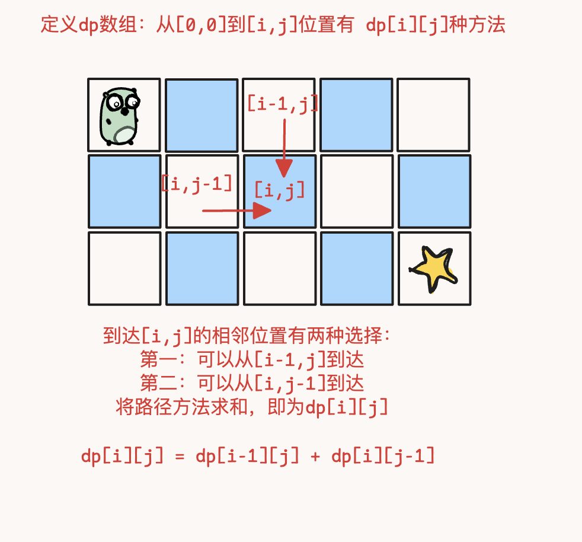

```java
func uniquePaths(m int, n int) int {
   
		// 定义 dp 数组
    dp := make([][]int,m)
    for i := 0;i < m;i++ {
        dp[i] = make([]int,n)
    }


    for i := 0;i < m;i++ {
        for j := 0;j < n;j++ {
            if i == 0 { // base case 第一行 因为只能向右移动
                dp[i][j] = 1
            } else if j == 0 { //base case  第一列 因为只能向下移动
                dp[i][j] = 1
            } else { // 递推关系
                dp[i][j] = dp[i-1][j] + dp[i][j-1]
            }
        }
    }
  	// 最终位置[m-1,n-1]
    return dp[m-1][n-1]
}
```


## 662. 二叉树最大宽度

给你一棵二叉树的根节点 `root` ，返回树的 **最大宽度** 。树的 **最大宽度** 是所有层中最大的 **宽度** 。

每一层的 **宽度** 被定义为该层最左和最右的非空节点（即，两个端点）之间的长度。将这个二叉树视作与满二叉树结构相同，两端点间会出现一些延伸到这一层的 `null` 节点，这些 `null` 节点也计入长度。

题目数据保证答案将会在 **32 位** 带符号整数范围内。

思路：

这题是层序遍历的一个应用。我们需要给节点编号，每一层的最左边节点和最右边节点编号的【差值】，即为该层的宽度。题目要求最大宽度，那用一个变量`result`记录下来最值即可。

```java

func widthOfBinaryTree(root *TreeNode) int {
    ///！！！层序遍历：每一层的最右边节点编号 - 最左边节点的编号 + 1 ，表示当前层的宽度
    if root == nil {
        return 0
    }
    type pair struct { //用来记录节点和节点编号
        node *TreeNode
        uid int
    }
  	
    q := []*pair{}
  	// 从根节点root开始，编号为 1
    q = append(q,&pair{root,1})
    result := 0
    leftId, rightId := 0,0 //每一层的最左和最右节点编号
    for len(q) != 0 {
        size := len(q)

        for i := 0;i < size;i++ {
            if i == 0 {
                leftId = q[i].uid //最左边节点
            }
            if i == size-1 { //最右边节点
                rightId = q[i].uid
            }

            //判断左节点是否存在
            if q[i].node.Left != nil {
                q = append(q,&pair{q[i].node.Left,2 * q[i].uid}) //编号为 2*uid
            }
            //判断右节点是否存在
            if q[i].node.Right != nil {
                q = append(q,&pair{q[i].node.Right,2 * q[i].uid + 1}) //编号为 2*uid+1
            }
        }
        ///去掉q头部的size个元素
        q = q[size:]
				// rightId-leftId+1 计算本层宽度， result记录所有层的最大值
        result = max(result,rightId-leftId+1)
    }
    return result
}

func max ( a, b int) int{
    if a > b {
        return a
    }
    return b
}
```


## 152. 乘积最大子数组

给你一个整数数组 `nums` ，请你找出数组中乘积最大的非空连续 子数组（该子数组中至少包含一个数字），并返回该子数组所对应的乘积。

测试用例的答案是一个 **32-位** 整数。

思路：

这题和最大子数组和类似（只需要定义最大子数组和），但是本题需要定义最大子数组乘积和最小子数组乘积。

- `dpMax`数组定义：以`i`为结尾的最大乘积
- `dpMin`数组定义：以`i`为结尾的最小乘积

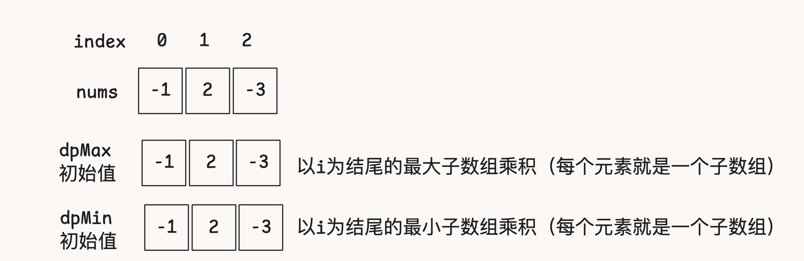

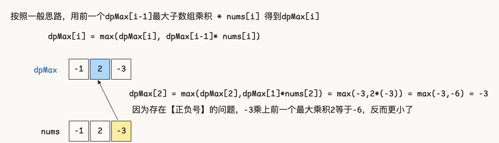

因为当前`nums`是`-3`,乘上一个正数 `2`，只会让结果更小。那如果乘上的是个负数呢？负负得正，那结果不就是变大了。那就要想到负数肯定不是一个最大值，那就是一个最小值。所以额外定义一个最小值的数组乘积

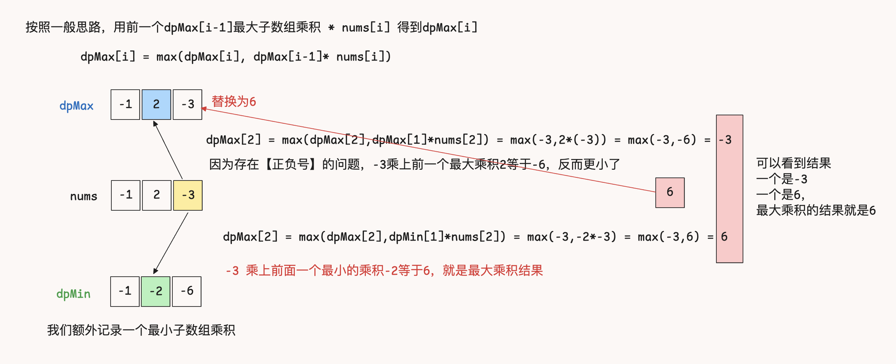

```java
func maxProduct(nums []int) int {
  
		// 定义 dp 数组
    dpMax := make([]int,len(nums))
    dpMin := make([]int,len(nums))


    for i := 0;i < len(nums);i++ { //每个元素值（就是一个子数组），就是初始值
        dpMax[i] = nums[i]
        dpMin[i] = nums[i]
    }

    
    for i := 1;i < len(nums);i++ {
      	// 用 nums[i] * 前一个最大or最小子数组乘积
        maxVal := nums[i]*dpMax[i-1]
        minVal := nums[i]*dpMin[i-1]
      	// 取最大值作为 dpMax
        dpMax[i] = max(dpMax[i], maxVal,minVal )
      	// 取最小值作为 dpMin
        dpMin[i] = min(dpMin[i], maxVal,minVal)
    }
    
    res := math.MinInt
		// 再遍历一遍，dpMax数组，找出最值，返回
    for i := 0;i < len(dpMax);i++ {
        res = max1(res,dpMax[i])
    }
    return res
}

func max1(a,b int) int{
    if a > b{
        return a
    }
    return b
}

func max(a,b ,c int) int{
    if a < b{
        a = b
    }
    if a > c {
        return a
    }
    return c
}

func min(a,b,c int) int{
    if a > b{
        a = b
    }

    if a > c {
        return c
    }
    return a
}
```

## 198. 打家劫舍

你是一个专业的小偷，计划偷窃沿街的房屋。每间房内都藏有一定的现金，影响你偷窃的唯一制约因素就是相邻的房屋装有相互连通的防盗系统，**如果两间相邻的房屋在同一晚上被小偷闯入，系统会自动报警**。

给定一个代表每个房屋存放金额的非负整数数组，计算你 **不触动警报装置的情况下** ，一夜之内能够偷窃到的最高金额。

思路：

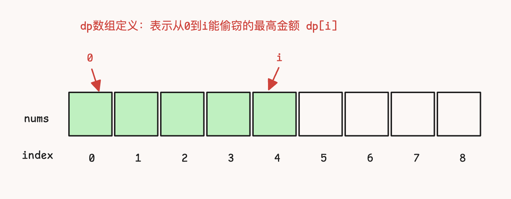

在每间房子前都有两种**选择**：抢或者不抢。

在`i`位置处，我们如果不偷窃，`dp[i] = dp[i-1]`

在`i`位置处，如果偷，`dp[i] = dp[i-2] + nums[i]`

所以，我们的最大金额为： `dp[i] = max(dp[i-1],dp[i-2]+nums[i])`

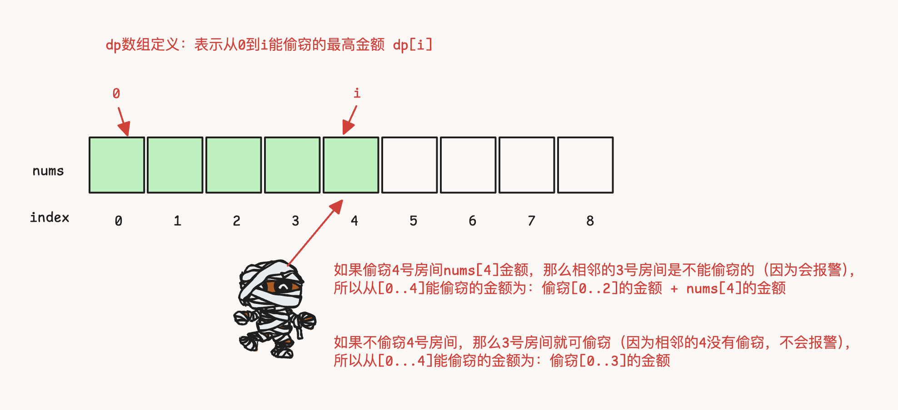

```java
func rob(nums []int) int {
   
		// 定义 dp 数组
    dp := make([]int ,len(nums))
   
    for i := 0; i < len(nums);i++ {
        if i == 0 { // base case 只有一个房间
            dp[i] = nums[0]
        } else if i == 1 { // base 有两个房间
            dp[i] = max(nums[0],nums[1])
        } else { // 一般递推关系
            dp[i] = max(dp[i-1],nums[i]+ dp[i-2])
        }
    }
  	// 最后， dp[len(nums)-1] 表示从[0...len(nums)-1]能偷窃的最大金额（不理解的话，看下dp数组的定义）
    return dp[len(nums)-1]
}

func max(a,b int) int{
    if a > b {
        return a
    }
    return b
}
```


## 112. 路径总和

给你二叉树的根节点 `root` 和一个表示目标和的整数 `targetSum` 。判断该树中是否存在 **根节点到叶子节点** 的路径，这条路径上所有节点值相加等于目标和 `targetSum` 。如果存在，返回 `true` ；否则，返回 `false` 。

**叶子节点** 是指没有子节点的节点。

思路：

这题和上面的 **113. 路径总和II**类似的，只是本题只需要找到一个满足的路径即可（而且也不用记录下来路径值）

```java

func hasPathSum(root *TreeNode, targetSum int) bool {
    return PathSum(root,targetSum,0)
}

// PathSum函数定义： root树是否存在从根节点到叶子节点的路径和 等于 targetSum
func PathSum(root *TreeNode,targetSum int,sum int) bool {
  	// root 为nil，不存在
    if root == nil {
        return false
    }
  	// 前序位置，累加路径和
    sum += root.Val
    if root.Left == nil && root.Right == nil { // 说明 root 是叶子节点
        
        if sum == targetSum { // 找到路径和
            return true
        }
        return false
    }
		// 判断左子树 或者 右子树 是有有满足的路径和（注意：是或的关系，并不需要同时满足）
    return PathSum(root.Left,targetSum,sum) || PathSum(root.Right,targetSum,sum)
}


```


## 179. 最大数

给定一组非负整数 `nums`，重新排列每个数的顺序（每个数不可拆分）使之组成一个最大的整数。

**注意：**输出结果可能非常大，所以你需要返回一个字符串而不是整数。

思路：

```java
func largestNumber(nums []int) string {
    // 这题的思路就是排序：按照相邻的两个数字，希望组成最大的数值，比如 3和30；可以组成330和303，符合题目的结果为330；

    // 1.先将int转成字符串保存起来
    strSlice := make([]string,len(nums),len(nums))

    for k, v := range nums {
        strSlice[k] = strconv.Itoa(v)
    }

    // 2.然后对字符串数组排序
    sort.Slice(strSlice,func(i,j int)bool {
      
        // 比如3和30，那就拼接为：330和303 进行比较
        return strSlice[i] + strSlice[j] > strSlice[j] + strSlice[j]
    })

    // 3.corner case 如果数组中都是0，特殊情况的首字符，是0

    if strSlice[0][0] == '0' {
        return "0"
    }

    return strings.Join(strSlice,"")
}
```


## 560. 和为K的子数组

给你一个整数数组 `nums` 和一个整数 `k` ，请你统计并返回 *该数组中和为 `k` 的子数组的个数* 。

子数组是数组中元素的连续非空序列。

**示例 1：**

```
输入：nums = [1,1,1], k = 2
输出：2
```

**示例 2：**

```
输入：nums = [1,2,3], k = 3
输出：2
```

思路：

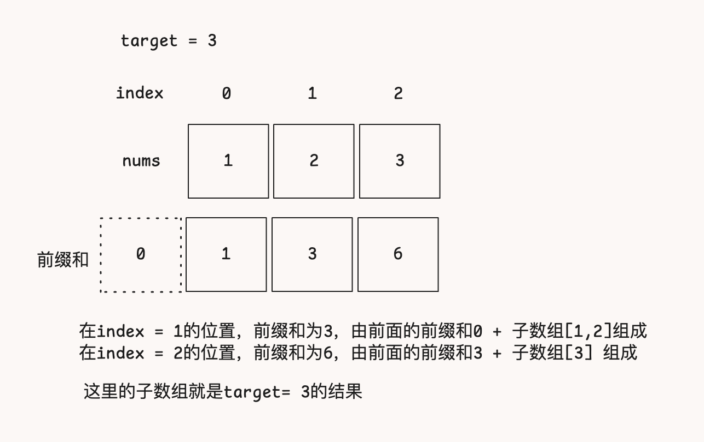

由上图可以得知，这么一个公式` 前缀和 X = 前缀和Y + target（数值等于target子数组）`，也就是 `前缀和 Y = 前缀和X - target（数值等于target子数组）`。由此可知，我们只需要用当前的前缀和 `X - target` ，看下是否存在前缀和`Y` ，如果存在，说明就可以找到一个满足条件的子数组，和 `Y`一起，组成`X`的值。

这里的`Y`的值可能会重复多次

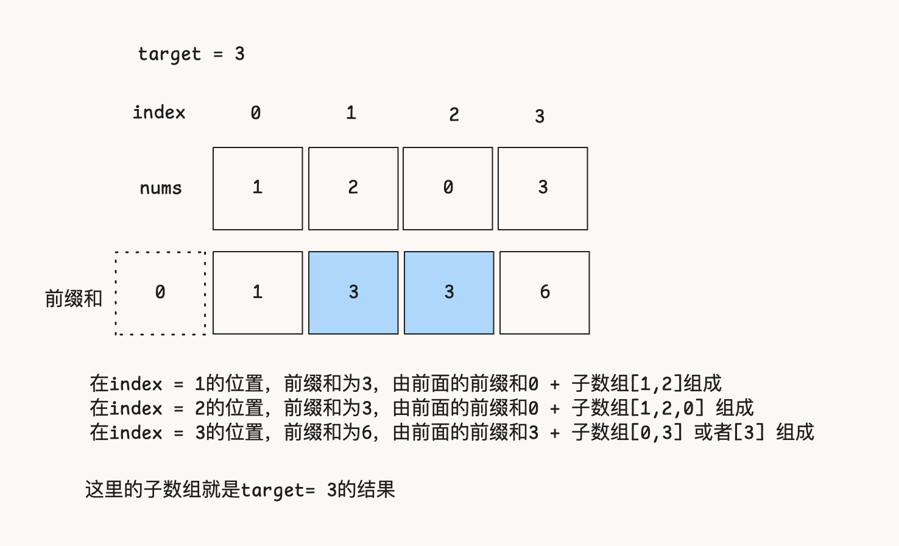

在 `index= 3`的位置，前缀和`6`，可以由前面的一个前缀和`3 + [0,3]`组成，也可以是后面的一个前缀和`3 + [3]`组成，也就是这里的`前缀和Y=3`出现了两次（代表子数组也有两种方案）

最终实现代码如下：`map`用来记录前缀和 + 出现的次数

```java
func subarraySum(nums []int, k int) int {
    // 用map记录前缀和 + 出现次数

    m := make(map[int]int)

		// 默认的前缀和0，出现1次
    nSum := 0
    m[nSum]++

    result := 0

    for i := 0;i < len(nums);i++ {
				// 当前的前缀和x
        nSum += nums[i] 
				// 前缀和x - target = 前缀和Y，在 m中查找Y出现的次数
        result += m[nSum-k]

        // 累积前缀和x出现的次数
        m[nSum]++
    }

    return result
}
```


## 227. 基本计算器II

给你一个字符串表达式 `s` ，请你实现一个基本计算器来计算并返回它的值。整数除法仅保留整数部分。你可以假设给定的表达式总是有效的。所有中间结果将在 `[-231, 231 - 1]` 的范围内。

**注意：**不允许使用任何将字符串作为数学表达式计算的内置函数，比如 `eval()` 。

思路：

第一次做，这题挺难想到，利用栈，模拟计算过程（一回生二回熟，多看几次就记住了）

- 利用两个栈实现，一个存储数值，一个存储符号
- 遇到数值直接入栈
- 遇到符号：需要判断（在栈不为空的情况下），当前符号优先级 <= 栈顶符号优先级（**也就是栈中的符号的优先级比较高**）
- 那么，出栈两个数值，和出栈一个符号，计算结果，把结果存入【栈中】
- 继续比较，是否符合（当前符号优先级 <= 栈顶（且栈不为空）），否则符号直接入栈；

```java
func calculate(s string) int {
    
		// 两个栈
    operands := make([]int,0) //操作数
    operators := make([]byte,0)//操作符
    var result int
  	// index 作为索引，用来遍历每一个字符
    index := 0
    for index < len(s) {
        if isDigit(s[index]) { //判断字符是否是数字
          	// 连续取出多个字符，作为一个完整的整数
            digit := 0
            for index < len(s) && isDigit(s[index]) {
                digit = 10*digit + int((s[index]-'0'))
                index++
            }
          	// 保存到栈中
            operands = append(operands,digit)
        } else if s[index] == ' ' { //空格，跳过
            index++
        } else {
          	// operators 栈不为空，并且栈顶的符号优先级高（先计算栈中的符号）
            for len(operators) != 0 && priority(operators[len(operators)-1],s[index] ) { //栈顶优先级 >= s[i]
                //出栈并运算 -- 运算完成后，继续看下一个操作符号
                if operators[len(operators)-1] == '+' {
                    result =  operands[len(operands)-2] + operands[len(operands)-1]
                }else if operators[len(operators)-1] == '-' {
                    result =  operands[len(operands)-2] - operands[len(operands)-1]
                }else if operators[len(operators)-1] == '*' {
                    result =  operands[len(operands)-2] * operands[len(operands)-1]
                }else if operators[len(operators)-1] == '/' {
                    result =  operands[len(operands)-2] / operands[len(operands)-1]
                }
               
               //出栈数值
               operands = operands[:len(operands)-2]
               operands = append(operands,result) //入栈result结果
               //出栈符号
               operators = operators[:len(operators)-1]
            }

            //直到操作符号为空，或者，不满足优先级关系，入栈操作符
            operators = append(operators,s[index])
            index++ //继续下一个字符
        }
    }
  
  	//如果还有运算符号，说明还需要做最后的运算
    for len(operators) != 0  { 
        //出栈并运算
        if operators[len(operators)-1] == '+' {
            result =  operands[len(operands)-2] + operands[len(operands)-1]
        }else if operators[len(operators)-1] == '-' {
            result =  operands[len(operands)-2] - operands[len(operands)-1]
        }else if operators[len(operators)-1] == '*' {
            result =  operands[len(operands)-2] * operands[len(operands)-1]
        }else if operators[len(operators)-1] == '/' {
            result =  operands[len(operands)-2] / operands[len(operands)-1]
        }
        
        //出栈数值
        operands = operands[:len(operands)-2]
        operands = append(operands,result) //入栈result结果
        //出栈符号
        operators = operators[:len(operators)-1]
    }
    // 最后operands栈中保存的就是结果
    return operands[0]
}

func priority( a, b byte) bool {
    if a == '*' || a == '/' {
        return true
    } else if b == '+' || b== '-' {
        return true
    }
    return false
}

func isDigit( c byte)bool{
    if c >= '0' && c <= '9' {
        return true
    }
    return false
}
```


## 169. 多数元素

给定一个大小为 `n` 的数组 `nums` ，返回其中的多数元素。多数元素是指在数组中出现次数 **大于** `⌊ n/2 ⌋` 的元素。

你可以假设数组是非空的，并且给定的数组总是存在多数元素。

思路：

这道题的标准解法肯定是用一个哈希表作为计数器记录每个元素出现的次数，然后寻找出现次数最多的那个元素，时间和空间复杂度都是 `O(N)`。

但是由于题目说了这个目标元素（众数）出现的次数**过半**，这就有意思了，其实我们不需要用哈希表来做计数器就能把这个众数找出来。

比方说一群带正电的粒子和一群带负电的粒子，把它们混合起来，得到的这群混合粒子的带电性质是什么？这取决于正电离子多还是负电离子多，如果正负粒子数量恰好相等，则呈电中性。

回到这道题，题目告诉你一定存在一个众数，它出现的次数过半，那么如果你把这个众数元素想象成正电粒子，其他的所有元素都想象成负电粒子，那么它们混合起来会怎样？

**在正负粒子混合的过程中，整体的带电性可能在正负间波动，但最终的结果一定是正电**。

```java
func majorityElement(nums []int) int {
	
	target := 0
	count := 0 // 这里的count可以想象【电子容器】的电性是中性的
	for i := 0; i < len(nums); i++ {
		if count == 0 {
			target = nums[i] // count = 0 表示中性的，将 nums[i] 作为第一个电子，放到容器中
			count++ // 容器电性+1
		} else if target == nums[i] { //发现了target电子相同，电性++
			count++
		} else { //否则电性--
			count--
		}
	}
	return target
}


```

## 139. 单词拆分

给你一个字符串 `s` 和一个字符串列表 `wordDict` 作为字典。如果可以利用字典中出现的一个或多个单词拼接出 `s` 则返回 `true`。

**注意：**不要求字典中出现的单词全部都使用，并且字典中的单词可以重复使用。

思路：

动态规划


这里其实有两个字符串`apple 和 pen`供选择。

如果选择 `apple`那么 `dp[i]`的组成就取决于`dp[i-5]`

如果选择 `pen`那么 `dp[i]`的组成就取决于`dp[i-3]`

这两种情况只要有一个满足即可，所以`dp[i]`需要用 `||`来综合`dp[i-5] dp[i-3]`的结果。

很显然，这里只有 `apple`和`applepenapple`尾部匹配

下图演示了，取`apple`的情况下，能否组成的结果，保存到 `dp[i] `中

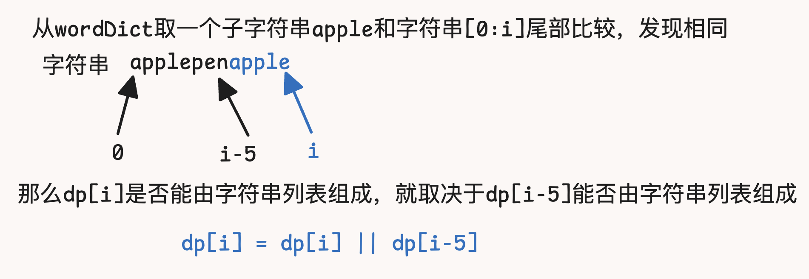

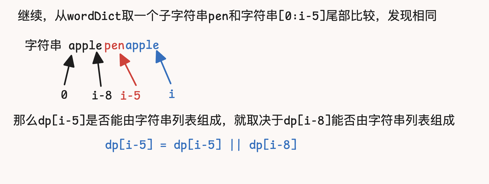

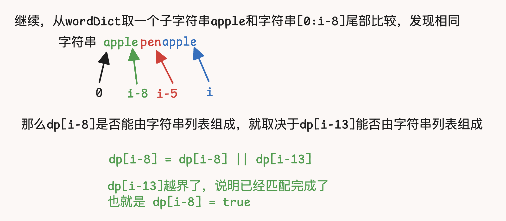

`dp[i] = dp[i] || dp[i-len(word)] ` 这个如果不理解，可以看下这个范例：

比如字符串`dogs` 和字符串列表` [dog,gs,s]`

能和`dogs`尾部匹配的字符串，包括 `gs 和 s`两种情况

- 如果选择`gs`，那么`dp[i]`的结果就取决于`dp[i-2]`，` dp[i] = dp[i] || dp[i-2]` 将结果保存到 `dp[i]`中
- 如果选择`s`，那么`dp[i]`的结果就取决于`dp[i-1]`，` dp[i] = dp[i] || dp[i-1]` 将结果保存到 `dp[i]`中

所以`dp[i]`得最终结果就取决于`dp[i-2] 或者 dp[i-1]`。

```java
func wordBreak(s string, wordDict []string) bool {

    // 定义 dp[i] 表示 [0...i] 能否用字符串列表wordDict拼接出来
    dp := make([]bool,len(s))

    for i := 0; i < len(s);i++ {
			
        for _,word := range wordDict {
            // 字符串长度 >= word 并且 尾部的字符串和 word相等
            if i + 1 >= len(word) && s[i+1-len(word):i+1] == word {
             	 if i - len(word) >= 0 { //没有越界，需要考虑前面的结果dp[i-len(word)]
                     dp[i] = dp[i] || dp[i-len(word)] // 这里用 || 表示要综合考虑字符串尾部，和wordDict的多个字符串都匹配的时候的结果。
                } else {
                    dp[i] = true // 如果越界，说明正好匹配完成
                } 
            }
        }
    }
    return dp[len(s)-1]
}
```


## 83. 删除排序链表中的重复元素

给定一个已排序的链表的头 `head` ， *删除所有重复的元素，使每个元素只出现一次* 。返回 *已排序的链表* 。

思路：

```java
func deleteDuplicates(head *ListNode) *ListNode {

    p := head
    
    for head != nil {
      	// 固定left
        left := head
				// 让 head 移动，保证 [left,head]之间的元素相同
        for head.Next != nil && left.Val == head.Next.Val {
            head = head.Next
        }

        // [left,head] 就是重复的元素，保留一个
        if left != head {
            left.Next = head.Next
        }
        head = head.Next // 同时 head 指向新的一轮链表的起始位置
    }
    return p
}
```

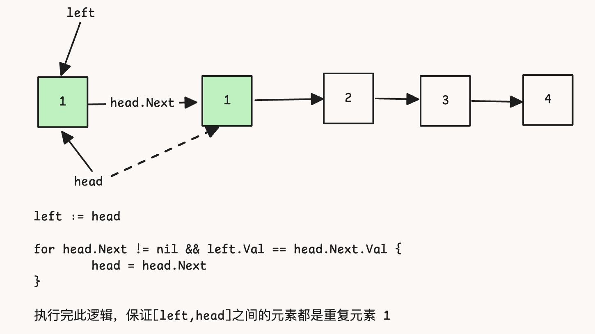

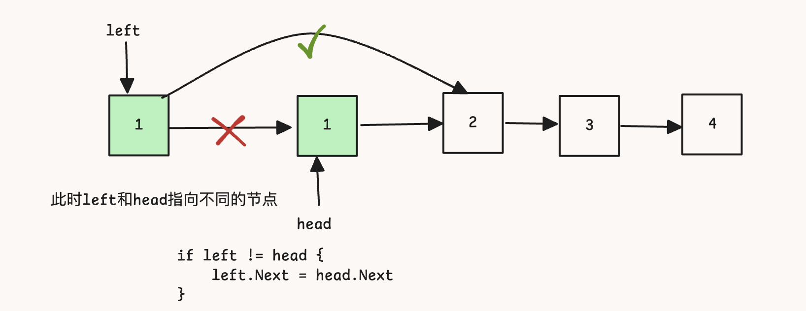


## 718. 最长重复子数组

给两个整数数组 `nums1` 和 `nums2` ，返回 *两个数组中 **公共的** 、长度最长的子数组的长度* 。

思路：

- `dp`数组定义：`dp[i][j] ` 表示必须以 `i`结尾的子数组和 必须以`j`结尾子数组的公共长度（注意："必须"的含义）

- 递推关系：

  如果`nums1[i] == nums2[j]`，表示两个子数组结尾的数值相同   `dp[i][j] = dp[i-1][j-1] + 1`

  如果 `nums1[i] != nums2[j]`，表示两个子数组结尾的数值不相同，也就是说必须以 `i`结尾的子数组和 必须以`j`结尾子数组的公共长度为`0`

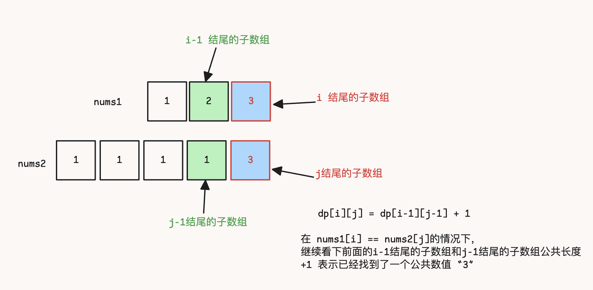

```java
func findLength(nums1 []int, nums2 []int) int {
    // dp 数组定义
    m,n := len(nums1),len(nums2)
    dp := make([][]int,m)
    for k,_ := range dp {
        dp[k] = make([]int,n)
    }

    result := 0
    for i := 0;i < m;i++ {
        for j := 0;j< n;j++ {
            if  i == 0  ||  j == 0 { // base case 当i子数组只有一个元素 or j子数组只有一个元素
                if nums1[i] == nums2[j] {
                    dp[i][j] = 1
                }
            } else if nums1[i] == nums2[j] { // 一般递推关系
                dp[i][j] = dp[i-1][j-1] + 1
            }
						// 题目要求最大长度，dp[i][j]只是记录的每一个的子数组的公共长度
            if dp[i][j] > result {
                result = dp[i][j]
            }
        }
    }
    return result
}
```


## 209. 长度最小的子数组

给定一个含有 `n` 个正整数的数组和一个正整数 `target` **。**

找出该数组中满足其总和大于等于 `target` 的长度最小的 **子数组**`[numsl, numsl+1, ..., numsr-1, numsr]` ，并返回其长度**。**如果不存在符合条件的子数组，返回 `0` 。

**示例 1：**

```
输入：target = 7, nums = [2,3,1,2,4,3]
输出：2
解释：子数组 [4,3] 是该条件下的长度最小的子数组。
```

思路：

- 要先理解子数组的含义：**子数组** **是数组中连续的** **非空** **元素序列**  。比如上面的示例，`[2,3,1]`是子数组，`[2,1]`就不是子数组

- 这题的解法采用滑动窗口：

  利用`left,right`指针，框住一片连续区域；

  移动`right`保证窗口内的子数组之和大于等于`target`；

  移动`left`保证窗口内的子数组之和大于等于`target`的前提下，窗口的长度减小，寻找最小长度

```java
func minSubArrayLen(target int, nums []int) int {
    // 滑动窗口
    n := len(nums)
  	// left right 窗口的左右指针
    left,right := 0,0

    winSum := 0 // 记录窗口内的总和
    result := math.MaxInt // 设定为最大值（因为要求最小值）

    for right < n {
				// 移动右边界 right
        rightVal := nums[right]
        right++
				// 记录窗口内子数组和
        winSum += rightVal

        for winSum >= target { // 保证窗口的总和 >= target前提下，寻找最小数组长度
            result = min(result,right-left)
          	// 移动左边界 left
            leftVal := nums[left]
            left++
            winSum -= leftVal
        }
    }
    // 表示不存在
    if result == math.MaxInt {
        result = 0
    }
    return result
}

func min(a,b int) int{
    if a < b{
        return a
    }
    return b
}
```


## 226. 翻转二叉树

给你一棵二叉树的根节点 `root` ，翻转这棵二叉树，并返回其根节点。

思路：

这题和**101. 对称二叉树**可以对比看下，都是前序位置进行处理。二叉树的处理，既要以`root`树的整体角度思考，也要从具体的一个`root`节点思考。

如何翻转二叉树？其实就是把二叉树上的每个节点的左右子节点都交换一下

```java
// invertTree函数定义：翻转root二叉树
func invertTree(root *TreeNode) *TreeNode {
    if root == nil {
        return root
    }

    //对root节点，左右子节点交换
    root.Left,root.Right = root.Right,root.Left
  	// 翻转root.Left左树
    invertTree(root.Left)
  	// 翻转root.Right右树
    invertTree(root.Right)
    return root
}

```


## 24. 两两交换链表中的节点

给你一个链表，两两交换其中相邻的节点，并返回交换后链表的头节点。你必须在不修改节点内部的值的情况下完成本题（即，只能进行节点交换）。

思路：

这题是 `25. K个一组翻转链表`的特例题型，即 两个一组翻转链表

- 明确递归函数的定义：**swapPairs函数定义：对链表进行两两节点翻转，并返回头节点**
- 在递归函数内部，先针对一小段链表（2个节点的链表）进行翻转，将翻转后的链表，拼接上通过递归函数`swapParis`翻转的链表的头节点

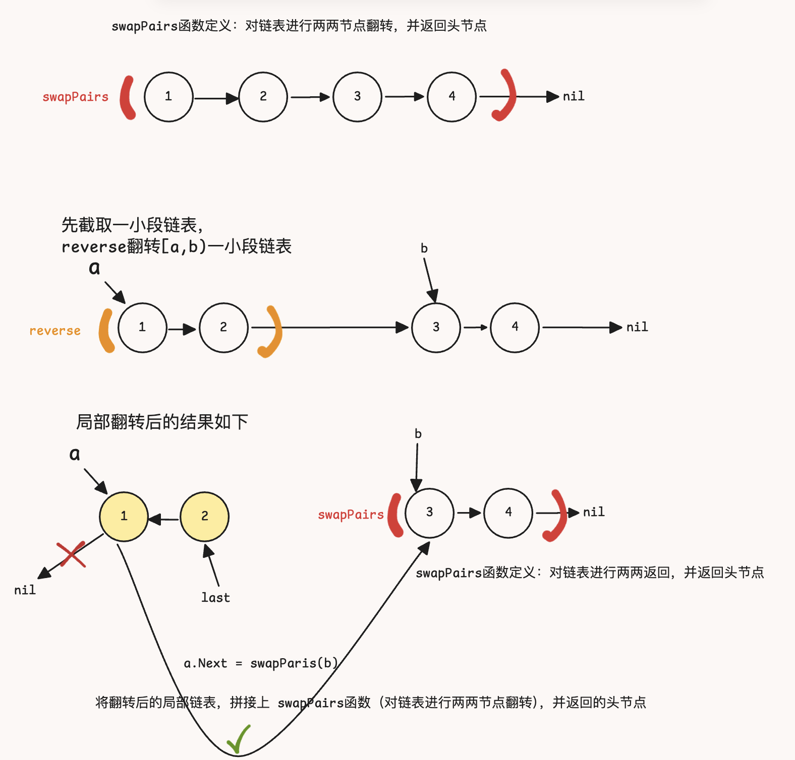

```java
// swapPairs函数定义：翻转以head 为头节点的链表，并返回翻转后的头节点
func swapPairs(head *ListNode) *ListNode {
  	// 截取一小段链表
    a,b := head,head
    for i := 0;i < 2;i++ {
        if b == nil {
            return a
        }
        b = b.Next
    }
		// 对这段链表进行翻转
    last := reverse(a,b)
  	// 将翻转后的尾部节点a拼接上， swapPairs(b) 翻转后的头节点
    a.Next = swapPairs(b)
    return last
}


func reverse(a *ListNode, b *ListNode) *ListNode {
    
    var pre *ListNode = nil 
    for a != b {
        temp := a.Next

        a.Next = pre
        pre = a

        a = temp
    }
    return pre
}
```


## 283. 移动零

给定一个数组 `nums`，编写一个函数将所有 `0` 移动到数组的末尾，同时保持非零元素的相对顺序。

**请注意** ，必须在不复制数组的情况下原地对数组进行操作。

思路：

利用双指针，`slow`指向待存储元素的位置，`fast`负责遍历所有的元素（查看所有的元素）

当 `fast`指向的元素不为`0`的时候，保存到`slow`指向的存储位置

```java
func moveZeroes(nums []int)  {

    slow , fast := 0,0
    for fast < len(nums) {
        if nums[fast] != 0 {
            nums[slow],nums[fast] = nums[fast],nums[slow]
            slow++
        }
        fast++
    }
}
```

这题和 **[905. 按奇偶排列数组](https://leetcode.cn/problems/sort-array-by-parity/)**是一样的解题方案。

给你一个整数数组 `nums`，将 `nums` 中的的所有偶数元素移动到数组的前面，后跟所有奇数元素。返回满足此条件的 **任一数组** 作为答案。

思路：

双指针方案：`slow`指向待存储元素的位置，`fast`负责遍历所有的元素（查看所有的元素）。当 `fast`指向的元素为偶数的时候，保存到`slow`指向的存储位置。

```java
func sortArrayByParity(nums []int) []int {
    slow,fast := 0,0
    // 类似于，283. 移动零 交换 0 和 >0的数字，让0都放到尾部
    for fast < len(nums) {
        if nums[fast] % 2 == 0 { // 偶数
            nums[slow],nums[fast] = nums[fast],nums[slow]
            slow++
        }
        fast++
    }
    return nums
}

//这是另外一种方案（有点类似于快速排序中的一点点逻辑）：定义 left right 指针分别指向数组的两端
func sortArrayByParity(nums []int) []int { 

    left,right := 0,len(nums)-1
		// 保证从[0...left]范围都是偶数元素
  	// 保证从 [right...len(nums)-1]范围的都是奇数元素
    for left < right {
        
        for left < right && nums[left] % 2 == 0 { // left指向偶数，直到碰到奇数停止
            left++
        }

        for left < right && nums[right] % 2 != 0 { // right指向奇数，直到碰到偶数停止
            right--
        }

        if left >= right {
            break
        }
				// 交换 left right指向的元素
        nums[left],nums[right] = nums[right],nums[left]
    }

    return nums
}
```


